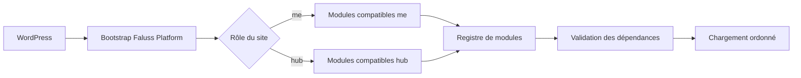

# Architecture initiale

`faluss-platform` est un plugin WordPress commun à `faluss.me` et `faluss.com`. Le site choisit explicitement son rôle via `FALUSS_PLATFORM_ROLE`, dont les seules valeurs autorisées sont `me` et `hub`.

## État actuel

Le plugin fournit son point d’entrée, le rôle de site et un registre capable de charger des modules dans l’ordre de leurs dépendances. Le tableau de bord d’administration est commun aux deux rôles. Le module optionnel des [jetons visuels](modules/THEME-TOKENS.md) est limité au rôle `me` et reste inactif sans opt-in explicite. Aucune table n’est créée et aucune configuration de production n’est modifiée.

Si le rôle n’est pas configuré ou est invalide, le plugin ne charge aucun module. Si une dépendance manque ou forme un cycle, le registre refuse le chargement avant de démarrer le moindre module.

## Ajouter un module

Un module implémente `Faluss\Platform\Core\Module` et déclare :

- un identifiant stable ;
- ses rôles compatibles ;
- les identifiants de ses dépendances ;
- sa méthode `boot()`.

Le registre vérifie les doublons, l’absence de dépendance, l’incompatibilité de rôle et les cycles avant le chargement. Le module `theme-tokens` est la première migration optionnelle ; chaque module suivant fera l’objet d’une PR distincte et de tests de parité ciblés.

## Cohabitation et rollback

Le socle ne déclare aucune route REST, aucun shortcode, hook métier, schéma SQL ou cron ; il peut cohabiter avec les plugins existants. Désactiver le plugin revient entièrement à l’état précédent. Aucun déploiement en production n’est inclus dans cette étape.

## Administration

Sur un site dont le rôle est configuré, l’entrée de menu « Faluss » donne accès à une page de synthèse montrant le rôle local et les modules chargés. Ce n’est pas un indicateur de connexion réseau entre les deux sites. Seuls les comptes disposant de la capacité WordPress `manage_options` peuvent y accéder. La feuille de style est chargée uniquement sur cette page et ne modifie pas les interfaces des anciens plugins. Aucune action d’écriture, donnée personnelle ou appel réseau n’est ajouté. Si le rôle manque, aucun menu Faluss Platform n’est créé.

L’[inventaire des plugins historiques](modules/LEGACY-INVENTORY.md) s’affiche sur cette page pour aider à suivre la migration sur chaque site. Il est local et en lecture seule.

Le [module de catalogue de thèmes](modules/CATALOG.md) fournit une migration optionnelle de l’ancien catalogue sur `faluss.me`. Sans opt-in, aucun hook du nouveau catalogue n’est enregistré. Si le plugin historique est encore chargé, il reste seul responsable du catalogue.

Le [module Faluss Link et Studio](modules/LINK.md) reprend sur le rôle `me` les surfaces publiques et éditoriales historiques derrière un opt-in distinct. Faluss Identity reste l’autorité active ; Link consomme ses contrats publics ainsi que ceux de Catalog et Token Engine Connector, sans recopier l’identité ni les décisions économiques.

Le [module Faluss Identity](modules/IDENTITY.md) reprend sur le rôle `me` l’unique autorité de `faluss_id`, le passwordless, les profils, l’onboarding et le serveur OAuth. Il reste opt-in, refuse toute seconde autorité chargée et fournit à Link une projection publiée sans accès direct au stockage Identity.

Le [module Faluss Subscriptions](modules/SUBSCRIPTIONS.md) reprend sur le rôle `hub` l’autorité historique des offres, essais, abonnements, entitlements, clients Stripe et audits. Il est opt-in, refuse la coexistence avec l’ancien plugin et expose à Portal une projection étroite sans déplacer la source de vérité avant la bascule approuvée.

Le [module Token Engine](modules/TOKEN-ENGINE.md) reprend sur le rôle `hub` les projets, permissions, règles, droits et les ledgers générique/PF historiques. Il reste opt-in, conserve les lignes append-only sans recalcul et expose à Portal uniquement le gain quotidien Hub derrière un contrat serveur fermé.
