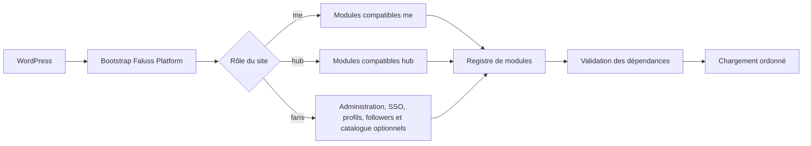

# Architecture initiale

`faluss-platform` est un plugin WordPress modulaire. Le site choisit explicitement son rôle via `FALUSS_PLATFORM_ROLE`, dont les seules valeurs autorisées sont `me`, `hub` et `fans`. Le rôle `fans` admet l'administration commune, un [client SSO propre](modules/FANS-SSO.md), des [profils créateurs structurés](modules/FANS-PROFILES.md), un [suivi local minimal](modules/FANS-FOLLOWERS.md) et un [catalogue sans achat](modules/FANS-STORE.md), chacun après opt-in et vérification de son schéma. Les modules Me et Hub restent limités à leurs rôles déclarés.

## État actuel

Le plugin fournit son point d’entrée, le rôle de site et un registre capable de charger des modules dans l’ordre de leurs dépendances. Le tableau de bord d’administration est commun aux trois rôles. Le module optionnel des [jetons visuels](modules/THEME-TOKENS.md) est limité au rôle `me` et reste inactif sans opt-in explicite. L'admission du rôle `fans` seule ne crée aucune table ; le client SSO exige une activation distincte et ne modifie aucune configuration de production dans cette PR.

Si le rôle n’est pas configuré ou est invalide, le plugin ne charge aucun module. Si une dépendance manque ou forme un cycle, le registre refuse le chargement avant de démarrer le moindre module.

## Ajouter un module

Un module implémente `Faluss\Platform\Core\Module` et déclare :

- un identifiant stable ;
- ses rôles compatibles ;
- les identifiants de ses dépendances ;
- sa méthode `boot()`.

Le registre vérifie les doublons, l’absence de dépendance, l’incompatibilité de rôle et les cycles avant le chargement. Le module `theme-tokens` est la première migration optionnelle ; chaque module suivant fait l’objet d’une PR distincte et de tests ciblés. Les domaines [Faluss Fans](modules/FANS.md) au-delà des profils, du suivi minimal et du catalogue sans achat restent contractuels et ne sont pas chargés par l'admission du rôle ou les autres modules.

## Cohabitation et rollback

Le socle ne déclare aucune route REST, aucun shortcode, hook métier, schéma SQL ou cron ; il peut cohabiter avec les plugins existants. Désactiver le plugin revient entièrement à l’état précédent. Aucun déploiement en production n’est inclus dans cette étape.

## Administration

Sur un site dont le rôle est configuré, l’entrée de menu « Faluss » donne accès à une page de synthèse montrant le rôle local et les modules chargés. Ce n’est pas un indicateur de connexion réseau entre les deux sites. Seuls les comptes disposant de la capacité WordPress `manage_options` peuvent y accéder. La feuille de style est chargée uniquement sur cette page et ne modifie pas les interfaces des anciens plugins. Aucune action d’écriture, donnée personnelle ou appel réseau n’est ajouté. Si le rôle manque, aucun menu Faluss Platform n’est créé.

L’ancien [inventaire des plugins historiques](modules/LEGACY-INVENTORY.md) n’est plus affiché dans cette page depuis la fin de la migration. Son code reste disponible pour un contrôle ponctuel de compatibilité et de retour arrière.

Le [module de catalogue de thèmes](modules/CATALOG.md) fournit une migration optionnelle de l’ancien catalogue sur `faluss.me`. Sans opt-in, aucun hook du nouveau catalogue n’est enregistré. Si le plugin historique est encore chargé, il reste seul responsable du catalogue.

Le [module Faluss Link et Studio](modules/LINK.md) reprend sur le rôle `me` les surfaces publiques et éditoriales historiques derrière un opt-in distinct. Faluss Identity reste l’autorité active ; Link consomme ses contrats publics ainsi que ceux de Catalog et Token Engine Connector, sans recopier l’identité ni les décisions économiques.

Le [Studio Faluss V2 natif](modules/ME-STUDIO.md) est un fournisseur optionnel de l’interface Link sur le rôle `me`. Il dépend explicitement d’Identity, Catalog, Link et Apps Registry, conserve le renderer Link unique et retombe sur le Studio interne par simple configuration. Son activation est distincte d’une mise à jour du plugin.

Le [module Faluss Identity](modules/IDENTITY.md) reprend sur le rôle `me` l’unique autorité de `faluss_id`, le passwordless, les profils, l’onboarding et le serveur OAuth. Il reste opt-in, refuse toute seconde autorité chargée et fournit à Link une projection publiée sans accès direct au stockage Identity.

Le [module Faluss Subscriptions](modules/SUBSCRIPTIONS.md) reprend sur le rôle `hub` l’autorité historique des offres, essais, abonnements, entitlements, clients Stripe et audits. Il est opt-in, refuse la coexistence avec l’ancien plugin et expose à Portal une projection étroite sans déplacer la source de vérité avant la bascule approuvée.

Le [module Token Engine](modules/TOKEN-ENGINE.md) reprend sur le rôle `hub` les projets, permissions, règles, droits et les ledgers générique/PF historiques. Il reste opt-in, conserve les lignes append-only sans recalcul et expose à Portal uniquement le gain quotidien Hub derrière un contrat serveur fermé.

Le [module Faluss Events](modules/EVENTS.md) reprend sur les rôles `me` et `hub` les contrats EVT, les six tables privées, les registres fermés, le transport Federation existant, les leases, les retries et les trois workers Cron. Il reste opt-in, refuse un second runtime actif et ne crée aucun événement métier au chargement.

Le [module Faluss Analytics](modules/ANALYTICS.md) reprend sur le rôle `hub` le consumer `faluss-analytics.aggregate-v1`, les reçus d’idempotence, les agrégats journaliers anonymisés, le read-model privé et le Cron de rétention. Il dépend du module Events, reste opt-in et n’ajoute aucun producteur, route publique, cookie ou statistique artificielle.

Le [module Faluss Federation](modules/FEDERATION.md) reprend sur les rôles `me` et `hub` le transport privé Ed25519, les politiques locales de pairs, les registres de providers, l’anti-rejeu transactionnel et l’administration historique. Il reste désactivé par défaut, refuse un second runtime actif et ne génère ni clé, ni pair, ni politique. Ses consommateurs actuels interdisent encore tout retrait du contrat Federation.

L’outil historique [Faluss Production Reset](modules/PRODUCTION-RESET.md) est retiré du périmètre runtime de Platform. Son inventaire ne révèle aucun consommateur, mais son code supprime réellement comptes, médias et données membre. En l’absence d’un journal durable et d’une autorisation explicite de production, aucun module, flag, hook, route ou écran de remplacement n’est enregistré. Le retrait ou la désinstallation du plugin historique sur les sites réels reste une opération de production séparée et autorisée.
