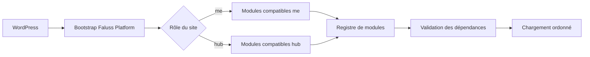

# Architecture initiale

`faluss-platform` est un plugin WordPress commun à `faluss.me` et `faluss.com`. Le site choisit explicitement son rôle via `FALUSS_PLATFORM_ROLE`, dont les seules valeurs autorisées sont `me` et `hub`.

## État actuel

Le plugin fournit uniquement son point d’entrée, le rôle de site et un registre capable de charger des modules dans l’ordre de leurs dépendances. Aucun ancien plugin Faluss n’est remplacé, aucune table n’est créée et aucune configuration de production n’est modifiée.

Si le rôle n’est pas configuré ou est invalide, le plugin ne charge aucun module. Si une dépendance manque ou forme un cycle, le registre refuse le chargement avant de démarrer le moindre module.

## Ajouter un module

Un module implémente `Faluss\Platform\Core\Module` et déclare :

- un identifiant stable ;
- ses rôles compatibles ;
- les identifiants de ses dépendances ;
- sa méthode `boot()`.

Le registre vérifie les doublons, l’absence de dépendance, l’incompatibilité de rôle et les cycles avant le chargement. L’enregistrement effectif des premiers modules fera l’objet d’une PR distincte, accompagnée des tests de parité avec les plugins existants.

## Cohabitation et rollback

Le socle ne déclare aucune route REST, aucun shortcode, hook métier, schéma SQL ou cron ; il peut cohabiter avec les plugins existants. Désactiver le plugin revient entièrement à l’état précédent. Aucun déploiement en production n’est inclus dans cette étape.
