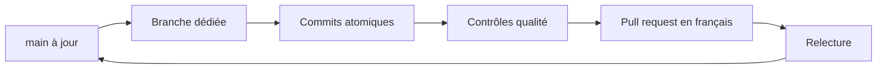

# Contribuer à Faluss Platform

## Principe

Chaque changement est développé dans une branche dédiée et livré dans une pull request petite et cohérente. La branche `main` reste protégée et publiable.

Ces règles s'appliquent aux contributions humaines et à celles produites avec une IA. Un commit direct, une fusion locale ou un contournement administrateur vers `main` est interdit, même si la CI passe ensuite. La relecture est faite par une autre personne que l'auteur.



## Branches

Formats acceptés :

- `feat/nom-explicite`
- `fix/nom-explicite`
- `refactor/nom-explicite`
- `docs/nom-explicite`
- `chore/nom-explicite`
- `test/nom-explicite`
- `ci/nom-explicite`
- `build/nom-explicite`
- `perf/nom-explicite`
- `hotfix/nom-explicite`

Exemple :

```bash
git switch main
git pull --ff-only
git switch -c feat/module-registry
```

Quand une petite PR dépend d’une autre PR non fusionnée, créer la branche suivante depuis la branche précédente et choisir cette dernière comme base de la nouvelle PR. Chaque PR montre ainsi uniquement son propre changement. Après fusion de la PR de base, rebaser ou ajuster la cible de la suivante vers `main`. Les contrôles CI s’exécutent sur toutes les PR, y compris celles de cette chaîne.

## Commits

Les sujets de commits utilisent un gitmoji suivi d’un message impératif en anglais :

```text
✨ Add module registry
🐛 Prevent duplicate route registration
📝 Document the module lifecycle
```

La description facultative du commit est également rédigée en anglais.

## Pull requests

Les PR sont rédigées en français avec le template du dépôt. Elles doivent :

- expliquer leur objectif ;
- décrire les changements ;
- contenir un changelog clair ;
- lister les vérifications réellement effectuées ;
- évaluer l’intégration avec les deux sites et les modules existants ;
- indiquer les risques et la procédure de retour arrière ;
- inclure des captures pour toute modification visuelle.

Une ligne correspondante doit aussi être ajoutée sous `Unreleased` dans `CHANGELOG.md`.

## Protection GitHub de `main`

Le workflow « PR governance » lit les règles depuis la branche de base avec
`pull_request_target` et traite le code proposé uniquement comme des données.
Une PR qui modifie le workflow ne peut donc pas affaiblir son propre contrôle.
Ce workflow vérifie la forme de la contribution ; il ne peut pas empêcher à lui
seul un push direct. La protection GitHub est le verrou effectif.

Configurer une règle de protection ou un ruleset ciblant exactement `main` :

1. Exiger une pull request avant toute fusion, avec au moins une approbation par
   une autre personne que l'auteur, suppression des approbations devenues
   obsolètes après un nouveau commit et résolution des conversations.
2. Exiger le statut de commit `Faluss PR governance` publié sur le dernier
   commit de la PR par GitHub Actions, ainsi que les contrôles
   `Lint, static analysis and tests`, `Federation without native Sodium` et
   `Check JavaScript syntax`, sur le commit à fusionner. Sélectionner GitHub
   Actions comme source attendue de chaque statut, jamais « n'importe quelle
   source ». Exiger une branche à jour avant fusion si la règle GitHub le permet.
3. Interdire les poussées forcées, la suppression de `main` et tout acteur de
   contournement, y compris les administrateurs, applications et jetons
   d'automatisation. Ne pas autoriser de poussée directe sur `main`.
4. Pour `AGENTS.md`, `.github/` et cette procédure, désigner des responsables
   de revue distincts des auteurs et exiger leur approbation. Vérifier la
   protection après sa création avec un essai de PR et un essai de push direct
   rejeté, sans modifier le contenu de `main`.

Le nom exact des contrôles doit être choisi parmi les statuts publiés par les
workflows du dépôt. Après modification de la protection, vérifier dans GitHub
qu'aucun rôle ni application ne figure dans la liste de contournement.

## Taille des changements

Une PR doit répondre à un seul objectif. Le scaffold, le registre des modules, un module métier, une migration de données et une refonte visuelle doivent être livrés séparément lorsqu’ils peuvent être relus et validés indépendamment.

## Documentation

La documentation évolue dans la même PR que le code concerné. Les diagrammes utilisent Mermaid afin de rester versionnés, lisibles et modifiables avec le code.
