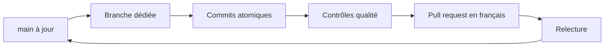

# Contribuer à Faluss Platform

## Principe

Chaque changement est développé dans une branche dédiée et livré dans une pull request petite et cohérente. La branche `main` reste protégée et publiable.



## Branches

Formats acceptés :

- `feat/nom-explicite`
- `fix/nom-explicite`
- `refactor/nom-explicite`
- `docs/nom-explicite`
- `chore/nom-explicite`
- `test/nom-explicite`
- `ci/nom-explicite`
- `build/nom-explicite`
- `perf/nom-explicite`
- `hotfix/nom-explicite`

Exemple :

```bash
git switch main
git pull --ff-only
git switch -c feat/module-registry
```

Quand une petite PR dépend d’une autre PR non fusionnée, créer la branche suivante depuis la branche précédente et choisir cette dernière comme base de la nouvelle PR. Chaque PR montre ainsi uniquement son propre changement. Après fusion de la PR de base, rebaser ou ajuster la cible de la suivante vers `main`. Les contrôles CI s’exécutent sur toutes les PR, y compris celles de cette chaîne.

## Commits

Les sujets de commits utilisent un gitmoji suivi d’un message impératif en anglais :

```text
✨ Add module registry
🐛 Prevent duplicate route registration
📝 Document the module lifecycle
```

La description facultative du commit est également rédigée en anglais.

## Pull requests

Les PR sont rédigées en français avec le template du dépôt. Elles doivent :

- expliquer leur objectif ;
- décrire les changements ;
- contenir un changelog clair ;
- lister les vérifications réellement effectuées ;
- évaluer l’intégration avec les deux sites et les modules existants ;
- indiquer les risques et la procédure de retour arrière ;
- inclure des captures pour toute modification visuelle.

Une ligne correspondante doit aussi être ajoutée sous `Unreleased` dans `CHANGELOG.md`.

## Taille des changements

Une PR doit répondre à un seul objectif. Le scaffold, le registre des modules, un module métier, une migration de données et une refonte visuelle doivent être livrés séparément lorsqu’ils peuvent être relus et validés indépendamment.

## Documentation

La documentation évolue dans la même PR que le code concerné. Les diagrammes utilisent Mermaid afin de rester versionnés, lisibles et modifiables avec le code.
