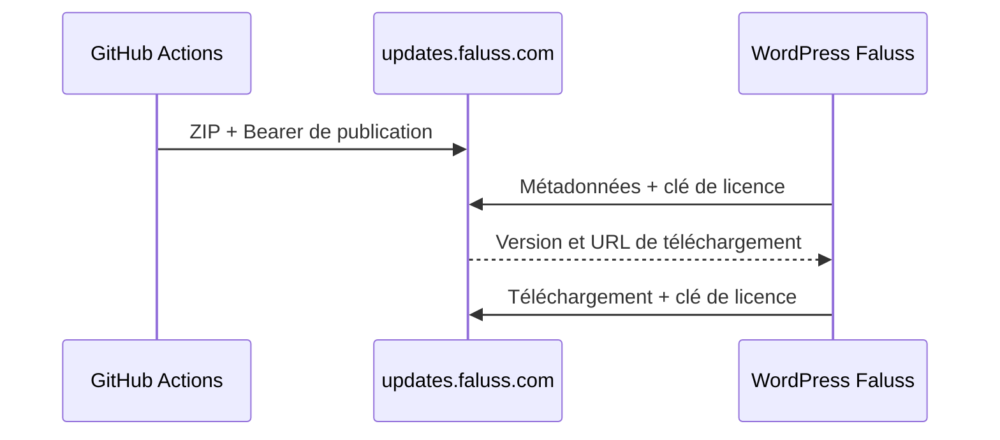

# Mises à jour privées de Faluss Platform

Faluss Platform utilise Plugin Update Checker 5.7 pour interroger exclusivement
`https://updates.faluss.com`. Le serveur reçoit des archives construites par
GitHub Actions et ne connaît ni le dépôt GitHub ni un jeton GitHub.



## Publication

Le workflow `.github/workflows/publish-private-release.yml` est déclenché par un
tag `v*`. Le tag doit correspondre exactement à l'en-tête `Version` de
`faluss-platform.php`. Le workflow installe les dépendances de production,
construit une archive dont le dossier racine est `faluss-platform`, puis l'envoie
avec le secret GitHub Actions `WP_UPDATE_UPLOAD_TOKEN`.

Pour publier la version `0.2.0` après fusion de la PR :

```sh
git tag -s v0.2.0 -m "Faluss Platform 0.2.0"
git push origin v0.2.0
```

Une exécution manuelle est disponible pour diagnostiquer le workflow. Elle ne
remplace pas un tag versionné et le serveur refuse normalement de remplacer une
version déjà publiée.

## Licence des sites WordPress

La clé se configure dans **Faluss → Mises à jour privées**. Elle est enregistrée
dans l'option non autoloadée `faluss_platform_license_key` et n'est jamais
réaffichée dans le formulaire. En production, la constante suivante peut fournir
la clé depuis une configuration non versionnée :

```php
define('FALUSS_PLATFORM_LICENSE_KEY', 'cle-fournie-hors-du-depot');
```

La constante est prioritaire sur l'option. La même clé accompagne la requête de
métadonnées et le téléchargement du ZIP. Le Bearer de publication n'est jamais
installé dans WordPress.

## Vérification et retour arrière

Après publication, vérifier que le serveur retourne `401` sans licence, des
métadonnées avec une licence autorisée, puis que `wp plugin update
faluss-platform` installe la version annoncée. Pour revenir en arrière, supprimer
le tag avant toute publication ou retirer le workflow et le client par une PR.
Les packages déjà publiés restent immuables ; leur suppression est une opération
serveur distincte.
