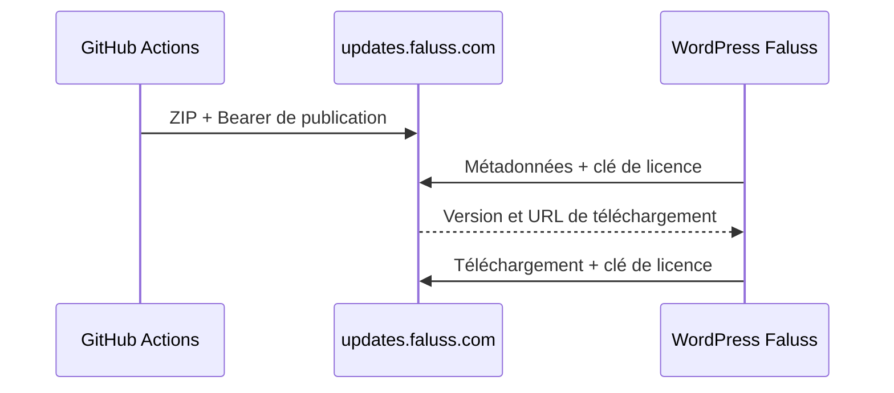

# Mises à jour privées de Faluss Platform

Faluss Platform utilise Plugin Update Checker 5.7 pour interroger exclusivement
`https://updates.faluss.com`. Le serveur reçoit des archives construites par
GitHub Actions et ne connaît ni le dépôt GitHub ni un jeton GitHub.



## Publication

Le workflow manuel `Prepare release` calcule la prochaine version, génère les
notes depuis les commits postérieurs au dernier tag, crée une branche
`chore/release-vX.Y.Z` et ouvre une PR. Il ne modifie jamais `main` directement.
En mode `auto`, `💥` produit une version majeure, `✨` une version mineure et les
autres commits une version corrective. L'opérateur peut imposer `patch`, `minor`
ou `major` au lancement.

Le secret GitHub Actions `RELEASE_PR_TOKEN` contient un jeton limité au dépôt,
autorisé à créer la PR afin que ses événements déclenchent les contrôles CI. Le
jeton ne rejoint jamais le paquet et reste distinct du Bearer d'upload.

Après fusion et contrôles verts, `.github/workflows/publish-private-release.yml`
détecte la nouvelle version sur `main`, crée le tag correspondant puis publie le
ZIP. Le même workflow accepte encore un tag `v*` créé manuellement, à condition
qu'il corresponde exactement à l'en-tête `Version` de `faluss-platform.php`.
Il installe les dépendances de production, construit une archive dont le dossier
racine est `faluss-platform`, puis l'envoie avec le secret GitHub Actions
`WP_UPDATE_UPLOAD_TOKEN`. Le script de build inclut uniquement le code, les
assets, les contrats, les licences tierces et les dépendances de production.
La CI vérifie la racine, les chemins, les symlinks, les modes `755/644`, les
fichiers obligatoires et la cohérence des métadonnées WordPress avant l'envoi.

Pour préparer une publication depuis GitHub CLI :

```sh
gh workflow run prepare-release.yml -f bump=auto
```

Relire puis fusionner la PR générée après ses contrôles CI. Le tag et le paquet
sont alors produits automatiquement. Le serveur refuse de remplacer une version
déjà publiée.

## Licence des sites WordPress

La clé se configure dans **Faluss → Mises à jour privées**. Elle est enregistrée
dans l'option non autoloadée `faluss_platform_license_key` et n'est jamais
réaffichée dans le formulaire. En production, la constante suivante peut fournir
la clé depuis une configuration non versionnée :

```php
define('FALUSS_PLATFORM_LICENSE_KEY', 'cle-fournie-hors-du-depot');
```

La constante est prioritaire sur l'option. La même clé accompagne la requête de
métadonnées et le téléchargement du ZIP. Le Bearer de publication n'est jamais
installé dans WordPress.

## Vérification et retour arrière

Après publication, vérifier que le serveur retourne `401` sans licence, des
métadonnées avec une licence autorisée, puis effectuer la mise à jour depuis
 l'administration WordPress. Avant l'installation, vérifier que **Faluss →
Mises à jour privées** ne signale pas l'absence du client et sauvegarder la base
et le dossier du plugin. Le dossier installé doit appartenir à `www-data:www-data` ;
le script `scripts/repair-wordpress-ownership.sh` réalise cette réparation
initiale avec une sauvegarde vérifiée. Si l'erreur `upgrade-temp-backup` apparaît,
conserver les traces puis restaurer la sauvegarde avant un nouvel essai. Pour
revenir en arrière avant la publication, fermer la PR de release ; après
installation, restaurer la sauvegarde du site concerné.
Les packages déjà publiés restent immuables ; leur suppression est une opération
serveur distincte.

L'incident d'installation incomplète `0.3.0`, les contrôles des dossiers et les
limites du diagnostic de l'erreur de déplacement sont consignés dans
`docs/incidents/2026-09-24-installation-incomplete.md`.
La cause racine des droits et la recette native `Plugin_Upgrader` sont décrites
dans `docs/incidents/2026-09-25-wordpress-update-root-cause.md`.

Un appel PHP direct à `Plugin_Upgrader::upgrade()` ne reproduit pas tout le
parcours interactif de WordPress. Un lanceur scripté doit utiliser trois
processus séparés : relevé de l'état actif local et réseau, installation, puis
restauration et vérification de cet état avec `activate_plugin()` en mode
silencieux. Il doit aussi tenter la restauration après un échec, sans masquer
l'erreur initiale. Il ne doit jamais modifier directement l'option
`active_plugins` ni simuler un contexte cron. L'incident et la procédure
détaillée sont documentés dans
`docs/incidents/2026-09-24-scripted-update-deactivation.md`.
