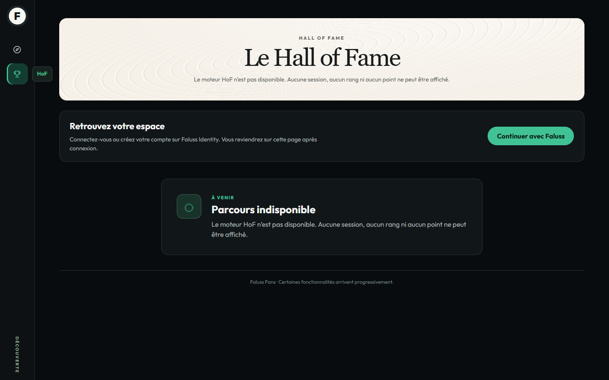
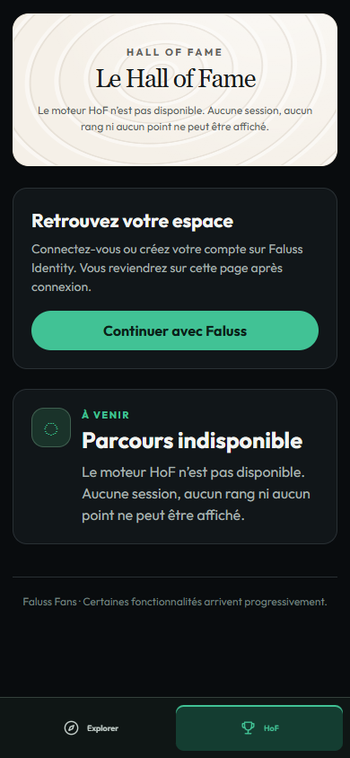

# Lot 12 — routes avec slash final

## Défaut et correction

Reproduction avant correction : `/faluss-fans/creator/creer/?publication=…`
donnait HTTP 404. La règle de réécriture existante capturait le slash dans la
vue, alors que la liste de vues autorisées n’en contient pas.

Le contrôleur et le filtre de barre WordPress normalisent maintenant la vue.
La vérification du chemin accepte exactement le chemin canonique ou celui-ci
suivi d’un slash. Aucun changement des règles stockées ni flush requis.

## Environnement et scénario

29 septembre 2026. Serveur PHP 8.5.4 isolé dans WSL, fichiers Git avec fins LF,
dépendances physiques vérifiées contre composer.lock, sans jonction `vendor`.
Navigateur Windows, viewport ordinateur 1440 × 900 et mobile 390 × 844.
Les rôles et API sont des fixtures des adaptateurs `tests/Fans/Ui/recipe`.
**Ce serveur n’est pas WordPress ou Elementor ; aucun site réel n’a été visité.**

- 289 tests PHP, 4 434 assertions ; deux dépréciations préexistantes. Lint des
  deux PHP modifiés et PHPStan réussis.
- Matrice : 18 routes × 2 formes × 4 rôles × 2 viewports + 24 cas de profils
  absents/suspendus/retirés = **312 cas** dans chacun des deux moteurs.
- Contrôles supplémentaires : profil public actif avec slash, doubles slashs,
  segment supplémentaire, retour SSO vers le texte sélectionné avec slash,
  contrôle de la barre via la règle réellement enregistrée par le code.
- Les droits restent 200/403/404 selon le rôle. Aucun nom, session, score ou
  donnée de progression n’est ajouté aux écrans.

Reproduction : lancer `matrix.cjs` et `browser.cjs` avec `FANS_UI_BROWSER` égal
à `chromium` ou `webkit`, selon la [recette du lot 10](../lot-10/README.md).
Les résultats sont dans [routes-chromium.json](routes-chromium.json) et
[routes-webkit.json](routes-webkit.json). Les tests supplémentaires sont des
assertions de recette, non comptées comme des lignes de cette matrice.

## Captures inspectées

Chromium 154.0.8037.58, URL `/faluss-fans/fan/hof/`, visiteur non connecté.
Le rendu ne change pas par rapport à la route sans slash. L’état indisponible
et la connexion Me restent explicites, sans session ni rang inventés.

WebKit Windows 26.5 est utilisé pour les contrôles fonctionnels. Sa limite
typographique documentée au lot 10 reste entière ; aucune conformité Safari
macOS/iOS, SSO HTTPS réel ou barre WordPress réelle n’est déduite de ces tests.
La recette cible appartient au propriétaire avant toute activation.
