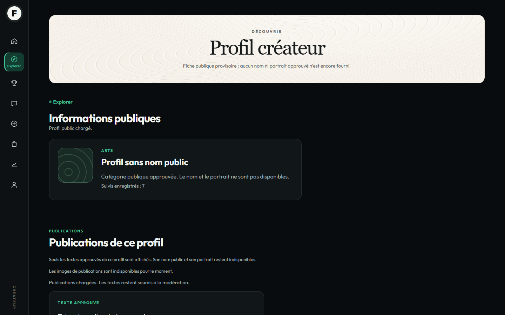
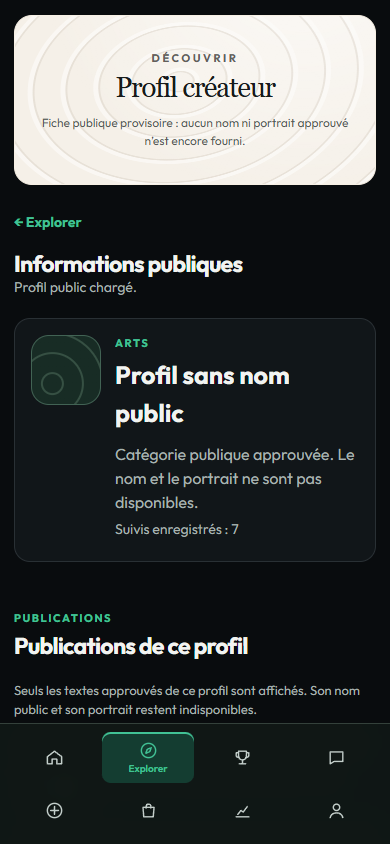

# Lot 13 — nombre public de suivis

## Périmètre

Lecture de `GET /creators/{creator_id}/followers/count` après validation d’un
profil public. Aucun moteur, route, permission, écriture sociale, flag, paiement
ou statistique financière ajouté. Le nombre décrit des relations enregistrées,
pas une preuve d’activité ou de personnes uniques. Pas de valeur de secours.

## Environnement et preuves

29 septembre 2026. Source basée sur `main`
`40ee56038c78061c6040703f2bbeb6f4f98f97d9`, version conservée 0.6.3.
Serveur PHP 8.5.4 isolé WSL, adaptateurs de rôle/API sous `tests/`, aucun
WordPress/Elementor ni site réel. Le compteur 7 et les textes des captures sont
**des fixtures de test**, jamais des valeurs du code produit.

- `follow-count.cjs` : Chromium 154.0.8037.58 et WebKit Windows 26.5 ; invité,
  Fan lié, Créateur lié, administrateur, 1440 × 900 et 390 × 844.
- Une requête GET par lecture ; zéro réel ; 404/503 ; entier négatif,
  fractionnaire, chaîne, null, dépassement de précision et mauvais créateur
  refusés sans cacher la fiche active ni fabriquer un zéro.
- Réponse retardée après départ, invalidation sur masquage, reprise au retour
  visible/BFcache ; aucun appel pour les profils absents/suspendus/retirés.
- Régressions Chromium : `browser.cjs` et `profile-publications.cjs`, dont
  Explorer → profil, navigation Créateur, SSO, publications et permissions.
- Service Followers inchangé, tests ciblés existants rejoués dans la copie
  Linux à dépendances physiques. Aucun PHP modifié dans ce lot.
- Syntaxe JS, scan ciblé et liens de documentation contrôlés avant commit.

Reproduction : serveur de recette et dépendances Playwright comme au
[lot 10](../lot-10/README.md), puis `node tests/Fans/Ui/recipe/follow-count.cjs`.
Choisir `FANS_UI_BROWSER=chromium` ou `webkit` et un dossier temporaire dans
`FANS_UI_OUTPUT` pour conserver les preuves historiques.

## Captures Chromium inspectées

Le compteur réutilise la typographie et l’espacement de la fiche existante.
Les huit accès Créateur restent présents, sans débordement mobile.

## Limites

Aucun suivi/désabonnement depuis l’UI. Les règles de blocage, signalement,
suppression et rétention restent requises avant ouverture sociale. Les noms et
portraits ne sont toujours pas disponibles. Un retrait intervenu après une
réponse ne peut pas être rappelé sans nouvelle lecture ; pas de polling ajouté.
La typographie WebKit Windows reste une limite du banc, pas une preuve Safari
réelle. Recette WordPress/Elementor/SSO par le propriétaire avant activation.
