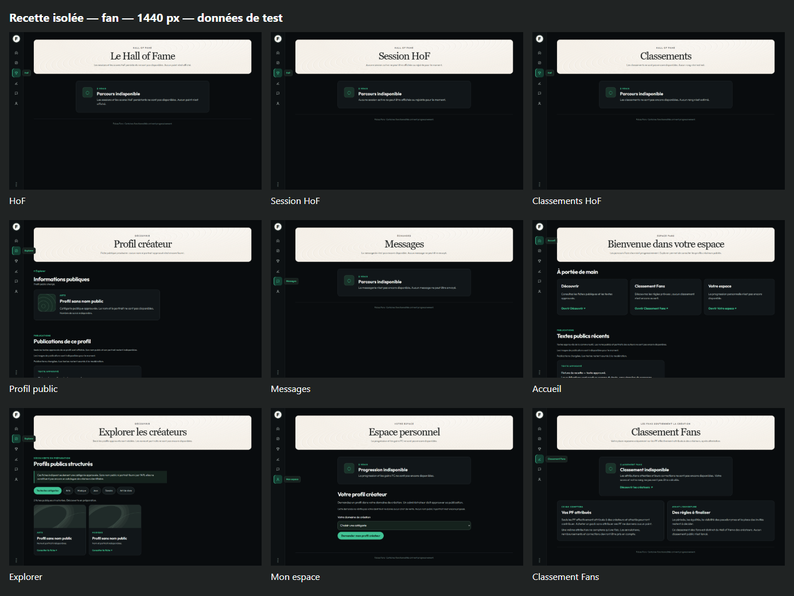
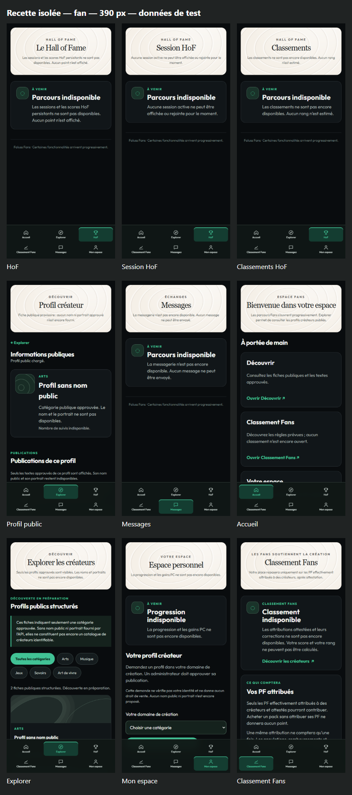
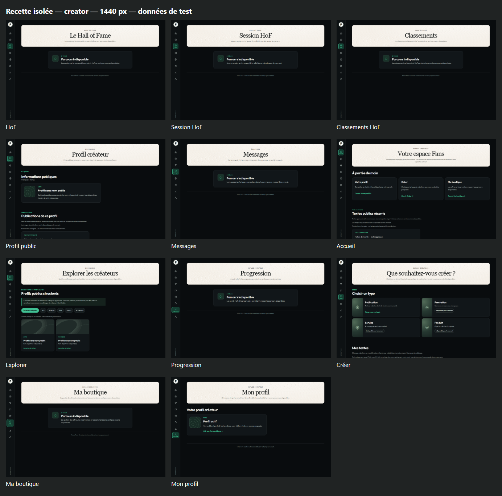
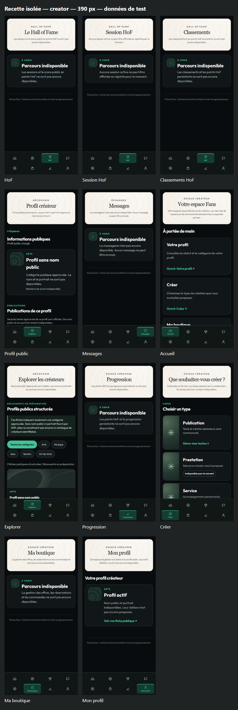

# Lot 14 — couverture visuelle du code courant

## Source et environnement

Code exporté de `198ea135e0ecac6b86ab7ac43310018ae7c9da33` (PR #101),
version d’en-tête conservée 0.6.3, le 29 septembre 2026. Aucune release publiée.
PHP 8.5.4 sous WSL, adaptateurs de `tests/Fans/Ui/recipe/router.php`,
Chromium 154.0.8037.58 sous Windows. Les rôles, profils et textes sont des
fixtures ; les formulaires texte et admission sont rendus disponibles dans
ce banc seulement. Les images et le compteur de suivis sont indisponibles
dans cette série ; leurs états disponibles ont leurs preuves aux lots 7 et 13.

**Aucun WordPress, Elementor, compte réel, SSO réseau ou site cible utilisé.**
Les cookies du banc ne constituent pas un mécanisme de rôle produit.

`visual-review.cjs` capture le viewport initial : 1440 × 900 ou 390 × 844.
Les vues mobiles restent défilables ; cette série ne remplace pas les captures
des formulaires et contrôles après défilement des lots 4, 6, 7 et 10.
Les assemblages montrent seulement les captures réduites avec leurs légendes,
sans ajout de contenu dans l’UI. Les quarante captures sont indexées dans
[screens.json](screens.json).

## Résultat de l’inspection

- Vingt vues, deux tailles : dix-huit vues des planches officielles, plus le
  Classement Fans demandé et la route Mon profil distincte du profil public.
- Chaque navigation a six accès Fan ou huit accès Créateur, une seule destination
  active et aucun débordement horizontal dans les quarante cas.
- Fond sombre, bandeau crème, titres sérif, accents verts et rail latéral du
  socle conservés. Sur mobile, navigation fixe en deux rangées, cartes empilées
  et retours de ligne lisibles. Le label Créateur reste sur le seul accès actif.
- Aucun nouveau défaut de mise en page constaté dans les quatre assemblages
  inspectés. Les contenus sous le pli et les actions restent couverts par les
  recettes ciblées ; cette inspection n’est pas un test de tous leurs états.

## Écarts explicites aux planches officielles

| Élément de référence | Code observé | Nature de l’écart |
| --- | --- | --- |
| Relief crème du bandeau | Motif graphique du socle #84, sans photographie extraite de la planche | Approximation visuelle conservée, pas une reproduction pixel à pixel |
| Profils nommés, portraits et galerie photographique | Catégories approuvées et fiches anonymes provisoires ; publications réelles via API | Identité éditoriale/modération absentes ; aucune personne inventée |
| Cartes de sessions, podiums, rangs et courbes | États indisponibles HoF/Progression/Classements | Moteurs et politiques absents ; densité volontairement différente, pas de faux score |
| Accueil avec messages, communauté et créations personnalisées | Accès réels et textes publics récents | Pas de fil personnalisé ni statistiques supposées |
| Messagerie conversationnelle | État indisponible explicite | Service, blocage/signalement et rétention absents |
| Choix de création illustrés | Quatre types distincts, texte raccordé et autres choix indisponibles | Pas de photo de substitution ; services commerciaux absents |
| Boutique avec offres et réservations | État indisponible | Pas de gestion propriétaire/réservation/achat ; refus serveur conservés |
| Progression Fan de la planche | PC indisponibles ; nouveau Classement Fans sur route distincte | Aucun mélange PF attribués/PC/euros ; classement non lancé |
| Navigation mobile | Adaptation du rail en deux rangées | Les planches fournies sont des planches ordinateur ; adaptation contrôlée à 320/390 px dans les lots précédents, sans preuve iPhone réel |

Ces écarts empêchent de présenter Fans comme un produit complet ou comme une
reproduction intégrale des planches. Ils sont reliés aux trois états de la
[matrice d’évaluation](../../../modules/FANS-48H-EVALUATION.md). La validation
visuelle cible, dont la typographie Safari, reste au propriétaire avant activation.

## Planches de contrôle

### Fan ordinateur

### Fan mobile

### Créateur ordinateur

### Créateur mobile

## Reproduction

Exporter le SHA indiqué dans un répertoire isolé et lancer le routeur de recette
en local selon le [lot 10](../lot-10/README.md). Choisir un répertoire temporaire
dans `FANS_UI_OUTPUT`, puis exécuter
`node tests/Fans/Ui/recipe/visual-review.cjs`. Aucun appel aux sites n’est nécessaire.
Le script échoue si le répertoire de sortie n’est pas explicitement choisi.

## Captures individuelles

| Vue | Ordinateur | Mobile |
| --- | --- | --- |
| creator — Accueil | [1440 px](creator-06-accueil-1440.png) | [390 px](creator-06-accueil-390.png) |
| creator — Ma boutique | [1440 px](creator-10-boutique-1440.png) | [390 px](creator-10-boutique-390.png) |
| creator — Classements HoF | [1440 px](creator-03-classements-1440.png) | [390 px](creator-03-classements-390.png) |
| creator — Créer | [1440 px](creator-09-creer-1440.png) | [390 px](creator-09-creer-390.png) |
| creator — Explorer | [1440 px](creator-07-explorer-1440.png) | [390 px](creator-07-explorer-390.png) |
| creator — HoF | [1440 px](creator-01-hof-1440.png) | [390 px](creator-01-hof-390.png) |
| creator — Session HoF | [1440 px](creator-02-session-1440.png) | [390 px](creator-02-session-390.png) |
| creator — Messages | [1440 px](creator-05-messages-1440.png) | [390 px](creator-05-messages-390.png) |
| creator — Mon profil | [1440 px](creator-11-mon-profil-1440.png) | [390 px](creator-11-mon-profil-390.png) |
| creator — Progression | [1440 px](creator-08-progression-1440.png) | [390 px](creator-08-progression-390.png) |
| creator — Profil public | [1440 px](creator-04-profil-1440.png) | [390 px](creator-04-profil-390.png) |
| fan — Profil public | [1440 px](fan-04-profil-1440.png) | [390 px](fan-04-profil-390.png) |
| fan — Accueil | [1440 px](fan-06-accueil-1440.png) | [390 px](fan-06-accueil-390.png) |
| fan — Classement Fans | [1440 px](fan-09-classement-fans-1440.png) | [390 px](fan-09-classement-fans-390.png) |
| fan — Classements HoF | [1440 px](fan-03-classements-1440.png) | [390 px](fan-03-classements-390.png) |
| fan — Mon espace | [1440 px](fan-08-espace-1440.png) | [390 px](fan-08-espace-390.png) |
| fan — Explorer | [1440 px](fan-07-explorer-1440.png) | [390 px](fan-07-explorer-390.png) |
| fan — HoF | [1440 px](fan-01-hof-1440.png) | [390 px](fan-01-hof-390.png) |
| fan — Session HoF | [1440 px](fan-02-session-1440.png) | [390 px](fan-02-session-390.png) |
| fan — Messages | [1440 px](fan-05-messages-1440.png) | [390 px](fan-05-messages-390.png) |
