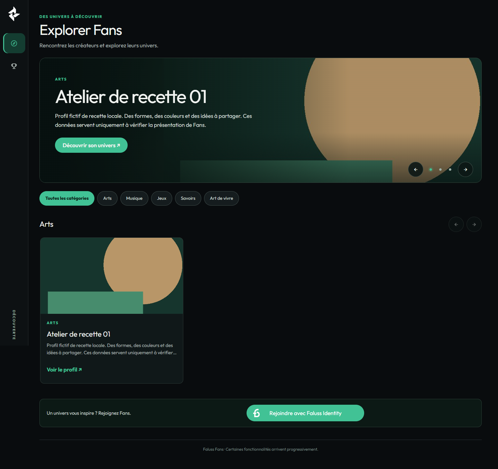
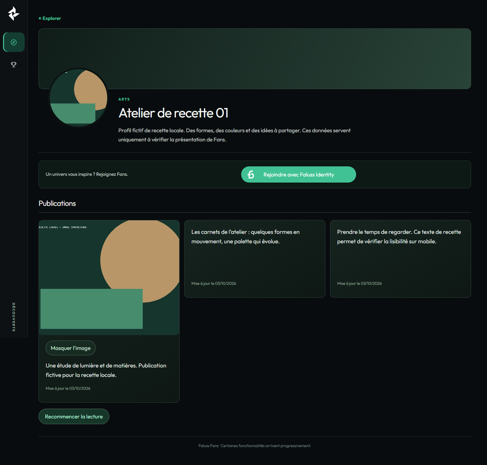

# Explorer et profil public — repasse en brouillon

Recette du 4 octobre 2026 (Paris), base `a8ae604e5571cc66d0eb086f6ed9d212800c7d54`, version publiée 0.12.1.
Une seule PR, **brouillon soumis à validation visuelle**. Aucune fusion ni release demandée pour ce lot.

## Périmètre et scénarios

- Explorer : hero, catégories réellement peuplées, rangées de dix fiches maximum, filtre existant pour voir la liste de la catégorie. Le bloc de publications est retiré uniquement d’Explorer.
- Profil public : zone graphique de couverture, portrait public distinct, identité/bio approuvées, actions existantes, connexion compacte et cartes de publications. Aucun changement du formulaire SSO.
- Positifs : invité et Fan lié, un créateur, plusieurs créateurs, aucun média public ; navigation vers le profil, filtre, clavier et tactile.
- Négatifs : aucune présentation approuvée, catégorie vide, profil absent/pending/suspendu, tentative de lecture privée ou de mutation sans permission/nonce ; modification en attente, refus et retrait éditorial.
- La sidebar, le shell, le CSS commun, les autres écrans, les comptes, les règles de modération et les permissions restent inchangés. Deux lectures additives, décrites ci-dessous, sont utilisées uniquement par Explorer et le profil public. Les appels aux rendus des deux pages passent par `FansUiDiscovery`. La branche `data-presentation="profile"` du lecteur ne s’applique qu’au profil public.

## Hero : règle **provisoire pour tests et recettes**

Arbitrage confirmé : **créateurs arrivés le plus récemment en premier** ; un seul créateur éligible occupe les trois slides. Cette règle n'est pas une politique éditoriale définitive, un classement HoF ou une mise en avant payante.

1. `GET /faluss-fans/v1/creators/discovery?per_page=3` sélectionne les profils actifs ayant une présentation approuvée et un nom public non vide. Les exclusions précèdent le tri et la limite SQL. Aucun nom dérivé du compte, du Faluss ID ou de l'e-mail.
2. Date retenue : `faluss_fans_creator_profiles.created_at`, écrite en UTC par `CreatorProfileService::create()` lors de la **première demande de profil Créateur Fans**, initialement en attente. Ce n'est ni `wp_users.user_registered`, ni la date du compte Identity, ni la date d'approbation éditoriale. Une modification, une suspension ou une réactivation ne rajeunit pas cette arrivée.
3. Ordre serveur exact : `created_at DESC, creator_id DESC`. À date identique, l'UUID sert uniquement de départage stable, jamais affiché et sans valeur de mérite. Deux arrivées de même seconde sont ainsi déterministes.
4. Trois profils au maximum ; deux profils donnent deux slides. **Un seul profil donne trois slides de ce même profil**, conformément à la consigne. Aucune rotation automatique.
5. Aucun profil admissible : pas de hero ni de carte anonyme.

**Point de remplacement futur :** la sélection ordonnée dans `EditorialService::discovery()` et la règle de répétition dans `hero()` (`assets/fans-ui-v2.js`). Les cartes et les contrôles de diffusion sont indépendants. Une future règle devra décider de sa date, du départage et de sa source ; aucune règle commerciale implicite.

## Lecture additive et « Voir tous »

La nouvelle route publique dépend des contrôles existants `EditorialModule::available()` et renvoie uniquement `{items, next_cursor}` avec la projection publique approuvée existante. Les anciennes routes `/creators` et `/creators/{id}` gardent leurs contrats et leurs consommateurs.

- `category` facultative, parmi les cinq catégories existantes ; `per_page` entre 1 et 20 (20 par défaut) ; `cursor` facultatif. Entrée invalide ou curseur d'une autre catégorie : 400. Réponses `no-store`.
- Curseur de position `d1.<category|all>.<date UTC>.<UUID>`, validé strictement et lié à la catégorie. Ce n'est pas un droit d'accès. Chaque page relit statut et présentation approuvée sous transaction. Filtre de continuation strict `<` sur date puis UUID ; aucune pagination par décalage.
- Explorer général : hero global de trois profils, première page de dix par catégorie ; catégories vides masquées. « Voir tous » apparaît si une page suivante existe et ouvre le filtre existant.
- Catégorie : pages de dix, commandes « Précédents » / « Suivants », numéro de page, dernière page désactivée et focus sur le titre après action. Le navigateur conserve seulement les curseurs précédents et une page de cartes ; aucun plafond de vingt sur le parcours complet.
- Catalogue vivant : une nouvelle arrivée devant le curseur sera visible après actualisation ; un retrait disparaît à la lecture suivante. Ce n'est pas un instantané figé de la base. Le retour en arrière relit lui aussi les permissions actuelles.

## Images des publications du profil

`GET /faluss-fans/v1/text-publications?creator_id=<id>&public_image=1` ajoute seulement **`has_public_image: bool`** aux cinq champs publics existants. L'option exige un filtre Créateur public ; valeur invalide ou usage sur une liste privée refusé. Sans option, les projections et les autres consommateurs sont inchangés.

Le service vérifie sous transaction le texte approuvé, le profil actif, l'association, le propriétaire, la révision approuvée de l'image, les prérequis de diffusion et le fichier privé normalisé attesté (intégrité comprise). Aucun identifiant d'image, chemin privé ou octet source ne sort dans la liste. Le dérivé public recontrôle ces conditions lors de la livraison : le booléen n'est pas une autorisation durable.

Sur le **profil public seulement**, seules les publications indiquées `true` reçoivent un contrôle image et un chargement séquentiel automatique, sans rejeu. Un texte seul ne déclenche aucune tentative d'image. Un retrait entre liste et livraison supprime le contrôle sur 404. Les limites JPEG/2 Mio/1280 px, annulations et révocations Blob demeurent. Les accueils conservent leur ancien chargement à la demande. Aucune URL privée n'est essayée ou déduite.

## Environnement et portée des preuves

- WordPress **7.1.2 réel**, thème Twenty Twenty-Five, PHP **8.5.4**, MariaDB privée via socket Unix, source physique et dépendances Composer vérifiées contre le lockfile.
- HTTP uniquement sur `127.0.0.1`, base/configuration/comptes créés pour cette recette. Aucun WordPress existant consulté ; trafic HTTP sortant et e-mails neutralisés.
- Chromium **155.0.8059.26** : ordinateur **1440 × 1000**, mobile **390 × 844** avec tests tactiles Chromium. Débordements également vérifiés à 320, 600, 700, 701 et 1024 px.
- Comparatifs historiques : avant = `main` ci-dessus, après = première version de la PR, à données et dimensions identiques. Révision 2 : même pile technique et dimensions, nouvelle base jetable élargie à plus de vingt profils. Pas de REST simulée pour les captures et parcours ci-dessous.
- Comptes Fan liés par la table SSO de la recette et cookies WordPress locaux. Ce n’est **pas** une nouvelle preuve d’authentification auprès d’Identity Me.
- Noms/bios explicitement marqués « recette », 37 profils éligibles synthétiques (35 Arts) et cinq cas exclus dans la révision 2 ; quatorze profils dans la recette initiale, image géométrique marquée « RECETTE LOCALE ». Ces données ne sont ni embarquées dans l’application ni destinées à la production. Dépôt multipart réel, approbation d’image, approbation éditoriale et approbation de publication via les routes existantes.
- Configuration opt-in **jetable** de test uniquement. Aucun flag de production, site, secret existant, compte réel, installation ou activation cible modifié.
- Elementor cible et appareils physiques Safari/iOS non testés. Le rendu sur `fans.faluss.me` reste à valider par le propriétaire.

## Résultats de la révision 2

- **317 tests PHPUnit / 5 324 assertions**, PHPStan sans erreur. Deux dépréciations PHP 8.5 déjà présentes dans la base ; lint, syntaxe JS, scan ciblé et diff contrôlés séparément.
- [SQL réel : 37 contrôles](revision-2/sql.json) : date du profil opposée à l'ancienneté du compte WP, égalités, trois plus récents hors ancienne limite, pagination complète de 35 Arts/37 au total, exclusions avant limite, curseur invalide, ancien contrat conservé ; images approuvées/textes seuls/détachées/pending/rejetées/retirées/révision obsolète/autre propriétaire/intégrité invalide.
- [Navigateur et nouvelles captures](revision-2/browser.json) : invité/Fan lié, 1440 × 1000 et 390 × 844, un/plusieurs créateurs, aucun média et catalogue vide. Les 35 Arts sont parcourus par « Voir tous » jusqu'à la quatrième page, puis retour, au clavier ; aucune requête image pour les textes seuls. La règle un profil → trois slides est vérifiée.
- [Interactions complémentaires](revision-2/interaction.json) : geste tactile Chromium réel, cinq largeurs intermédiaires, navigation clavier Explorer → profil → retour navigateur, pages inexistantes/en attente en 404. [Permissions rejouées](revision-2/permissions.json) : nonce forgé refusé, présentation approuvée conservée pendant révision/rejet, suspension en 404 et retrait éditorial sans fuite.
- **32 nouvelles captures**, 37 groupes navigateur, 37 contrôles SQL ; aucun événement JavaScript en erreur.
- Les captures `revision-2/` correspondent à cette correction. Les dossiers `before/` et `after/` restent la preuve **historique de la première version de #137**, sans prétendre prouver le nouveau tri ou la nouvelle pagination.

### Nouvelles captures à valider

| Écran / état | Ordinateur | Mobile |
|---|---|---|
| Explorer, un créateur, invité | [1440](revision-2/one-guest-explorer-1440.png) | [390](revision-2/one-guest-explorer-390.png) |
| Explorer, plusieurs, Fan lié | [1440](revision-2/many-fan-explorer-1440.png) | [390](revision-2/many-fan-explorer-390.png) |
| Profil avec média, invité | [1440](revision-2/one-guest-profile-1440.png) | [390](revision-2/one-guest-profile-390.png) |
| Profil avec média, Fan lié | [1440](revision-2/many-fan-profile-1440.png) | [390](revision-2/many-fan-profile-390.png) |
| Profil sans média, invité | [1440](revision-2/no-media-guest-profile-1440.png) | [390](revision-2/no-media-guest-profile-390.png) |
| Voir tous, troisième page, Fan lié | [1440](revision-2/pagination-fan-1440.png) | [390](revision-2/pagination-fan-390.png) |

## Résultats historiques de la première version

- **315 tests PHP / 5 302 assertions**, PHPStan sans erreur, lint PHP des fichiers modifiés, syntaxe JavaScript et `git diff --check`. Deux dépréciations PHP 8.5 déjà présentes dans les 314 tests de la base.
- [Avant : 24 cas](before/browser.json), [après : 27 groupes de contrôles](after/browser.json), [permissions réelles : 3 groupes](permissions.json), [états vides/focus/effacement : 3 groupes](edgecases.json).
- 48 captures avant/après : chaque combinaison scénario × invité/Fan × Explorer/profil × ordinateur/mobile, plus quatre captures de profil sans publication (`after/empty-publications-{guest|fan}-{1440|390}.png`).
- Carousel : une seule slide exposée à la fois, boutons nommés, focus conservé après Entrée, aucun mouvement automatique. Rangées : défilement natif tactile, flèches et clavier, « Voir tous », catégories vides, aucun débordement global.
- API et navigation réelles Explorer → profil → Explorer. Formulaires invités : méthode POST, action et noms des champs inchangés dans les relevés ; aucune valeur de nonce enregistrée. Le code SSO reste hors diff.
- Révision éditoriale en attente puis rejetée : projection publique approuvée strictement inchangée, et vérifiée dans les deux pages. Données privées refusées aux invités et Fans, nonce forgé refusé.
- Profil absent/pending/suspendu : **HTTP 404 de la page**, y compris invité/Fan/admin, et portrait refusé. Le retrait de la **présentation éditoriale** ne supprime pas le profil actif : comme avant, page 200 sans ancienne identité ; il disparaît d’Explorer. Ne pas confondre retrait éditorial et retrait du profil.
- HoF invité, accueil Fan, progression Créateur et profil propriétaire : captures à 1440 px **identiques pixel pour pixel** avant/après (SHA-256 dans les deux JSON). Aucun chargement du CSS spécifique sur ces pages. Publications conservées sur l’accueil et les profils.

## Captures comparatives

Les images entières incluent la navigation fixe existante. Sur une capture mobile pleine page, la barre fixe apparaît à la limite de la fenêtre de 844 px, pas en pied du document entier. Les portraits hors écran sont chargés lorsqu’ils entrent dans la fenêtre ; une capture pleine page peut donc montrer leur fond graphique avant le premier défilement.

| État | Explorer avant / après | Profil avant / après |
|---|---|---|
| Un créateur, invité, ordinateur | [Avant](before/one-guest-explorer-1440.png) · [Après](after/one-guest-explorer-1440.png) | [Avant](before/one-guest-profile-1440.png) · [Après](after/one-guest-profile-1440.png) |
| Un créateur, invité, mobile | [Avant](before/one-guest-explorer-390.png) · [Après](after/one-guest-explorer-390.png) | [Avant](before/one-guest-profile-390.png) · [Après](after/one-guest-profile-390.png) |
| Plusieurs, Fan, ordinateur | [Avant](before/many-fan-explorer-1440.png) · [Après](after/many-fan-explorer-1440.png) | [Avant](before/many-fan-profile-1440.png) · [Après](after/many-fan-profile-1440.png) |
| Plusieurs, Fan, mobile | [Avant](before/many-fan-explorer-390.png) · [Après](after/many-fan-explorer-390.png) | [Avant](before/many-fan-profile-390.png) · [Après](after/many-fan-profile-390.png) |
| Aucun média, invité, ordinateur | [Avant](before/no-media-guest-explorer-1440.png) · [Après](after/no-media-guest-explorer-1440.png) | [Avant](before/no-media-guest-profile-1440.png) · [Après](after/no-media-guest-profile-1440.png) |
| Aucun média, Fan, mobile | [Avant](before/no-media-fan-explorer-390.png) · [Après](after/no-media-fan-explorer-390.png) | [Avant](before/no-media-fan-profile-390.png) · [Après](after/no-media-fan-profile-390.png) |

Toutes les autres combinaisons suivent `{one|many|no-media}-{guest|fan}-{explorer|profile}-{1440|390}.png` dans `before/` et `after/`.

### Aperçus de la révision 2

## Écarts avec les planches et capacités manquantes

| Élément | Écart et cause |
|---|---|
| Couverture du profil | Aucun champ de couverture dans la projection publique. Fond graphique sans inventer de photo ni transformer une image privée en couverture. |
| Photographies du hero | Portrait approuvé, s’il est disponible, avec recadrage de présentation ; sinon composition abstraite. Aucune récupération des photographies fictives de la planche. |
| Mosaïque de publications | Grille adaptative de textes et images autorisées. Le booléen public additif permet maintenant de charger les médias autorisés, un par un. Il manque encore une description alternative éditoriale approuvée ; aucun contenu d'image n'est inventé. La densité de la mosaïque dépend des publications et images réellement disponibles. |
| Liens sociaux, localisation, badge en ligne | Ces données publiques ne sont pas disponibles ; aucune invention. |
| Suivre / message | Aucun nouveau droit/action. Le compteur réel s’affiche seulement si son API répond valablement ; aucune action de suivi ajoutée. Le lien de demande de message conserve exactement la condition serveur existante. |
| HoF, boutique, réservation, produits, prix | Services/contrats hors du périmètre demandé ; aucun bloc de remplissage. |
| Catégories | Les cinq catégories actuelles sont utilisées ; aucune catégorie de maquette sans donnée. |
| Ordre d’arrivée | Règle de recette provisoire, désormais exacte côté serveur et paginée ; définition détaillée plus haut. |

## Reproduire sans site existant

1. Préparer une copie physique du commit avec `vendor` conforme à `composer.lock`, PHP, MariaDB, WP-CLI et le cœur/thème WordPress locaux.
2. Démarrer `tests/Fans/Profiles/recipe/admission-wordpress.py --source <copie> --core <wordpress> --cli <wp-cli.phar> --backoffice --keep`. Base, comptes et serveur loopback sont jetables. Dans cette configuration uniquement : retirer l'opt-in Store et activer le prérequis de diffusion d'image pour tester le service existant. Filtre MU de recette `rest_url` : remplacer `https://fans.example.test` par `WP_SITEURL` ; ne changer aucun code de service ni configuration cible.
3. WP-CLI `eval-file tests/Fans/Ui/recipe/discovery-seed.php <root>/session.json --use-include`, puis `discovery-v2-seed.php` avec les mêmes arguments. Exécuter `discovery-media.cjs` avec `BASE` loopback et `ROOT` : dépôt multipart, approbations image/éditorial/publication réelles.
4. WP-CLI `eval-file tests/Fans/Ui/recipe/discovery-v2-sql.php <root>/session.json <résultat.json> --use-include` vérifie les contrats sur la vraie base ; les mutations négatives de recette sont restaurées.
5. Lancer `discovery-v2-wordpress.cjs` avec `BASE`, `ROOT`, `REPO_WSL` et `OUT`. Il applique les états via `discovery-state.php`, sans changer les flags entre captures. Puis `discovery-v2-interaction.cjs` pour geste tactile, autres largeurs et retour navigateur. Pour rejouer les tests de permissions historiques : remettre l'état `one`, puis `discovery-permissions.cjs` ; ses mutations sont terminales.
6. Poser `<root>/STOP`, attendre l'arrêt des processus et supprimer uniquement cette racine jetable. Ne pas conserver cookies, configuration, base ou secrets locaux avec les preuves.

Retour arrière : retirer les commits de la PR. Aucun schéma, migration, cron, flag, numéro de version ou dépendance modifié. Les deux extensions de lecture sont additives ; les consommateurs existants gardent leurs réponses.
