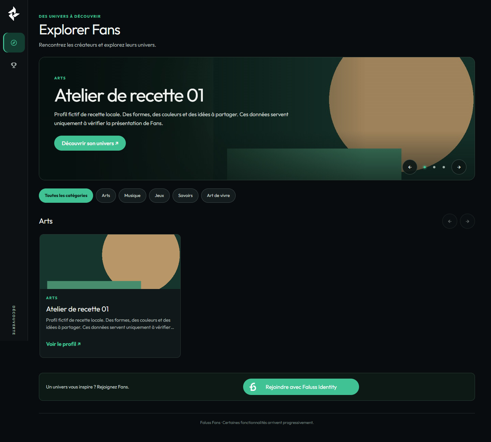
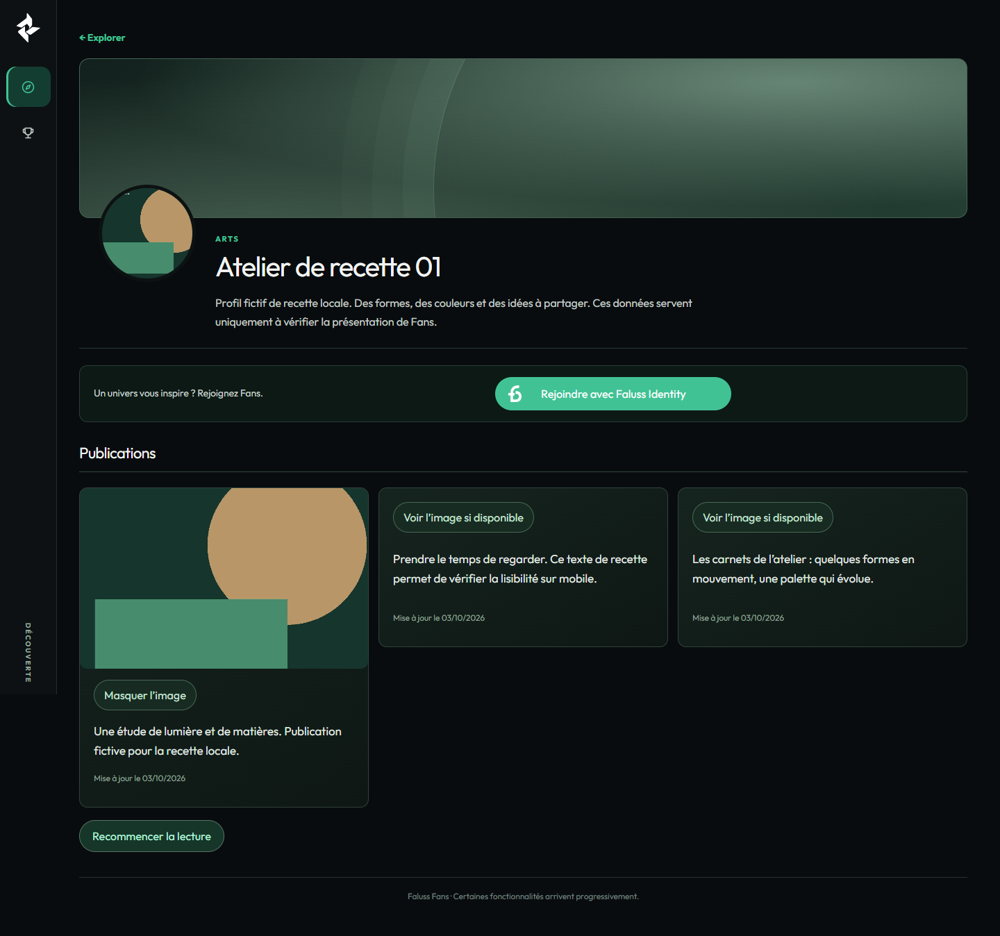

# Explorer et profil public — repasse en brouillon

Recette du 4 octobre 2026 (Paris), base `a8ae604e5571cc66d0eb086f6ed9d212800c7d54`, version publiée 0.12.1.
Une seule PR, **brouillon soumis à validation visuelle**. Aucune fusion ni release demandée pour ce lot.

## Périmètre et scénarios

- Explorer : hero, catégories réellement peuplées, rangées de dix fiches maximum, filtre existant pour voir la liste de la catégorie. Le bloc de publications est retiré uniquement d’Explorer.
- Profil public : zone graphique de couverture, portrait public distinct, identité/bio approuvées, actions existantes, connexion compacte et cartes de publications. Aucun changement du formulaire SSO.
- Positifs : invité et Fan lié, un créateur, plusieurs créateurs, aucun média public ; navigation vers le profil, filtre, clavier et tactile.
- Négatifs : aucune présentation approuvée, catégorie vide, profil absent/pending/suspendu, tentative de lecture privée ou de mutation sans permission/nonce ; modification en attente, refus et retrait éditorial.
- Les routes, API, sidebar, shell, CSS commun, comptes, modération, permissions, messagerie et paiements restent inchangés. Les appels aux rendus des deux pages passent par `FansUiDiscovery`. La branche `data-presentation="profile"` du lecteur ne s’applique qu’au profil public.

## Hero : règle **provisoire pour tests et recettes**

Arbitrage utilisateur dans cette conversation : utiliser temporairement l’ordre d’arrivée, et répéter le seul créateur disponible sur chaque slide. Cette règle **n’est pas une politique éditoriale définitive**.

1. Lire les cinq listes publiques par catégorie, via les API existantes.
2. Garder les profils actifs dont la projection éditoriale approuvée contient un nom public valide. Aucun nom dérivé du compte, du Faluss ID ou de l’e-mail.
3. Trier les données reçues par `created_at` croissant (date de création du profil Fans ; ce n’est pas la date du compte Identity). En cas d’égalité, UUID comme départage technique stable, jamais affiché.
4. Retenir les trois premiers au maximum. Avec deux profils, deux slides. Avec un seul profil, trois slides reprennent **ce même profil**, conformément à la dernière consigne, sans simuler trois créateurs. Aucun autoplay.
5. Aucun profil admissible : pas de hero ni de carte anonyme de découverte.

**Point de remplacement futur :** `hero()` et le comparateur `byArrival` dans `assets/fans-ui-v2.js`. Le choix des profils est séparé du rendu des cartes, des liens et des contrôles de diffusion. Une future règle devra préciser la sélection, les égalités et sa source de données ; elle ne doit pas être déduite du HoF, des PF, d’un paiement ou de l’identité technique.

**Limite réelle :** le serveur renvoie vingt profils maximum par catégorie, actuellement sélectionnés par UUID, sans pagination publique ni tri serveur par arrivée. Le tri chronologique est donc exact **sur les profils reçus**, pas garanti sur un catalogue dépassant ce plafond. « Voir tous » réutilise le filtre et présente au maximum ces vingt résultats dans une grille ; la vue générale garde dix cartes par rangée. Un tri global et une sélection éditoriale persistée nécessiteraient un contrat de liste étendu, hors de cette PR.

## Environnement et portée des preuves

- WordPress **7.1.2 réel**, thème Twenty Twenty-Five, PHP **8.5.4**, MariaDB privée via socket Unix, source physique et dépendances Composer vérifiées contre le lockfile.
- HTTP uniquement sur `127.0.0.1`, base/configuration/comptes créés pour cette recette. Aucun WordPress existant consulté ; trafic HTTP sortant et e-mails neutralisés.
- Chromium **155.0.8059.26** : ordinateur **1440 × 1000**, mobile **390 × 844** avec tests tactiles Chromium. Débordements également vérifiés à 320, 600, 700, 701 et 1024 px.
- Avant = source de `main` ci-dessus ; après = diff de la PR. Même base, données, cookies locaux, navigateur, polices, dimensions. Pas de REST simulée pour les captures et parcours ci-dessous.
- Comptes Fan liés par la table SSO de la recette et cookies WordPress locaux. Ce n’est **pas** une nouvelle preuve d’authentification auprès d’Identity Me.
- Noms/bios explicitement marqués « recette », quatorze profils synthétiques, image géométrique marquée « RECETTE LOCALE ». Ces données ne sont ni embarquées dans l’application ni destinées à la production. Dépôt multipart réel, approbation d’image, approbation éditoriale et approbation de publication via les routes existantes.
- Configuration opt-in **jetable** de test uniquement. Aucun flag de production, site, secret existant, compte réel, installation ou activation cible modifié.
- Elementor cible et appareils physiques Safari/iOS non testés. Le rendu sur `fans.faluss.me` reste à valider par le propriétaire.

## Résultats

- **315 tests PHP / 5 302 assertions**, PHPStan sans erreur, lint PHP des fichiers modifiés, syntaxe JavaScript et `git diff --check`. Deux dépréciations PHP 8.5 déjà présentes dans les 314 tests de la base.
- [Avant : 24 cas](before/browser.json), [après : 27 groupes de contrôles](after/browser.json), [permissions réelles : 3 groupes](permissions.json), [états vides/focus/effacement : 3 groupes](edgecases.json).
- 48 captures avant/après : chaque combinaison scénario × invité/Fan × Explorer/profil × ordinateur/mobile, plus quatre captures de profil sans publication (`after/empty-publications-{guest|fan}-{1440|390}.png`).
- Carousel : une seule slide exposée à la fois, boutons nommés, focus conservé après Entrée, aucun mouvement automatique. Rangées : défilement natif tactile, flèches et clavier, « Voir tous », catégories vides, aucun débordement global.
- API et navigation réelles Explorer → profil → Explorer. Formulaires invités : méthode POST, action et noms des champs inchangés dans les relevés ; aucune valeur de nonce enregistrée. Le code SSO reste hors diff.
- Révision éditoriale en attente puis rejetée : projection publique approuvée strictement inchangée, et vérifiée dans les deux pages. Données privées refusées aux invités et Fans, nonce forgé refusé.
- Profil absent/pending/suspendu : **HTTP 404 de la page**, y compris invité/Fan/admin, et portrait refusé. Le retrait de la **présentation éditoriale** ne supprime pas le profil actif : comme avant, page 200 sans ancienne identité ; il disparaît d’Explorer. Ne pas confondre retrait éditorial et retrait du profil.
- HoF invité, accueil Fan, progression Créateur et profil propriétaire : captures à 1440 px **identiques pixel pour pixel** avant/après (SHA-256 dans les deux JSON). Aucun chargement du CSS spécifique sur ces pages. Publications conservées sur l’accueil et les profils.

## Captures comparatives

Les images entières incluent la navigation fixe existante. Sur une capture mobile pleine page, la barre fixe apparaît à la limite de la fenêtre de 844 px, pas en pied du document entier. Les portraits hors écran sont chargés lorsqu’ils entrent dans la fenêtre ; une capture pleine page peut donc montrer leur fond graphique avant le premier défilement.

| État | Explorer avant / après | Profil avant / après |
|---|---|---|
| Un créateur, invité, ordinateur | [Avant](before/one-guest-explorer-1440.png) · [Après](after/one-guest-explorer-1440.png) | [Avant](before/one-guest-profile-1440.png) · [Après](after/one-guest-profile-1440.png) |
| Un créateur, invité, mobile | [Avant](before/one-guest-explorer-390.png) · [Après](after/one-guest-explorer-390.png) | [Avant](before/one-guest-profile-390.png) · [Après](after/one-guest-profile-390.png) |
| Plusieurs, Fan, ordinateur | [Avant](before/many-fan-explorer-1440.png) · [Après](after/many-fan-explorer-1440.png) | [Avant](before/many-fan-profile-1440.png) · [Après](after/many-fan-profile-1440.png) |
| Plusieurs, Fan, mobile | [Avant](before/many-fan-explorer-390.png) · [Après](after/many-fan-explorer-390.png) | [Avant](before/many-fan-profile-390.png) · [Après](after/many-fan-profile-390.png) |
| Aucun média, invité, ordinateur | [Avant](before/no-media-guest-explorer-1440.png) · [Après](after/no-media-guest-explorer-1440.png) | [Avant](before/no-media-guest-profile-1440.png) · [Après](after/no-media-guest-profile-1440.png) |
| Aucun média, Fan, mobile | [Avant](before/no-media-fan-explorer-390.png) · [Après](after/no-media-fan-explorer-390.png) | [Avant](before/no-media-fan-profile-390.png) · [Après](after/no-media-fan-profile-390.png) |

Toutes les autres combinaisons suivent `{one|many|no-media}-{guest|fan}-{explorer|profile}-{1440|390}.png` dans `before/` et `after/`.

### Aperçus après

## Écarts avec les planches et capacités manquantes

| Élément | Écart et cause |
|---|---|
| Couverture du profil | Aucun champ de couverture dans la projection publique. Fond graphique sans inventer de photo ni transformer une image privée en couverture. |
| Photographies du hero | Portrait approuvé, s’il est disponible, avec recadrage de présentation ; sinon composition abstraite. Aucune récupération des photographies fictives de la planche. |
| Mosaïque de publications | Grille adaptative de textes et images autorisées. Le contrat texte ne signale ni présence d’image ni description alternative approuvée. La vérification explicite par bouton est conservée, sans préchargement automatique de dérivés ni contournement de la limite de génération. |
| Liens sociaux, localisation, badge en ligne | Ces données publiques ne sont pas disponibles ; aucune invention. |
| Suivre / message | Aucun nouveau droit/action. Le compteur réel s’affiche seulement si son API répond valablement ; aucune action de suivi ajoutée. Le lien de demande de message conserve exactement la condition serveur existante. |
| HoF, boutique, réservation, produits, prix | Services/contrats hors du périmètre demandé ; aucun bloc de remplissage. |
| Catégories | Les cinq catégories actuelles sont utilisées ; aucune catégorie de maquette sans donnée. |
| Ordre d’arrivée | Règle de recette provisoire et bornée par le plafond de liste, détaillée plus haut. |

## Reproduire sans site existant

1. Préparer une copie physique du commit de base avec `vendor` correspondant à `composer.lock`. Utiliser le cœur WP, WP-CLI, PHP et MariaDB locaux.
2. Démarrer `tests/Fans/Profiles/recipe/admission-wordpress.py --source <copie> --core <wordpress> --cli <wp-cli.phar> --backoffice --keep`. Le script crée une base privée, des identités de recette et un serveur loopback. Dans **cette seule configuration jetable**, retirer l’opt-in Store et ajouter l’opt-in de diffusion d’image. Ajouter au MU-plugin de recette le filtre `rest_url` remplaçant `https://fans.example.test` par `WP_SITEURL` pour le transport loopback ; ne changer aucun code de service.
3. Exécuter avec WP-CLI `eval-file tests/Fans/Ui/recipe/discovery-seed.php <root>/session.json --use-include`, puis `discovery-media.cjs` avec `BASE` (loopback) et `ROOT`. Le second script effectue le dépôt multipart et les décisions via WordPress réel.
4. Exécuter `discovery-wordpress.cjs` avec `BASE`, `ROOT`, `REPO_WSL`, `OUT`, `STAGE=before`. Il applique les états contrôlés avec `discovery-state.php`, sans changer de flag entre captures.
5. Copier uniquement les six fichiers UI de ce diff dans le plugin jetable. Exécuter le même script avec `STAGE=after` ; il compare également les quatre écrans hors périmètre et les formulaires. Puis exécuter `discovery-permissions.cjs` et `discovery-edgecases.cjs` : leurs mutations sont terminales pour la recette.
6. Poser `<root>/STOP`, attendre l’arrêt des deux processus, puis supprimer cette racine jetable seulement. Ne pas conserver les cookies, `wp-config.php`, la base ni les secrets locaux avec les captures.

Retour arrière : retirer le commit UI. Aucun schéma, migration, API, flag, cron ni dépendance ajouté.
