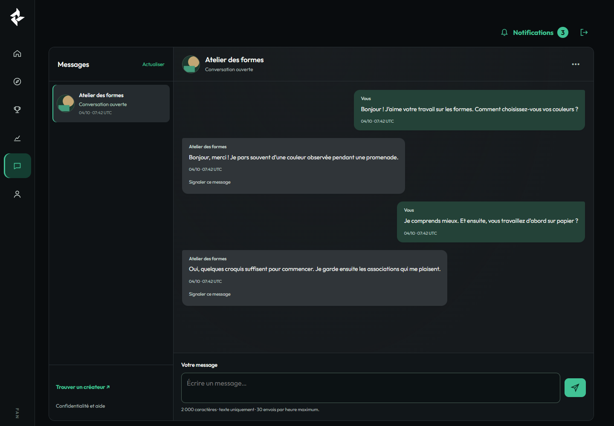
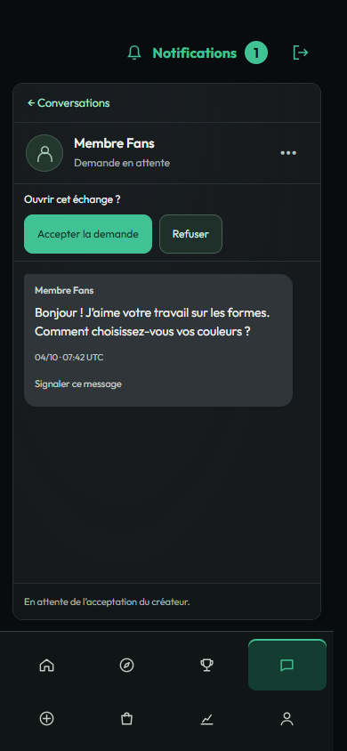

# Messagerie Fans — repasse V2 (brouillon)

Base : `7821460193ef806b8b5eb30e5864cd98e6f25e6d` (0.12.2). Référence : planche
FANS-Messagerie-V2 fournie par l’utilisateur. Validation visuelle attendue avant
Ready for review, fusion ou publication. Aucun site consulté ou modifié.

## Composition et périmètre

- Sidebar globale Fans conservée : mêmes icônes, dimensions, routes, états et aide tactile.
- Panneau de messagerie joint : seconde sidebar intérieure, liste défilante,
  conversation avec en-tête, bulles, demandes et actions d’acceptation/refus,
  saisie textuelle en bas. État vide discret dans le panneau de lecture.
- Mobile : liste d’abord, conversation séparée, lien « Conversations » pour revenir.
  Défilement de l’historique indépendant du compositeur. Formulaires HTML natifs,
  utilisables sans JavaScript ; libellés accessibles et commandes au clavier.
- « Confidentialité et aide » dans la liste ; menu de conversation pour blocage,
  dossiers et actualisation ; signalement sur chaque message reçu. Rétention et
  voies de recours existantes conservées.
- Uniquement les vues de messagerie, leur projection visuelle des correspondants,
  leurs assets et tests. Deux raccordements conditionnels dans `FansUiView` :
  chargement du JS de messagerie et classe de page. Aucun changement des API,
  des moteurs, schémas, quotas, flags, cron, permissions ou de la sidebar.

## Données et écarts assumés avec la planche

| Planche | Interface livrée | Cause réelle |
|---|---|---|
| Nombreux correspondants photographiés | Conversations réellement renvoyées, portraits publics approuvés côté Créateur | Pas de personnes ni conversations ajoutées pour remplir la liste |
| Nom et portrait des Fans | « Membre Fans » et silhouette neutre | La projection privée ne fournit aucune identité publique approuvée du Fan ; plusieurs Fans peuvent donc avoir le même libellé générique |
| Aperçu du dernier message, non-lus | État de l’échange et date du dernier envoi | Aucun aperçu ni marqueur de lecture dans le contrat actuel |
| Recherche et filtres | Omis | Pas de recherche privée ni filtre serveur dans le périmètre ; aucun contrôle décoratif |
| Temps réel, présence, abonnements | Actualisation explicite, pagination existante | Pas de présence/temps réel/preuve d’abonnement consommable ; aucun statut « en ligne » |
| Photos dans les messages, liens commerciaux | Texte uniquement | Contrat livré textuel ; pas de média, paiement ou remerciement |
| Sidebar compacte de la planche | Sidebar actuellement livrée, inchangée | Périmètre explicite : ne pas la retoucher |

Les noms/portraits des Créateurs passent uniquement par `EditorialService::publicById`
et le dérivé public `creators/{id}/portrait/{revision}`. Révision non approuvée,
retrait ou absence : aucun champ privé de remplacement. Les portraits de capture
sont des formes géométriques de recette, approuvées par les vrais services ; ils
ne représentent pas des comptes du site. La cloche globale affiche les événements
réellement produits par ces recettes, pas un compteur de non-lus de conversation.

La liste garde l’ordre et la pagination fournis par l’API (20 conversations par
page). L’historique se lit par pages de 50, avec suite et retour au début ; il ne
prétend pas avoir chargé automatiquement l’intégralité ni la dernière page.

## Scénarios positifs et négatifs

Avant implémentation : conserver les mêmes champs/nonce/POST et tester liste vide,
demande Fan, acceptation Créateur, réponse bilatérale, retour mobile, scroll et
composer ; refuser envoi avant acceptation, accès tiers, nonce invalide, champ
forgé ; vérifier signalement, recours, blocage et lecture quand les envois ferment.

Recette reproductible :

1. Checkout isolé avec dépendances Composer correspondant au lock.
2. `tests/Fans/Profiles/recipe/admission-wordpress.py --source <checkout> --core <wordpress> --cli <wp-cli.phar> --backoffice --keep`.
3. Sur **la nouvelle instance jetable seulement** : `layout-prepare.py --root <root renvoyé> --base <loopback renvoyé> --cli <wp-cli.phar>`.
4. Depuis Windows, avec Playwright/Chrome : `BASE=<loopback> ROOT=<root> OUT=<preuves> node tests/Fans/Messaging/recipe/layout-wordpress.cjs`.
5. Arrêt via fichier `STOP` dans cette instance ; supprimer ensuite cette instance
   et ses sessions privées. Ne pas versionner `session.json`, cookies ou nonces.

Le script navigateur interdit toute destination autre que loopback. Pour les liens
et formulaires, seul l’hôte fictif `fans.example.test` est remplacé par loopback
par la recette ; chemin, méthode, champs, nonce, services et SQL restent réels.
La préparation atteste une **politique de fixture**, jamais la politique opérateur
ni les flags d’une installation. Aucun SSO central n’est sollicité.

## Environnement et résultats

- WordPress 7.1.2, PHP 8.5.4, MariaDB 11.8.6, thème Twenty Twenty-Five ; base privée
  InnoDB sur socket local. Comptes WordPress et liens SSO synthétiques distincts.
- Chromium 155.0.8059.26. Captures 1440 × 1000 et 390 × 844 ; débordements vérifiés
  aussi à 320, 700, 701 et 1024 pixels.
- Résultats détaillés : [browser.json](browser.json). Formulaires réels, portrait
  approuvé, brouillon éditorial invisible, pagination 50 + 7, confidentialité,
  refus d’accès, clavier, tactile émulé, brouillon conservé lors du redimensionnement.
- **66 assertions navigateur/HTTP** réussies ; **317 tests PHP / 5 324 assertions** réussis, avec deux dépréciations signalées sous PHP 8.5. PHPStan sans erreur, lint des quatre PHP modifiés/ajoutés, syntaxe JS/CJS, contrat JS existant, scan ciblé de secrets et `git diff --check` valides. Vendor copié physiquement dans le checkout Linux isolé (aucune jonction Windows).
- [Empreintes du code réellement servi](runtime-sha256.json), vérifiées contre le diff local après les dernières captures.
- Limites : aucune preuve sur le site cible ou Elementor cible ; le rétrécissement
  du viewport vérifie la place du compositeur mais ne remplace pas une recette du
  clavier logiciel sur iPhone/Android physique. Pas de modification de production.

## Captures

| État | Fan ordinateur | Fan mobile | Créateur ordinateur | Créateur mobile |
|---|---|---|---|---|
| Aucun échange | [Capture](fan-empty-1440.png) | [Capture](fan-empty-390.png) | [Capture](creator-empty-1440.png) | [Capture](creator-empty-390.png) |
| Demande en attente | [Capture](fan-pending-1440.png) | [Capture](fan-pending-390.png) | [Capture](creator-pending-1440.png) | [Capture](creator-pending-390.png) |
| Échange accepté | [Capture](fan-accepted-1440.png) | [Capture](fan-accepted-390.png) | [Capture](creator-accepted-1440.png) | [Capture](creator-accepted-390.png) |
| Nouvelle demande | [Capture](fan-request-1440.png) | [Capture](fan-request-390.png) | — | — |
| Retour à la liste | — | [Capture](fan-list-390.png) | — | [Capture](creator-list-390.png) |

## Compatibilité et retour arrière

Aucune migration ou dépendance. Me, Hub, Elementor et les autres routes Fans ne
chargent pas ces styles de messagerie. Les formulaires réutilisent exactement les
contrôles existants. Un revert de cette PR restaure la présentation antérieure
sans toucher aux conversations, blocages, preuves, recours ou tâches de purge.
