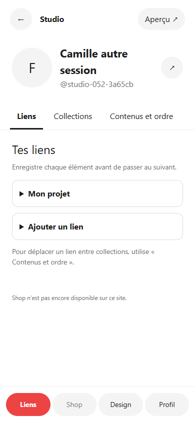
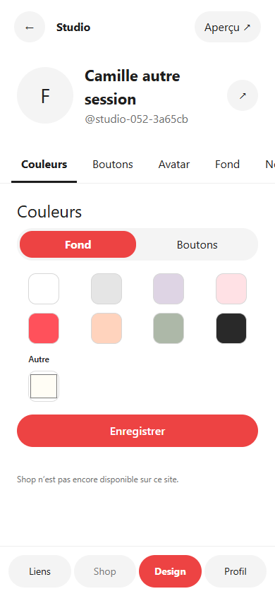
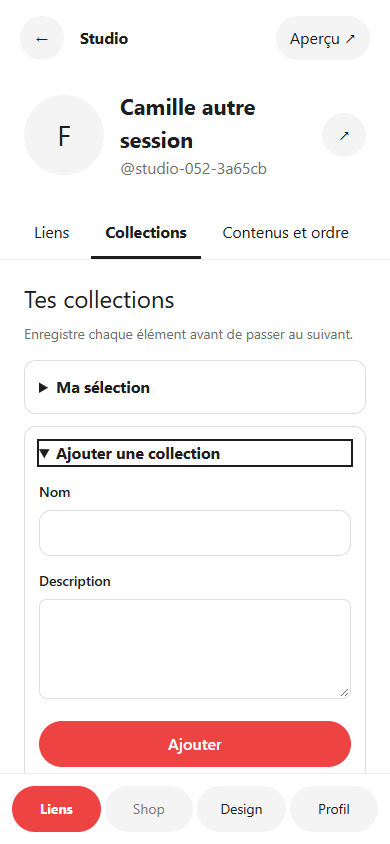

# Recette corrective 0.5.2 — environnement local uniquement

## Périmètre et environnement

Exécution le 25 septembre 2026, copie WordPress jetable sur `127.0.0.1:8092` : WordPress 7.1.2, MariaDB 11.8.6 (InnoDB), PHP 8.5.4, Elementor 4.3.1, Identity / Link V4 / Catalog / Me Studio activés. Comptes et cartes de fixture créés pour cette recette. Courriels interceptés par un `pre_wp_mail` **local**, pas de réception dans une boîte réelle. Les captures ne constituent ni une recette iPhone physique ni une preuve portant sur les données/médias/configurations de production.

Aucune connexion ni modification sur faluss.me ou faluss.com ; aucun flag de ces sites changé. La livraison du paquet passe par le workflow GitHub officiel existant.

## Constats du propriétaire à distinguer

- Compte publié `/origin` : OTP et accès Studio fonctionnent dans son essai 0.5.1.
- Ancien compte provisoire inachevé : reçoit l’OTP mais ne peut toujours pas le valider ; ancienne session avec `studio_unavailable`.
- **Nouveau compte via le SSO du Hub sur iPhone** : atteint « Dernier regard » Atomique ; **publication non testée**.
- Catalogue : seul le média Instagram a été ajouté. Les mentions de médias absents pour les autres réseaux sont **attendues**. Aucune icône de remplacement ajoutée.

## Connexion : observation avant et après

| Cas | 0.5.1 locale | 0.5.2 locale |
| --- | --- | --- |
| Publié, inachevé actif, inachevé pending, nouveau | OTP valide accepté | Accepté ; identité/handle/brouillon conservés pour l’existant |
| Suspended / utilisateur privilégié | Suspended refusé ; code consommé | Refus maintenu, aucune réactivation ni session |
| Panne SQL injectée dans l’activation Registry après OTP valide | OTP consommé ; même code refusé à la tentative suivante | Transaction annulée ; preuve pending ; même code accepté après retrait de la panne |
| Création WP suivie de panne Registry ou exception `user_register` | Non rejoué dans la comparaison ancienne | Annulation de la création et purge du cache, y compris avant retour de l’ID WP ; nouvelle tentative réussie |
| Nonce, cookie absents/invalides, expiré, remplacé, consommé, cinq essais | Protections existantes | Refus vérifiés ; cinq essais maximum |

Sources : [avant 0.5.1](otp-before-051.json), [après 0.5.2](otp-after-052.json), script `tests/Identity/passwordless-runtime.php`. Les stages `otp_rejected` sur les lignes positives proviennent du **test de rejeu après succès**, pas d’un échec de leur première connexion.

La panne Registry est une **injection contrôlée**, qui démontre le défaut de consommation prématurée. Les états de base des comptes inachevés passent aussi en 0.5.1 locale. **La cause de l’incident réel signalé n’est donc pas confirmée.** Aucun compte réel n’a été supprimé, recréé ou réinitialisé.

## Parcours HTTP et reprise

- Publié : formulaire `/login/`, envoi capturé localement, validation OTP, cookie de session, Studio V3.
- Inachevé `pending`, handle revendiqué et curseur `wizard_atomic_wallpaper` : véritable formulaire OTP, redirection `/commencer/`, étape `v3_wallpaper` ; Retour → avatar, rechargement → mode Atomique, Passer → fond.
- Adresse nouvelle : formulaire OTP et redirection `/commencer/`, choix du parcours `v3_mode`.
- Session absente : les renderers Studio et onboarding présentent le lien de connexion, sans `studio_unavailable` ni ancien écran.
- Les prérequis de `studio_unavailable` sont session, schéma Identity, contrat Studio Identity, schéma de composition Link. **Aucun de ces prérequis globaux n’échoue pour les comptes inachevés de cette copie locale.** Le nouveau hook distingue la condition sans réparer silencieusement le stockage.

Résultats : [parcours HTTP](http-resume.json). L’OTP, le cookie, l’e-mail et le contenu des courriels ne sont pas inclus dans les preuves.

## Studio et sauvegardes

- Treize rubriques rendues par `StudioV3`, sans dropdown général ni téléphone miniature : Liens (liens/collections/contenus/ordre), Design (7 rubriques), Profil (identité/réseaux/réglages).
- Shop explicitement indisponible : pas de contrat boutique membre dans les modules concernés, pas de produits fictifs.
- 320, 390 et 768 × 844 dans Chromium : panneau de formulaire en flux normal, largeur sans débordement, barre basse au bord du viewport, aperçu ouvert à la demande. Les règles de safe area sont présentes ; leur effet sur un iPhone physique n’est pas prouvé ici.
- Modification puis restitution du nom d’origine : changement d’onglet sans alerte.
- Sauvegarde HTTP réelle du nom, confirmation, changement d’onglet, rechargement : aucune fausse alerte. Nouveau nom retrouvé dans le profil public, le shortcode et **le widget Elementor réel local**.
- Deux pages authentifiées avec versions différentes : première sauvegarde réussie, seconde rejetée **HTTP 409 `stale_version`** ; les champs restent disponibles, erreur visible et sortie annulable. [Réponse horodatée](conflict.json).
- Création réelle locale d’une collection puis d’un lien dans cette collection, rechargement et changement d’onglet sans alerte ; lien retrouvé sur la carte publique.
- Test client avec serveur simulé : création de collection, nonce/payload/UUIDs, un seul appel, 409 et conservation des valeurs. Le test PHP existant conserve les mutations collections/textes/teasers/ordre/bio/publication et les comparaisons du renderer canonique.
- Régression existante de page entière à 390 × 844 repassée : cartes courte/longue, fond jusqu’au viewport/document, coins, absence de cadre et de débordement horizontal. [Capture de page entière](public-whole-page-390.png). Fond pleine page 0.5.1 conservé ; centrage et espacement supérieur ajustés dans le CSS commun.

### Captures de l’interface réelle locale

| Liens | Design | Collection ouverte |
| --- | --- | --- |
|  |  |  |

Autres preuves : [320 px](studio-320.png), [768 px](studio-768.png), [Profil](v3_identity-390.png), [aperçu complet](full-preview-390.png).

## Complément panneau et composition

- `v3-mobile-regression.js`, contrôles PHP et renderer réels avec stockage simulé et image illustrative : Chromium et WebKit, 320/390/768 × 844 et 390 × 690. Identité, Instagram dans Réseaux et Dernier regard : focus, réduction **simulée** de `visualViewport`, fermeture et expansion manuelle. Le panneau, le header et le bouton gardent les mêmes coordonnées ; le champ actif est entièrement visible au-dessus de la limite simulée. Aucun scroll du document. Réseaux : expansion puis défilement jusqu’au dernier contenu.
- Dernier regard mesure environ 280–294 px à 844 px de hauteur, Identité 541 px et Réseaux 558 px. Réserve de saisie initiale sur ces deux étapes ; aucun agrandissement au focus. Le clavier est autorisé à recouvrir le bouton. Sa fermeture retire la réserve interne de défilement et restaure la position précédente.
- Simple et Atomique, couverture compacte/pleine, effets et transitions répétés : avatar/nom/handle/réseaux centrés, groupe descendu, premier lien visible. Les médias de ce banc sont illustratifs, sans valeur de recette du catalogue officiel.
- WordPress réel **local** : le test `studio-v3-wordpress.js` compare les styles calculés et la marge supérieure dans l’aperçu, le public, le shortcode et le widget Elementor : [mesures](composition-local.json). L’avatar de cette fixture est masqué ; son centrage visible est couvert par le banc de composition, pas par cette preuve locale Elementor.
- L’alignement historique est conservé en données ; Réglages indique la composition centrée imposée à V3. Aucune migration ni réécriture des profils.
- [Résultats Chromium/WebKit](browser-results.txt), [Identité](onboarding-v3_identity-390.png), [Réseaux](onboarding-v3_socials-390.png), [Dernier regard](onboarding-v3_review-390.png). Ces trois images proviennent du banc de contrôles, clavier fermé ; elles sont distinctes des captures WordPress ci-dessus.

## Incidents et limites

- Au premier accès public de la copie, HTTP 404 dû aux règles de réécriture locales copiées : un `wp rewrite flush` **local** rétablit la route. Ce n’est pas présenté comme un correctif du plugin.
- Elementor local émet une dépréciation PHP 8.5 (`Atomic_Global_Styles::get_cache_root_key`, paramètre implicitement nullable). La route publique émet aussi `elementorFrontendConfig is not defined` dans cette configuration ; le rendu canonique et la persistance observée passent, mais cela ne valide pas toute l’intégration JS Elementor. [Trace navigateur](browser-notices.json). Aucune erreur JS du Studio dans cette recette.
- Restent à vérifier par le propriétaire : incident du compte réel, boîte e-mail réelle, iPhone/Safari avec clavier logiciel, rendu du média Instagram officiel et configuration/thème Elementor de production. Aucun test de ces éléments n’est revendiqué ici.

## Rejouer les vérifications ciblées

- `php vendor/bin/phpunit --filter 'MeStudio|Identity|Link|PluginVersion'` : 57 tests, 622 assertions ; une dépréciation existante du runner signalée.
- `php vendor/bin/phpstan analyse --no-progress` ; `php -l` des fichiers PHP modifiés ; `node --check` des JS modifiés ; `git diff --check` et scan de secrets du diff.
- `node tests/MeStudio/v3-mobile-regression.js` (Chromium et WebKit installés), `node tests/MeStudio/v3-studio-management-regression.js` et `node tests/MeStudio/v3-public-page-regression.js` avec `FALUSS_PHP`, `FALUSS_CHROME` et Playwright disponibles.
- Sur un WordPress jetable local uniquement : `wp eval-file tests/Identity/passwordless-runtime.php` crée les fixtures et teste les transactions réelles. Ce script ne s’exécute pas contre un domaine public.
- Pour le Studio HTTP : `wp eval-file tests/MeStudio/studio-v3-wordpress-fixture.php` produit un JSON de fixture. `FALUSS_LOCAL_FIXTURE` pointe sur ce JSON ; `FALUSS_LOCAL_MAIL` sur le JSON `{message: ...}` produit par un intercept `pre_wp_mail` local. Exécuter `node tests/MeStudio/studio-v3-wordpress.js` avec `FALUSS_CHROME`. Ne jamais archiver le fichier de mail ou les cookies.

Aucune migration ou activation automatique n’est ajoutée. Revenir au ZIP 0.5.1 restaure l’ancienne interface et l’ancien traitement OTP, avec leurs défauts connus ; les données métier et handles restent dans les tables existantes.
