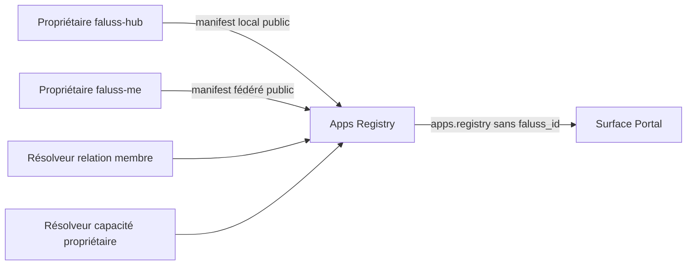

# Migration de Faluss Apps Registry

Faluss Apps Registry est le registre de composition partagé par les rôles `me` et `hub`. Il valide les manifests publics détenus par leurs applications propriétaires et construit, uniquement sur l'autorité Hub, le modèle membre `apps.registry`. Il ne devient propriétaire ni des données métier, ni des droits, ni de l'exécution des actions déclarées.



## Inventaire de compatibilité

| Surface | Contrat conservé | Propriétaire ou consommateur |
|---|---|---|
| Façade principale | `Faluss_Apps_Registry` et ses constantes `1.0.0` | Appelants historiques |
| Validation manifest | `Faluss_Apps_Registry_Manifest_Validator::validate` | Fédération |
| Validation lecture | `Faluss_Apps_Registry_Read_Model_Validator::validate` | Portal et tests de contrat |
| Enregistrement | `register_source` avec descripteur fermé `local_owner` ou `federated_peer` | Adaptateurs propriétaires |
| Lecture membre | `read_for_member($faluss_id, $surface, '1.0.0')` | Hub seulement |
| Document public | `faluss.app-capability-manifest` version `1.0.0` | Chaque application propriétaire |
| Modèle composé | namespace `apps.registry` version `1.0.0` | Apps Registry |
| Cache fédéré | transient lié au pair, à la clé et au contrat, 300 secondes maximum | Hub local |

Les manifests Faluss Hub et Faluss Me restent respectivement dans leurs modules propriétaires. Leur migration avec Portal et Link enregistrera les mêmes descripteurs auprès de cette façade. Le registre ne crée aucune table, route, tâche planifiée, option métier ou écran administratif.

## Limites d'autorité et fermeture sûre

Un descripteur incomplet, enrichi d'un champ inconnu ou dupliqué marque le registre en conflit et toute lecture échoue fermée. Une lecture membre exige un UUID v4, une surface connue, la version exacte et l'identité locale `hub-node` / `faluss-hub` / `https://faluss.com`. Les applications sont triées par clé ; une source momentanément indisponible est omise au lieu de produire une donnée de remplacement.

Le manifest fédéré est public : il ne contient ni membre, session, adresse e-mail, secret, droit ni cible exécutable. Sa réponse doit être signée et déjà validée par la couche Fédération ; le registre vérifie encore le pair, la clé, le contrat, la fenêtre temporelle de cinq minutes et le contenu. Le cache ne contient jamais le `faluss_id` et est invalidé si la politique de pair ou la clé change.

La relation membre, l'état de la capacité, sa compatibilité, sa fraîcheur, ses liaisons de surface et les actions symboliques sont des dimensions séparées. Le registre ne rend actives les liaisons et délégations que lorsque toutes ces dimensions l'autorisent. Il ne décide pas d'un droit métier et n'exécute aucune action : l'application propriétaire reste l'autorité au moment de l'appel.

## Activation contrôlée et coexistence

Le module s'enregistre pour les rôles `me` et `hub` uniquement avec une constante booléenne explicite et si aucune des trois classes historiques n'est déjà chargée :

```php
define('FALUSS_PLATFORM_ROLE', 'hub'); // ou 'me'
define('FALUSS_PLATFORM_APPS_REGISTRY', true);
```

Ces constantes appartiennent à une configuration non versionnée. Tant que `faluss-apps-registry` est chargé, la plateforme ne superpose pas le nouveau module. Pour revenir en arrière, **désactiver d'abord `FALUSS_PLATFORM_APPS_REGISTRY`, charger une nouvelle requête, puis réactiver l'ancien plugin**. Le registre n'ayant ni schéma ni donnée propriétaire, aucun transfert ou rollback de données n'est nécessaire.

## Preuves automatisées et porte de bascule

Les tests du module couvrent les manifests Hub et Me, les champs supplémentaires ou sensibles, les versions et namespaces, la forme complète du modèle de lecture, l'absence de sorties pour une relation inactive, le déterminisme, le cache fédéré borné, les sources invalides ou dupliquées, l'autorité Hub exacte et la coexistence des classes historiques. Les contrats CAP-01A, CAP-01B1 et CAP-01B2 de l'ancien dépôt restent des caractérisations séparées du plugin et de ses consommateurs historiques.

La porte de bascule reste fermée tant qu'une copie représentative du Hub et de `.me` n'a pas validé avec WordPress et la Fédération réels : ordre de chargement des adaptateurs, identité locale Hub, politique du pair Me, signature et rotation de clé, expiration et invalidation du transient, indisponibilité réseau, manifests propriétaires, relations membre et rendu Portal. Les tests statiques et le harnais PHP ne constituent pas une recette WordPress, MariaDB, réseau ou Portal réelle.

## Bascule de production du 22 septembre 2026

La première lecture préparatoire a révélé un double enregistrement de la source
`faluss-me` par le module Identity Client. L'incident est décrit dans le
[rapport dédié](../incidents/2026-09-22-apps-registry-source-conflict.md) et
suivi par l'issue GitHub #21. Le correctif de la PR #22 a été validé par 133
tests et 2 096 assertions, puis déployé. Après déploiement, le registre
historique a retrouvé `source_conflict=0` et une lecture membre valide avec
les applications `faluss-hub` et `faluss-me`.

`FALUSS_PLATFORM_APPS_REGISTRY` a ensuite été activé sur les deux sites et
les deux instances de `faluss-apps-registry` ont été désactivées. Une bascule
aller-retour contrôlée sur le Hub a comparé les documents historique et
Platform : leur seule différence est l'horodatage `generated_at` du modèle
spécialisé, produit au moment de chaque lecture. Le document Platform passe
le validateur `apps.registry`, conserve les deux applications et obtient le
manifest Me par la Fédération réelle. Les deux accueils répondent HTTP 200 et
les conteneurs restent sains.

Les fichiers historiques restent disponibles. Pour revenir en arrière,
remettre le drapeau Apps Registry à `false` sur le site concerné, charger une
nouvelle requête, puis réactiver son ancien plugin. La rotation de clé et une
panne réseau réelle restent couvertes par les tests et devront être rejouées
sur une copie avant la suppression physique des fichiers historiques.
