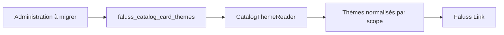

# Migration du catalogue de thèmes

Le catalogue historique de `faluss.me` possède les thèmes prédéfinis des cartes Faluss Link. Son option `faluss_catalog_card_themes` est distincte des jetons visuels de `Faluss Theme`. Faluss Link consomme actuellement la classe publique `Faluss_Catalog_Themes` ; cette dépendance devra rester compatible lors de la bascule.



## Première étape : lecture

`CatalogThemeReader` reprend le thème système immuable, la normalisation des enregistrements existants, le tri, le filtrage des thèmes actifs et la résolution par identifiant. Il utilise le même nom d’option et les mêmes champs que l’ancien plugin. Il ne lit ni n’écrit lui-même la base WordPress : le futur adaptateur fournira les valeurs de l’option au constructeur.

Cette étape n’enregistre aucun hook, menu, route ou façade globale. Le plugin historique reste seul actif et l’option demeure sa propriété. Aucun basculement de production n’est possible à ce stade.

## Deuxième étape : validation des écritures

`CatalogThemeEditor` valide les créations et modifications, génère des identifiants uniques, refuse les changements du thème système et prépare les suppressions. Il accepte uniquement les codes de droit fournis par le Connector ; lorsque ce dernier est indisponible, seul un code déjà associé peut être conservé. Les valeurs sont préparées en mémoire, sans écriture WordPress dans cette étape. L’adaptateur administratif à venir devra contrôler capacités et nonces, appliquer `wp_unslash`, persister l’option et émettre le hook de désactivation.

`CatalogEntitlementProvider` isole désormais la lecture des définitions du Connector et ne transmet à l’éditeur que les droits valides de type `theme`. Une réponse absente ou en erreur verrouille l’ajout de nouveaux droits, tout en permettant de conserver un droit déjà associé.

`CatalogAdminActions` prépare les endpoints `admin-post.php` historiques. La capacité `manage_options` et un nonce propre à chaque action sont vérifiés avant toute mutation. Les valeurs sont déséchappées, validées, puis écrites dans la même option ; les désactivations et suppressions réémettent `faluss_catalog_theme_deactivated`. La classe n’est pas encore branchée au démarrage du plugin : elle ne peut donc pas entrer en collision avec les endpoints de l’ancien catalogue.

`CatalogAdminPage` prépare le sous-menu « Faluss → Catalogue de thèmes ». Il reprend tous les champs du catalogue historique, les formulaires avec nonce, les messages de résultat et le sélecteur de médias WordPress, avec la présentation commune de Faluss Platform. Le menu et ses assets ne sont pas encore enregistrés par le bootstrap : aucun écran supplémentaire n’apparaît tant que le module complet n’est pas activé.

Le rendu a été vérifié dans une installation WordPress jetable avec un thème enregistré : le titre, le thème et les trois nonces attendus sont présents. Cet essai ne couvre pas encore le thème Elementor réel ni la bascule de production.

## Activation contrôlée et compatibilité

`CatalogModule` réunit le lecteur, l’éditeur, l’écran et les actions. Il s’enregistre uniquement sur le rôle `me`, avec la constante booléenne `FALUSS_PLATFORM_CATALOG` à `true`, et si la classe historique `Faluss_Catalog_Themes` n’est pas déjà chargée. La façade globale portant ce nom conserve les méthodes de lecture et les constantes utilisées par Faluss Link ; les noms d’actions et l’option restent inchangés.

```php
define('FALUSS_PLATFORM_ROLE', 'me');
define('FALUSS_PLATFORM_CATALOG', true);
```

Ces constantes appartiennent à la configuration non versionnée du site, pas au dépôt Git. Tant que `faluss-catalog` est actif, le nouveau module ne se charge pas et aucun endpoint ne se superpose. Aucun site de production n’a été modifié par cette branche.

Un essai sur un WordPress jetable a confirmé l’activation explicite, la lecture d’un thème par `Faluss_Catalog_Themes`, l’enregistrement du sous-menu et des actions, la création d’un thème par l’action WordPress avec nonce réel, ainsi que le refus de chargement lorsqu’une classe historique existe déjà. L’environnement d’essai a été supprimé après vérification.

Avant une bascule approuvée, tester sur une copie de `faluss.me` : sauvegarder l’option et des cartes utilisant des thèmes personnalisés ; vérifier Faluss Link, l’éditeur, les images, les droits Connector et les comportements lors de désactivation/suppression. Pour basculer, définir la constante, puis désactiver l’ancien catalogue. Le nouveau module prend le relais à la requête suivante, sans conversion des données.

Pour revenir en arrière, **désactiver d’abord `FALUSS_PLATFORM_CATALOG` dans la configuration, charger une nouvelle requête, puis réactiver `faluss-catalog`**. Réactiver l’ancien plugin dans la même requête où la façade du nouveau module est déjà chargée provoquerait une collision de classe PHP. L’option historique est conservée.

## Dépendances et risques à vérifier avant bascule

- Rôle : `me` uniquement ; `faluss.com` ne possède pas ce catalogue.
- Faluss Link appelle `get_active_theme`, `all_for_scope` et `active_for_scope` sur `Faluss_Catalog_Themes`.
- L’administration historique consulte les droits de thème via `Token_Engine_Connector_Service`.
- Les suppressions et désactivations émettent `faluss_catalog_theme_deactivated`.
- Les identifiants, images de prévisualisation, droits associés et références de cartes doivent survivre au changement de plugin.

Le futur retour arrière conservera l’option historique intacte et réactivera le plugin `faluss-catalog` ; cette procédure devra être éprouvée sur une copie de `faluss.me` avant toute désactivation réelle.
