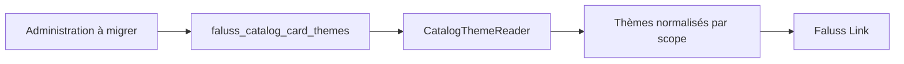

# Migration du catalogue de thèmes

Le catalogue historique de `faluss.me` possède les thèmes prédéfinis des cartes Faluss Link. Son option `faluss_catalog_card_themes` est distincte des jetons visuels de `Faluss Theme`. Faluss Link consomme actuellement la classe publique `Faluss_Catalog_Themes` ; cette dépendance devra rester compatible lors de la bascule.

## Première étape : lecture

`CatalogThemeReader` reprend le thème système immuable, la normalisation des enregistrements existants, le tri, le filtrage des thèmes actifs et la résolution par identifiant. Il utilise le même nom d’option et les mêmes champs que l’ancien plugin. Il ne lit ni n’écrit lui-même la base WordPress : le futur adaptateur fournira les valeurs de l’option au constructeur.

Cette étape n’enregistre aucun hook, menu, route ou façade globale. Le plugin historique reste seul actif et l’option demeure sa propriété. La création, la modification, la suppression, les droits issus du Connector et la compatibilité PHP avec Faluss Link restent à migrer dans des PR suivantes. Aucun basculement de production n’est possible à ce stade.

## Dépendances et risques à vérifier avant bascule

- Rôle : `me` uniquement ; `faluss.com` ne possède pas ce catalogue.
- Faluss Link appelle `get_active_theme`, `all_for_scope` et `active_for_scope` sur `Faluss_Catalog_Themes`.
- L’administration historique consulte les droits de thème via `Token_Engine_Connector_Service`.
- Les suppressions et désactivations émettent `faluss_catalog_theme_deactivated`.
- Les identifiants, images de prévisualisation, droits associés et références de cartes doivent survivre au changement de plugin.

Le futur retour arrière conservera l’option historique intacte et réactivera le plugin `faluss-catalog` ; cette procédure devra être éprouvée sur une copie de `faluss.me` avant toute désactivation réelle.
