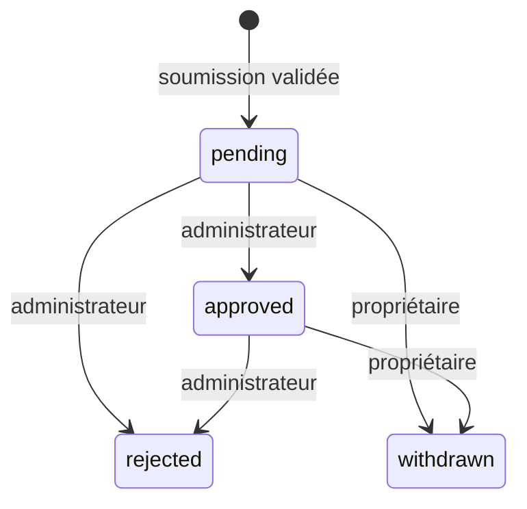

# Images Fans — quarantaine privée v1

## Statut et frontière

Premier moteur local d’images du Master Plugin, PR brouillon depuis `8b074d6`.
Aucune diffusion publique, même après approbation : `PublicationAccessPolicy`
reçoit l’état non publiable `quarantined`. Aucun lien avec les publications texte,
la médiathèque WordPress, les profils illustrés, Me, Hub, un teaser, une vidéo,
la messagerie, un paiement ou un droit commercial. Les contenus adultes restent
interdits ; aucune catégorie `external_adult_delivery_right` n’est admise ici.

Le rôle Fans, le client SSO et `CreatorProfileService` restent propriétaires des
identités et profils. `active` est une approbation de profil, pas une identité
vérifiée. Le service résout le propriétaire, sans identifiant créateur fourni par
le client. Une suspension empêche une soumission et la lecture des octets ; le
propriétaire lié peut toujours retirer une image. La réactivation du profil ne
restaure pas une image retirée ou rejetée.

## Stockage et activation explicites

Le flag serveur `FALUSS_PLATFORM_FANS_IMAGES=true` exige le rôle `fans`, les flags
SSO/profils et leurs schémas/configurations valides. Il est désactivé par défaut.
Activation/réactivation explicite : deux tables InnoDB `faluss_fans_images` et
`faluss_fans_image_decisions`, option de version `faluss_fans_images_schema_version=1`.
Pas de migration REST, de wp_posts, d’attachment, de miniature ou de cron.
Les hooks d’activation sont aussi isolés sur Me et Hub malgré un flag erroné.

Configuration hors Git obligatoire :

- `FALUSS_FANS_IMAGE_PRIVATE_ROOT` : répertoire POSIX dédié à ce site, chemin absolu
  canonique, hors ABSPATH, WP_CONTENT_DIR et DOCUMENT_ROOT (ni ancêtre ni descendant).
- Répertoire précréé mode **0700**, propriétaire UID effectif PHP, sans symlink ;
  Chaque ancêtre, **racine `/` comprise**, doit être un répertoire réel possédé
  exclusivement par **UID 0 (root) ou l’UID effectif du processus PHP**. Aucun autre
  propriétaire n’est admis, même avec un mode 0755 : il peut renommer/remplacer ses
  descendants. Les écritures groupe/autres sont refusées, sauf sticky **avec l’un
  de ces mêmes propriétaires de confiance** (ex. /var/tmp appartenant à root).
  Un répertoire sticky possédé par un autre UID est donc aussi refusé. Le dossier
  final reste exclusivement possédé par PHP et mode 0700 ; aucune exception sticky.
  Les processus partageant l’UID PHP et root font partie de la frontière de confiance.
  Ces contrôles POSIX ne valident ni ACL supplémentaires ni modification privilégiée
  du montage : leur audit demeure une responsabilité de l’hébergeur.
  Chaque fichier opaque UUID `.bin` est créé exclusivement, mode **0600**, fichier
  régulier sans symlink ni hardlink. Aucun chemin ou nom source n’est stocké ou renvoyé.
- `FALUSS_FANS_IMAGE_STORAGE_ATTESTED=true` uniquement après vérification par
  l’exploitant : aucun alias HTTP, montage public, CDN, indexation ou sauvegarde
  publique de ce répertoire ; UID et volume dédiés, pas de code tiers non fiable
  sous le même UID. Ce booléen n’est **pas** une preuve obtenue par PHP.
- GD et Fileinfo requis pour accepter les images. Les environnements non POSIX ou
  sans configuration de confidentialité vérifiable échouent fermés (503).

PHP peut vérifier les chemins et permissions locaux, **pas prouver l’absence d’un
alias Nginx/Apache, d’un partage de volume ou d’une sauvegarde publique**. Sans
attestation d’hébergement et contrôles locaux concordants, aucune admission ni
lecture d’octets. Les routes de retrait peuvent néanmoins inscrire la révocation,
puis signaler `image_cleanup_required` si le stockage ne permet pas de supprimer.
Ne pas interpréter les tests du serveur local comme une validation d’un hébergeur.

## Validation et limites

- Entrée : **JPEG ou PNG**, 2 Mio maximum de contenu réel, chaque dimension ≤4096,
  surface ≤4 000 000 pixels. SVG, GIF, WebP, vidéo et autres formats refusés.
- Nom, extension et MIME multipart ignorés pour décider du format. Fileinfo,
  dimensions réelles, décodage GD complet sans avertissement, puis réencodage en
  **PNG neuf** (≤8 Mio). Métadonnées et charges ajoutées au fichier source ne sont
  pas conservées. Aucun original source n’est gardé après la requête.
- Le décodage/réencodage réduit les formats actifs et les métadonnées ; il ne
  constitue ni antivirus, ni détecteur de contenu adulte, ni garantie de détection
  de tout contenu interdit. Les bibliothèques de décodage doivent être maintenues
  et isolées par l’hébergement. La revue humaine reste nécessaire.
- Par créateur : **5 images conservées** pending/approved, **20 soumissions/heure**
  et **60/24 h** glissantes. Les retraits/rejets ne remettent pas les compteurs de
  débit à zéro. Tentatives invalides non comptées : protection anti-abus en amont
  nécessaire. Par site : **100 fichiers physiques**, orphelins inclus (jusqu’à
  800 Mio de fichiers produits par ce moteur, hors temporaires/sauvegardes).
- Verrou MariaDB commun au site avant transactions et accès fichiers, attente
  maximale 5 secondes ; quotas vérifiés sous ce verrou, y compris entre workers.
  Lecture des compteurs en échec : 503. Pas de promesse de montée en charge ou de
  bascule SQL transparente ; fichiers et base doivent rester cohérents sur le même
  périmètre de stockage. Aucun multi-serveur de fichiers n’est pris en charge ici.

## Avant la réception des octets : limite réelle du contrat

Sur le transport multipart WordPress/PHP, le serveur web, le proxy éventuel puis
PHP reçoivent le corps et peuvent l’écrire dans un tampon ou `upload_tmp_dir`
**avant** l’exécution des permissions REST, du nonce, du SSO, des quotas métier ou
du décodage. Le moteur les vérifie avant conservation en quarantaine, pas avant
réception réseau. La formulation antérieure « avant de recevoir un octet » ne
constitue donc pas une garantie de cette implémentation.

Avant l’ouverture, l’exploitant doit configurer limites de corps et de débit au
proxy, délais, plafonds de connexions, `post_max_size`, `upload_max_filesize`,
`max_file_uploads`, mémoire et répertoires temporaires privés hors webroot pour le
proxy ET PHP. Réduire ces limites n’authentifie pas le contenu. Une admission en
deux étapes pourrait refuser certains clients avant upload ; elle n’empêcherait
pas un client hostile d’envoyer des octets au frontal. Aucun tel transport ni
filtre sémantique infaillible n’est revendiqué. Les contenus adultes/interdits ne
sont jamais autorisés ; leur absence avant inspection ne peut pas être garantie
par WordPress. Les fichiers suspects doivent être rejetés et supprimés.

## API et droits

Namespace `faluss-fans/v1`, cookie WordPress et `X-WP-Nonce` obligatoires, réponses
privées `no-store`. Aucune URL publique de fichier, aucun accès créateur aux octets.

| Route | Autorisation / contrat |
| --- | --- |
| POST `/images` | Créateur SSO au profil actif, multipart avec **un seul champ fichier `image`**, aucun autre champ/query/JSON ; 201 `{image_id,revision,state:pending}` |
| GET `/images?cursor=<uuid>` | Admin : toute la file/historique ; créateur : ses métadonnées seulement. 20 résultats max, UUID croissant, `items` et `next_cursor` ; aucun chemin/hash/octet |
| GET `/images/{id}/bytes` | Admin Fans `manage_options` + nonce, image pending/approved et profil actif ; PNG binaire, attachment, nosniff, CSP sandbox, no-store |
| POST `/images/{id}/moderate` | Admin + nonce ; `revision`, `decision=approve/reject`, `reason=allowed_image` pour approve ou `prohibited_content/needs_revision` pour reject |
| POST `/images/{id}/withdraw` | Propriétaire SSO + nonce, même suspendu ; `revision` |
| GET `/images/{id}/decisions` | Admin + nonce ; acteur local, révision, action, motif et date, aucun original ni chemin |
| POST `/images/cleanup` | Admin + nonce, JSON `{}` ; supprime seulement les fichiers révoqués ou sans ligne SQL, sous le même verrou ; reprise après panne/crash |

Statuts : 400 multipart/paramètres invalides ; 401/403 session, nonce ou permission ;
404 image révoquée, profil suspendu ou route absente ; 409 révision/transition périmée ;
413 taille réelle dépassée ; 415 format/décodage/dimensions invalides ; 429 quota ;
503 stockage, verrou, SQL, dépendance ou nettoyage indisponible. Les limites PHP ou
proxy peuvent renvoyer une autre réponse avant le moteur (pas de faux contrat 413
universel). Un rejeu de soumission n’est pas idempotent dans ce premier lot : ne pas
réessayer aveuglément après perte de réponse ; consulter ses métadonnées.

Une approbation conserve seulement un objet privé. Elle ne crée aucune publication,
URL, miniature, entitlement ou score. Le nonce d’inspection ne doit pas être placé
dans une URL. La lecture est bornée en mémoire, vérifie SHA-256 et garde le verrou
jusqu’à obtention des octets ; une révocation ne peut pas rappeler des octets déjà
obtenus par un administrateur, ni effacer ses téléchargements.

## Journal, pannes, suppression et retour arrière

SQL : une décision versionnée avec acteur local, motif borné, hash du PNG et date
UTC accompagne chaque mutation dans la même transaction. Pas de texte libre ni
nom original en journal. Révisions optimistes + verrou sérialisent les décisions.
Le fichier est créé avant commit ; un échec SQL tente immédiatement de le supprimer.
Un rejet/retrait est commité **avant** unlink : si unlink échoue, réponse 503
`image_cleanup_required`, mais l’état rejeté/retiré empêche déjà toute lecture.
Le client relit les métadonnées ; l’admin appelle cleanup après correction du
stockage. Un cleanup ne réactive jamais d’image et conserve le journal existant.

Base et système de fichiers ne forment pas une transaction atomique. Un arrêt
brutal peut laisser un fichier orphelin : il compte dans la capacité physique et
reste hors web ; cleanup explicite le supprime sous verrou après relecture SQL.
Une déconnexion ambiguë au commit n’est pas résolue automatiquement dans ce lot.
Les temporaires PHP sont supprimés après traitement et par PHP en fin de requête ;
le nettoyage des tampons du frontal relève de l’hébergement. Une suppression logique
ou unlink n’est pas une preuve d’effacement sur disque, réplica ou sauvegarde.

Retour arrière : désactiver `FALUSS_PLATFORM_FANS_IMAGES`, recharger les workers,
vérifier les routes absentes ; conserver tables, journal et stockage privé pour
traitement contrôlé. Aucun uninstall destructif. Ne pas déplacer le répertoire
privé dans uploads pour récupérer les fichiers. La fermeture du flag ne purge pas
les images pending/approved ; inventorier et traiter explicitement leur rétention.

## Rétention et ouverture : décisions restantes

Aucune expiration/cron ni politique légale de conservation ajoutée. Restent à
fixer : durée maximale de quarantaine et SLA de revue, durée des images approuvées
mais non diffusées, métadonnées/hashes/journal et comptes supprimés, signalements,
appels, conservation exceptionnelle et accès aux sauvegardes, purge des temporaires,
reprise après crash, habilitations séparées de modération et contrôle de l’hébergeur.
Un refus ou retrait tente immédiatement l’effacement du fichier, sans effacer la
trace. Aucun stockage volontaire de contenu interdit à titre d’archive de revue.

Preuves et limites : [recette locale](../../tests/Fans/Images/recipe/README.md).
La diffusion publique, les teasers Me et les autres médias nécessitent des lots et
contrats distincts : cette approbation n’autorise pas leur branchement ultérieur.

## Références depuis les textes

Le [contrat image–publication](FANS-PUBLICATION-IMAGES.md) ajoute une éligibilité
serveur via `PublicationImageReference`, sans accès aux tables Images par le
consommateur. L’image doit être approuvée, de révision exacte et appartenir au
créateur actif du texte. Son retrait/rejet ou la suspension rendent la référence
inutilisable à la lecture suivante ; l’approbation du texte ne change jamais
les permissions de lecture des octets. Aucune URL ni diffusion n’est ajoutée.
