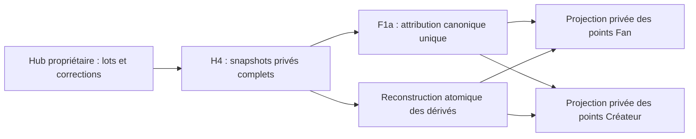

# F1a — projections privées fermées

## Autorisation et source

ALB-Origine autorise F1a uniquement sur Hub et Fans WordPress/MariaDB jetables,
avec données fictives. Base relue : `d00f41faa94dc8bc2542873c7434485baa7a5f96`.
H1–H4 sont implémentés et testés en recette fermée ; ils ne sont pas admis sur
les sites. [H4](HUB-PF-H4-CLOSED.md) fournit les faits privés rapprochés.

F1a lit exclusivement le contrat privé des snapshots H4 complets, dans l'inbox
Fans. Il ne reçoit ni quantité du navigateur, ni delta d'événement, ni ancien
reçu H3 comme autorité du score. Les notifications de remise ne peuvent être
que des invitations à relire les derniers faits rapprochés. Aucun appel de
consommation, ledger PF/PC, période, classement, session ou récompense.

## Scénarios écrits avant implémentation

Positifs : pack seul = zéro ; plusieurs Fans et Créateurs ; attribution
multi-lots regroupée une fois ; points Fan et Créateur distincts ; reconstruction
à partir de H4 après suppression/corruption des caches dérivés ; correction
partielle/totale ; litige puis résolution du seul net non annulé ; nouvelle
attestation sans changement de points ; réexécution et lecteurs concurrents.

Négatifs : snapshot absent, en cours, incomplet ou corrompu ; pages manquantes ;
époque étrangère ; double attribution/consommation ; même débit sous deux
attributions ; identité contradictoire ; PC, PF historiques et provenance non
admise ; ancien reçu après annulation ; événements désordonnés ; cache modifié ;
INSERT échoué, réponse perdue après COMMIT et mort du processus avant/après
COMMIT. Aucune génération partielle ne doit être lisible comme exacte.

## Architecture du lot fermé

- Un accès public étroit de l'inbox H4 verrouille le jeu complet des faits
  rapprochés sur le primaire, dans une transaction. Un état en cours ou refusé
  ferme toute lecture exacte ; aucune lecture directe des tables Hub par Fans.
- Une attribution canonique rassemble toutes ses allocations et conserve une
  consommation/débit unique. Son nombre de points est la somme des `net_pf` H4,
  après les dernières corrections attestées. Le disponible et l'achat du pack
  ne participent jamais à cette somme.
- Deux sommes séparées groupent ces mêmes contributions par Fan et par Créateur.
  Elles ne s'additionnent pas et ne constituent pas un solde ou un revenu.
- Caches persistants : attributions, deux projections et génération/source
  versionnée. Remplacement complet atomique ; aucun journal économique parallèle.
  Un verrou local sérialise les reconstructions. La source H4 demeure l'autorité.
- Une lecture vérifie le vecteur de snapshots et l'intégrité de la génération.
  Une source actualisée mais non reconstruite rend la projection indisponible.
  La reconstruction répare les dérivés depuis H4 sans restaurer un ancien reçu.

Le périmètre retourné est `reconciled_members` : seulement les membres disposant
d'un snapshot dans l'inbox. Ce n'est pas un inventaire global de tous les membres
Hub, ni un classement. Le vecteur peut contenir des révisions différentes par
membre, chacune attestée au rapprochement ; sans livraison continue, F1a ne peut
certifier une correction Hub qui n'a pas encore été rapprochée par H4. Une nouvelle
lecture H4 en cours ferme conservatoirement l'ensemble du calcul fermé ; cette
barrière technique ne décide pas la suspension produit ou la sanction F1b.

`withReconciledSet()` prend les lignes **et la plage d'insertion** de l'inbox
sur le primaire, transaction locale REPEATABLE READ. Le consommateur écrit ses
seules tables dérivées dans cette même transaction ; H4 ne peut remplacer ou
ajouter une source pendant la génération. Verrou nommé de dérivé avant verrou
de source, puis libération après COMMIT. Aucun verrou acquis dans Hub par Fans.
Le calcul porte sur le jeu fermé en mémoire ; débit incrémental, consommation
Events continue et dimensionnement d'exploitation sont des lots futurs.

## Frontières et retour arrière

Installation explicite de recette seulement, avec marqueur F1a **et** barrières
physiques H4. Aucun bootstrap, endpoint normal, cron, flag, admission réseau,
indicateur financier créateur ou migration automatique. Les anciens claims et
le ledger officiel sont inchangés. Aucun site, achat, score public ou activation.

[F1b R2](FANS-PF-F1B-PROPOSAL.md) a sa validation produit du 6 octobre 2026 :
relevé Europe/Paris, persistants et sessions distincts, places uniques corrigibles.
B1–B6 sont autorisés selon les dépendances ; l'extension Hub B3 a reçu son accord
propre pour la seule recette fermée le 6 octobre. F1a n'implémente pas ces règles
ou un classement public par cet accord.
#150 reste ouverte : aucune durée réelle, défaut de 24 mois ou purge de production.
Les [preuves locales](../evidence/fans-pf-f1a/README.md) sont celles de SQL et HTTP
isolés : 388/388 contrôles, dont 39 F1a après les 349 antérieurs, fixtures supprimées.
Elles ne prouvent pas le véritable SSO, un producteur d'achat réel ou une
exploitation cible. Retour arrière : revert
du lot fermé ; dérivés reconstruisibles et fixtures détruites hors sites. Aucun
uninstall ne supprime de faits H4/Hub. Aucune durée de cache/sauvegarde réelle
n'est fixée par ce lot, et les constantes de recette ne sont pas des flags métier.
