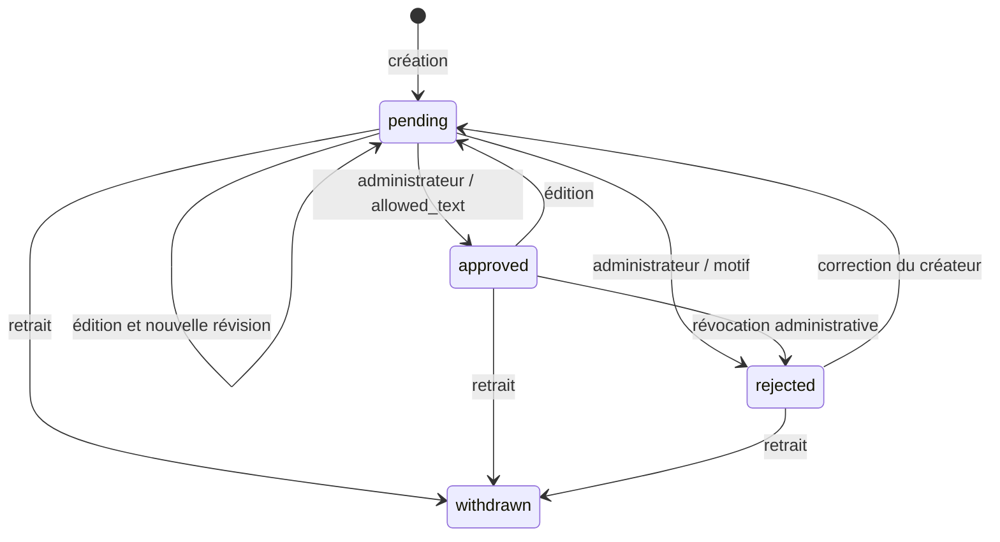

# Publications Fans — politiques v1 et moteur texte local

## Implémenté dans ce lot

Fondation fusionnée dans #72 : deux classes pures,
`PublicationAccessPolicy` décide si une publication déjà approuvée est éligible
à l'accès à son original ; `TeaserProjection` construit une projection publique
bornée à cinq sélections explicites du même créateur actif, avec révision et
expiration de cinq minutes. Les scénarios positifs et négatifs couvrent gratuit,
verrouillé sans/avec droit, suspension, retrait, modération, catégorie interdite,
consentement absent, sélection étrangère, doublon, six éléments et champs privés.

Le lot #74 a ajouté `fans-text-publications` dans le Master Plugin, exclusivement
sur Fans. Il réutilise la politique pour la lecture du texte gratuit. Les chemins
réservés par `TeaserProjection` restent non enregistrés : aucune consommation par Me,
aucun média, original verrouillé, paiement, score ou teaser actif.

## Stockage privé et modération humaine

Le schéma v2 conserve les deux tables InnoDB de la v1 : `${prefix}faluss_fans_text_publications` conserve
l'UUID public, le créateur public, la révision, le texte courant, l'état, la catégorie
fixe et les dates ; `${prefix}faluss_fans_text_decisions` conserve UUID/révision,
acteur WordPress, action, motif fermé, SHA-256 du texte concerné et date UTC.
Il ajoute `${prefix}faluss_fans_text_requests` : clé primaire composée du créateur
et du SHA-256 de la clé d'idempotence, empreinte de la requête et UUID de publication.
Aucun texte ni clé brute dans cette troisième table ; aucune donnée de celle-ci
n'est exposée dans les réponses publiques ou les listes privées.
Le journal n'enregistre pas le texte ni une copie des anciennes versions.
Les rejets et retraits effacent le texte courant, en conservant les décisions.
Aucun post, attachment, répertoire public, index de recherche WordPress, flux RSS
ou entrée de médiathèque n'est créé. Les tables sont privées au niveau applicatif,
pas chiffrées : accès administrateur base, sauvegardes et logs doivent être protégés.
Les écritures masquent les erreurs SQL WordPress pour ne pas journaliser le texte.
Les outils externes de journalisation des requêtes/corps HTTP doivent rester désactivés.

Un auteur `subscriber` lié au SSO ne peut agir que sur le profil résolu par
`CreatorProfileService::own()` ; aucun identifiant de propriétaire n'est accepté
en entrée. Son profil doit être `active` pour créer ou éditer. Toute création ou
édition devient `pending`, même si le texte précédent était approuvé. Le brouillon
est placé directement dans la file de revue privée ; il n'existe pas de publication
automatique ni d'étape publique provisoire. Le nonce seul ne prouve pas la propriété.

L'administrateur du site Fans (`manage_options` + nonce REST) lit le texte privé
et décide : `approve` exige `reason=allowed_text` et un profil actif ; `reject`
exige `prohibited_content` ou `needs_revision`. Le rejet est aussi possible après
approbation, même si le profil est suspendu, afin de révoquer/purger un texte.
Ce motif est une attestation humaine sur la révision lue, **pas un résultat de
détection automatique**. La validation UTF-8, longueur et absence de HTML ne peut
pas reconnaître toute prose adulte, illicite, donnée personnelle ou URL interdite.
Un texte inconnu peut donc entrer en quarantaine ; il ne peut pas devenir public
sans décision. Un contenu interdit doit être rejeté et purgé, jamais approuvé.
Il reste indispensable d'établir règles, moyens humains, délais de purge et recours
avant toute ouverture ; aucun SLA ni nettoyage automatique n'est implémenté.

Chaque écriture et sa trace sont atomiques. `SELECT ... FOR UPDATE` verrouille la
publication ; la révision entière obligatoire arbitre édition/modération/retrait
concurrents. Une révision périmée renvoie `409`. L'échec du journal annule la mutation.
Un rejet peut être corrigé par une nouvelle édition soumise à revue ; un retrait
est terminal. Le propriétaire peut retirer même si son profil est suspendu.
La suspension cache les textes sans les effacer ; réactiver le profil peut rendre
ses textes toujours approuvés visibles, jamais ses textes retirés ou rejetés.

## Contrat REST texte

Préfixe `faluss-fans/v1`. Écritures JSON strictes : champs inattendus, fichiers,
formulaires, catégorie adulte externe et accès verrouillé sont refusés. Le texte
doit être non vide, UTF-8, au plus 8 000 caractères / 32 000 octets, sans HTML ni
contrôles invisibles ASCII (sauf tabulation et retours ligne). Les clients doivent
rendre le texte comme texte, jamais comme HTML. Aucun import de contenu distant.

| Route relative | Permission | Données / effet |
| --- | --- | --- |
| `GET /text-publications` | Publique | Page de textes approuvés actuellement visibles, plus récents d'abord |
| `GET /text-publications/{id}` | Publique | Texte approuvé et profil actif, sinon 404 |
| `POST /text-publications` | Auteur SSO + nonce ; profil actif pour nouvelle création | `Idempotency-Key` UUID v4 obligatoire ; `text`, `category=hosted_allowed_content` ; 201 pending ou état courant lors d'un rejeu |
| `GET /text-publications/mine` | Auteur SSO + nonce | Pages de tous ses textes, tous états, plus récemment modifiés d'abord |
| `GET /text-publications/{id}/private` | Propriétaire ou admin + nonce | Révision courante privée |
| `POST /text-publications/{id}/edit` | Propriétaire actif + nonce | `text`, `revision` ; pending |
| `POST /text-publications/{id}/withdraw` | Propriétaire + nonce | `revision` ; withdrawn, texte effacé |
| `GET /text-publications/moderation` | Admin + nonce | Pages de toute la file pending, plus anciennes révisions en attente d'abord |
| `POST /text-publications/{id}/moderate` | Admin + nonce | `revision`, `decision=approve|reject`, `reason` |
| `GET /text-publications/{id}/decisions` | Admin + nonce | 100 dernières traces, sans texte |

Les réponses publiques ne contiennent que `publication_id`, `creator_id`, `revision`,
`body`, `updated_at`. Aucun `wp_user_id`, `faluss_id`, e-mail, motif ou acteur de
modération. À chaque lecture, la politique relit le statut du profil via son contrat
public et les valeurs conservées par Fans ; aucune donnée de droit client n'est utilisée.
Réponses `private, no-store, max-age=0` : un cache serveur/CDN ne doit pas passer outre.
Après commit d'un retrait ou d'une suspension, une nouvelle lecture est masquée ;
des octets déjà lus ou affichés avant le commit ne peuvent pas être rappelés.
Les trois listes acceptent `per_page` (entier de 1 à 20, défaut 20) et `cursor`
(absent pour la première page). Elles retournent désormais
`{"items": [...], "next_cursor": "..."}` plutôt qu'un tableau brut.
`next_cursor=null` marque la fin ; sinon transmettre ce curseur tel quel dans la
requête suivante sur la même liste. Exemple :
`GET /text-publications?per_page=20&cursor=<curseur-URL-encodé>`.
Valeur de taille, date, UUID, version ou portée de curseur invalide : HTTP 400.
Les permissions et nonces restent requis sur **chaque** page privée ; un curseur
n'est ni un secret, ni une autorisation, ni une preuve de propriété.

Le tri déterministe utilise le couple `(updated_at, publication_id)`, décroissant
pour le public et le créateur, croissant pour la modération. Pour un texte public,
`updated_at` correspond à sa dernière approbation ; l'UUID départage les égalités
à la seconde. Le curseur `v1` contient la portée et ce couple pour le dernier
élément rendu, sans acteur, propriétaire WordPress, total privé ou donnée cachée.
La recherche avance strictement après ce couple, sans pagination par offset.

Une page publique contient jusqu'à `per_page` **textes visibles**, pas autant de
candidats SQL : profil relu via son contrat public, politique d'accès et validité
du texte vérifiées avant de compter un élément. Les textes suspendus, retirés ou
refusés ne prennent pas une place ; la recherche continue jusqu'à remplir la page
ou épuiser les candidats. Un élément visible supplémentaire détermine s'il existe
une page suivante, sans être consommé par le curseur de la page courante.
Les lectures SQL sont faites par lots de 50 et la réponse est bornée à 20 ; le
nombre total de lots dépend des textes masqués. Ce n'est pas une borne constante
de travail ni une preuve de performance à grande échelle.

Sur un jeu inchangé, les pages successives ne dupliquent ni n'omettent d'éléments,
y compris aux dates identiques. Aucun instantané inter-requêtes n'est conservé :
modération, édition ou changement de statut peuvent modifier l'ensemble ou son
ordre pendant le parcours. Recommencer à la première page pour un parcours frais.
Le retrait et la suspension restent prioritaires sur tout ancien curseur.
La création est idempotente selon le contrat ci-dessous. Les modifications restent
protégées par leur révision : rejouer une édition déjà appliquée renvoie 409.
Pas d'écran d'édition/modération ajouté : parcours REST seulement, état du module
dans l'administration commune. L'ergonomie reste à traiter.

## Admission par créateur et concurrence

Seuils serveur fixes dans `TextPublicationIntake`, non configurables par le client :

| Limite | Créations et éditions concernées | Réponse quand atteinte |
| --- | --- | --- |
| 20 textes `pending` par créateur | Nouvelle création ou édition faisant passer un texte approved/rejected à pending | 429 `publication_pending_quota` |
| 30 admissions sur une heure glissante | Somme des créations et éditions validées | 429 `publication_hourly_quota` |
| 100 admissions sur 24 heures glissantes | Même somme ; ne se réinitialise pas à minuit | 429 `publication_daily_quota` |

Le contrôle intervient **avant** l'écriture. L'opération atteignant exactement le
seuil est permise ; la suivante est refusée. Une édition identique reste une
admission à modérer et compte aussi dans les limites de débit. À 20/20, une édition
d'un texte **déjà pending** est autorisée si les limites 30/heure et 100/24 h le
permettent : elle n'ajoute aucune place. Le serveur utilise l'état persisté lu sous
verrou de révision, jamais un état fourni par le client. Une création ou une édition
approved/rejected → pending exige une place libre et échoue sinon en 429, sans
modifier le texte, sa révision ou le journal. L'identité de quota est le profil propriétaire
résolu par le serveur, jamais un identifiant envoyé par le navigateur.
Le retrait du créateur, le rejet et l'approbation administratifs ne consomment
aucun quota et ne passent pas par cette admission. Retrait/rejet/approbation libèrent
une place pending, mais n'effacent pas les admissions de la fenêtre horaire/journalière.
Les textes refusés ou retirés ne permettent donc pas de contourner les limites de débit.

Un verrou MariaDB par créateur, commun à création et édition, est acquis **avant**
`START TRANSACTION`, et libéré après commit/rollback. Il sérialise la lecture des
quotas et l'écriture, y compris entre workers HTTP. Le verrou de révision sur la
publication reste ensuite utilisé pour les éditions. Échec/attente supérieure à
cinq secondes pour le verrou ou erreur de lecture des compteurs : 503, sans écriture.
La modération et le retrait restent indépendants de ce verrou d'admission ; une
décision concurrente peut provoquer un refus conservateur, pas un dépassement.

Les compteurs proviennent des tables du domaine, sans transient, cache partagé ni
nouveau ledger : nombre de pending et décisions `create`/`edit` reliées au créateur.
Les nouvelles traces sont datées par `UTC_TIMESTAMP()` MariaDB, comme les fenêtres
de calcul à borne inférieure exclusive (`occurred_at > maintenant - durée`).
Les traces anormalement futures restent comptées par prudence. Une transaction annulée n'ajoute aucune
admission. Les erreurs de quota ne promettent pas de `Retry-After` : la place pending
dépend d'un retrait ou d'une décision ; éviter toute boucle de nouvelles tentatives.

## Idempotence de la création

Envoyer un en-tête `Idempotency-Key` contenant un UUID v4 aléatoire, en minuscules,
sans donnée personnelle, pour chaque **nouvelle intention de création**. Conserver
cette clé et le JSON original jusqu'à résolution d'une réponse perdue. La clé est
scopée au créateur ; un autre créateur n'accède jamais à son résultat.

Le serveur compare une empreinte SHA-256 de la catégorie canonique et des octets
UTF-8 exacts du texte (pas de normalisation Unicode ou d'espaces). Publication,
première décision et association clé/empreinte/UUID sont validées dans **une seule
transaction InnoDB**. Une contrainte unique protège aussi le couple créateur/clé.
Un échec d'écriture du journal ou de l'association annule les trois écritures ;
la même clé peut alors être réessayée. Deux requêtes concurrentes identiques ne
créent ni deuxième publication, ni deuxième trace.

| Situation | Résultat REST |
| --- | --- |
| Nouvelle clé, texte valide et quota disponible | 201, publication pending |
| Même clé et même texte/catégorie | 201, **état courant** de la publication existante, sans nouvelle admission ni trace |
| Même clé, texte différent valide | 409 `idempotency_conflict`, aucune écriture |
| Clé absente, non UUID v4 minuscule ou mal formée | 400 `invalid_idempotency_key` |
| Quota atteint | 429 avec le code du seuil concerné |
| Stockage, verrou ou journal indisponible | 503, admission fermée |

Le rejeu est recherché avant les quotas et avant la condition de profil actif
nécessaire à une **nouvelle** création. Un propriétaire toujours lié au SSO peut
donc retrouver son texte même à quota plein ou après suspension. Il doit toujours
fournir sa session et son nonce. Une édition, un rejet ou un retrait intervenus
depuis la création sont conservés ; un rejeu ne restaure jamais un texte effacé et
ne republie rien. Une association orpheline échoue en 503, sans recréation silencieuse.
Le service direct exige aussi la clé : ce contrôle ne dépend pas uniquement du REST.

Les associations n'expirent pas et ne sont pas purgées dans ce lot, afin de ne pas
rouvrir une ancienne clé à la création. Seuls les hashes et l'UUID sont retenus.
Une future politique de suppression de compte/rétention devra préserver cette
protection ou documenter une nouvelle durée de garantie. Aucun mécanisme de purge
automatique ni limite globale multi-créateurs n'est ajouté ici.

## Activation et retour arrière

Opt-in serveur hors Git : rôle `fans`, SSO configuré et flag SSO, flag profils,
schémas SSO/profils valides, puis `FALUSS_PLATFORM_FANS_TEXT_PUBLICATIONS=true`.
Une activation/réactivation explicitement autorisée installe/vérifie les trois tables et
écrit `faluss_fans_text_publications_schema_version=2` après vérification exacte.
La migration v1 → v2 est additive : les textes et décisions v1 restent inchangés ;
leurs admissions récentes participent aux quotas, mais aucune clé n'est inventée
pour les créations historiques. Une v1 non migrée ferme le module v2 ; aucune
migration ne se produit au simple chargement d'une requête.
Un schéma absent, incompatible ou non InnoDB ferme le module ; aucun rattrapage
destructif automatique. La réactivation vérifie les tables existantes sans les vider.
Sur Me/Hub, même un flag erroné n'installe pas ces tables.

Retirer le flag et recharger la configuration des workers supprime les routes ;
tables et journal sont conservés. Pas de désinstallation destructive, migration
de `wp_posts`, cron, projection Me ou paiement. Ce lot laisse le flag absent en
production et la PR en brouillon. Seule l'instance locale jetable l'a activé,
puis désactivé pour vérifier le retour arrière.
Conserver aussi les associations d'idempotence. Ne pas réactiver l'ancien moteur
v1 ni abaisser manuellement l'option de version pour contourner l'admission : cela
supprimerait les garanties de quotas/rejeu. Le retour arrière sûr consiste à fermer
le flag, conserver les trois tables, puis livrer une correction revue.

## Preuves et limites de recette

Tests PHPUnit : transitions, propriété, révisions périmées, catégories interdites,
nonces, schéma absent, rollback du journal, suspension, purge et isolation Me/Hub.
Ils utilisent un modèle de base simulé, distinct de la recette réelle ci-dessous.

Correction de pagination : fixture PHPUnit de 185 textes, trois créateurs dont un
suspendu (60 textes approuvés masqués en tête), 45 textes initialement publics et
70 textes en attente. Parcours exhaustifs public/propriétaire/modération, dates
égales, pages pleines, fin exacte, retrait et nouvelle suspension, bornes et curseurs
invalides, permissions et adaptation REST sont testés. Aucun flag ni site n'est
activé pour cette correction initiale. La recette d'admission ci-dessous vérifie
désormais aussi cette pagination en WordPress/MariaDB réels.

Lot admission : tests unitaires d'idempotence, conflit, échec d'association, quotas
sur créations/éditions, opérations de retrait/rejet à quota plein et fermeture sans
lecture de quota ou sans migration. Recette étendue : migration v1 → v2 conservant
le texte existant, quatre créations HTTP simultanées avec une clé commune, clés
différentes à la frontière du quota, éditions concurrentes, rejeux sans double trace,
fenêtres glissantes et trois parcours paginés comparés à des requêtes SQL indépendantes.
Les sessions restent synthétiques ; aucun échange Me, paiement, média ni site réel
de production n'est sollicité. L’exécution initiale au SHA `930c43a` réussit **87 contrôles REST réels**.
La correction pending → pending à capacité pleine a ensuite été exécutée sur le
code `e76e873` : **96 contrôles REST réels réussis**. Création concurrente + édition
pending à 20/20 : 429/200, une seule décision et 20 places ; à 19/20 : 201/200.
Les transitions approved/rejected → pending sont refusées sans mutation à 20/20,
puis admises à 19/20. L’activation temporaire concerne uniquement l’instance locale
jetable : flag désactivé, routes fermées et serveur arrêté après recette ; aucune
activation sur `fans.faluss.me`, Me ou Hub et aucun déploiement.
Détails et résultats dans le README de recette.
Pas de preuve de charge à grande échelle ou de panne/reconnexion réseau au commit.

Recette locale initiale du 25 septembre 2026 (avant pagination, SHA `9d5f2eb`) : WordPress 7.1.2, PHP 8.5.4, MariaDB 11.8.6,
deux tables InnoDB, serveur PHP à quatre workers, cookies et nonces WordPress réels.
**45 contrôles REST réels réussis**, dont panne SQL par trigger puis rollback,
deux éditions concurrentes (200/409), données publiques limitées, suspension,
retrait et fermeture des routes après retrait du flag. Les fixtures et la commande
sont décrites dans [la recette](../../tests/Fans/Publications/recipe/README.md).
Transport HTTP sur loopback, sans preuve TLS/navigateur/proxy/CDN ; liaisons SSO
synthétiques, sans nouvel échange Me. Ce résultat ne vaut ni staging ni déploiement.

## Frontière de confiance et contrat

Les paramètres de politique proviennent du dépôt propriétaire Fans pour le texte
gratuit ; le résolveur des droits reste futur. Jamais du JSON reçu d'un client. La classe pure
ne prouve pas un droit ni une modération. Un booléen `true` envoyé par le navigateur
ne peut pas être adapté directement à ces arguments. Les adaptateurs serveur
devront relire propriétaire, version, état et droit lors de chaque accès.

`originalAllowed` accepte seulement un créateur actif, une publication `published`,
une décision `approved`, la catégorie `hosted_allowed_content` et un accès `free`
ou `locked` avec droit courant Fans. SSO, follow, abonnement affiché ou approbation
du profil ne constituent pas ce droit. Toute valeur inconnue échoue fermée.

`fans.creator-teasers` / `1.0.0` contient uniquement identifiant public créateur,
révision, dates UTC et liste des `teaser_id`, libellés, URL publiques d'aperçu et
liens canoniques Fans. Une liste vide retire tous les teasers ; une liste invalide
refuse toute projection. Le serveur exige deux décisions distinctes : sélection
du créateur et approbation de l'aperçu public. L'original peut rester verrouillé ;
aucune URL, clé de fichier ou permission de cet original n'est projetée.

L'identifiant `public_preview_id` appartient à un dérivé public séparément approuvé,
jamais au stockage original. Il est distinct du `publication_id`. Les chemins sont
construits sur l'origine Fans fixe : aucune URL fournie par le client n'est relayée.
Les champs supplémentaires privés de l'instantané propriétaire ne sont pas copiés.
Le consommateur devra encore échapper le libellé à son point de rendu.

## À construire avant médias, contenus verrouillés et teasers Me

- Étendre explicitement le dépôt et la modération aux types médias, avec quotas,
  rétention, signalements et recours ; le stockage texte ne les accepte pas.
- Stockage des originaux hors racine publique ; quarantaine avant analyse, quotas,
  validation MIME/signature/taille, autorisation d'upload avant réception du contenu.
- Routes privées avec ownership/nonce, lecture fraîche des droits et accès aux octets
  uniquement après contrôle ; aucun original protégé dans la médiathèque publique.
- Dérivés publics approuvés et révocation synchronisée avec retrait/suspension.
- Exclusion du contenu adulte également dans messages, aperçus et pièces jointes.
- Admission Federation/Events/Apps Registry explicite, projection signée Me,
  révocation et expiration du cache. La fraîcheur seule ne prouve pas l'autorité.
- Recette WP/MariaDB et HTTP de concurrence retrait/lecture, accès direct fichier,
  refus de substitution de créateur, faux droit et contournement de l'upload.

La projection pure peut être retirée sans migration ; le moteur texte conserve
ses données privées lors du rollback décrit ci-dessus. Catalog Me et les adaptateurs
Identity Hub restent inchangés.
