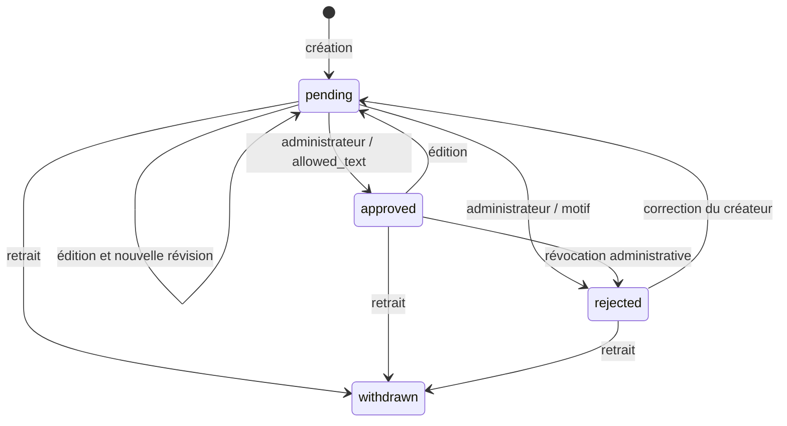

# Publications Fans — politiques v1 et moteur texte local

## Implémenté dans ce lot

Fondation fusionnée dans #72 : deux classes pures,
`PublicationAccessPolicy` décide si une publication déjà approuvée est éligible
à l'accès à son original ; `TeaserProjection` construit une projection publique
bornée à cinq sélections explicites du même créateur actif, avec révision et
expiration de cinq minutes. Les scénarios positifs et négatifs couvrent gratuit,
verrouillé sans/avec droit, suspension, retrait, modération, catégorie interdite,
consentement absent, sélection étrangère, doublon, six éléments et champs privés.

Le lot présent ajoute `fans-text-publications` dans le Master Plugin, exclusivement
sur Fans. Il réutilise la politique pour la lecture du texte gratuit. Les chemins
réservés par `TeaserProjection` restent non enregistrés : aucune consommation par Me,
aucun média, original verrouillé, paiement, score ou teaser actif.

## Stockage privé et modération humaine

Deux tables InnoDB version 1 : `${prefix}faluss_fans_text_publications` conserve
l'UUID public, le créateur public, la révision, le texte courant, l'état, la catégorie
fixe et les dates ; `${prefix}faluss_fans_text_decisions` conserve UUID/révision,
acteur WordPress, action, motif fermé, SHA-256 du texte concerné et date UTC.
Le journal n'enregistre pas le texte ni une copie des anciennes versions.
Les rejets et retraits effacent le texte courant, en conservant les décisions.
Aucun post, attachment, répertoire public, index de recherche WordPress, flux RSS
ou entrée de médiathèque n'est créé. Les tables sont privées au niveau applicatif,
pas chiffrées : accès administrateur base, sauvegardes et logs doivent être protégés.
Les écritures masquent les erreurs SQL WordPress pour ne pas journaliser le texte.
Les outils externes de journalisation des requêtes/corps HTTP doivent rester désactivés.

Un auteur `subscriber` lié au SSO ne peut agir que sur le profil résolu par
`CreatorProfileService::own()` ; aucun identifiant de propriétaire n'est accepté
en entrée. Son profil doit être `active` pour créer ou éditer. Toute création ou
édition devient `pending`, même si le texte précédent était approuvé. Le brouillon
est placé directement dans la file de revue privée ; il n'existe pas de publication
automatique ni d'étape publique provisoire. Le nonce seul ne prouve pas la propriété.

L'administrateur du site Fans (`manage_options` + nonce REST) lit le texte privé
et décide : `approve` exige `reason=allowed_text` et un profil actif ; `reject`
exige `prohibited_content` ou `needs_revision`. Le rejet est aussi possible après
approbation, même si le profil est suspendu, afin de révoquer/purger un texte.
Ce motif est une attestation humaine sur la révision lue, **pas un résultat de
détection automatique**. La validation UTF-8, longueur et absence de HTML ne peut
pas reconnaître toute prose adulte, illicite, donnée personnelle ou URL interdite.
Un texte inconnu peut donc entrer en quarantaine ; il ne peut pas devenir public
sans décision. Un contenu interdit doit être rejeté et purgé, jamais approuvé.
Il reste indispensable d'établir règles, moyens humains, délais de purge et recours
avant toute ouverture ; aucun SLA ni nettoyage automatique n'est implémenté.

Chaque écriture et sa trace sont atomiques. `SELECT ... FOR UPDATE` verrouille la
publication ; la révision entière obligatoire arbitre édition/modération/retrait
concurrents. Une révision périmée renvoie `409`. L'échec du journal annule la mutation.
Un rejet peut être corrigé par une nouvelle édition soumise à revue ; un retrait
est terminal. Le propriétaire peut retirer même si son profil est suspendu.
La suspension cache les textes sans les effacer ; réactiver le profil peut rendre
ses textes toujours approuvés visibles, jamais ses textes retirés ou rejetés.

## Contrat REST texte

Préfixe `faluss-fans/v1`. Écritures JSON strictes : champs inattendus, fichiers,
formulaires, catégorie adulte externe et accès verrouillé sont refusés. Le texte
doit être non vide, UTF-8, au plus 8 000 caractères / 32 000 octets, sans HTML ni
contrôles invisibles ASCII (sauf tabulation et retours ligne). Les clients doivent
rendre le texte comme texte, jamais comme HTML. Aucun import de contenu distant.

| Route relative | Permission | Données / effet |
| --- | --- | --- |
| `GET /text-publications` | Publique | Au plus 20 textes approuvés actuellement visibles |
| `GET /text-publications/{id}` | Publique | Texte approuvé et profil actif, sinon 404 |
| `POST /text-publications` | Auteur SSO actif + nonce | `text`, `category=hosted_allowed_content` ; 201 pending |
| `GET /text-publications/mine` | Auteur SSO + nonce | Au plus 20 textes privés de son profil |
| `GET /text-publications/{id}/private` | Propriétaire ou admin + nonce | Révision courante privée |
| `POST /text-publications/{id}/edit` | Propriétaire actif + nonce | `text`, `revision` ; pending |
| `POST /text-publications/{id}/withdraw` | Propriétaire + nonce | `revision` ; withdrawn, texte effacé |
| `GET /text-publications/moderation` | Admin + nonce | Au plus 20 pending |
| `POST /text-publications/{id}/moderate` | Admin + nonce | `revision`, `decision=approve|reject`, `reason` |
| `GET /text-publications/{id}/decisions` | Admin + nonce | 100 dernières traces, sans texte |

Les réponses publiques ne contiennent que `publication_id`, `creator_id`, `revision`,
`body`, `updated_at`. Aucun `wp_user_id`, `faluss_id`, e-mail, motif ou acteur de
modération. À chaque lecture, la politique relit le statut du profil via son contrat
public et les valeurs conservées par Fans ; aucune donnée de droit client n'est utilisée.
Réponses `private, no-store, max-age=0` : un cache serveur/CDN ne doit pas passer outre.
Après commit d'un retrait ou d'une suspension, une nouvelle lecture est masquée ;
des octets déjà lus ou affichés avant le commit ne peuvent pas être rappelés.
Les listes sont bornées sans pagination dans ce premier lot ; un client conserve
l'UUID renvoyé à la création pour retrouver un élément hors de cette première page.
POST création n'est pas idempotent : ne pas relancer aveuglément une requête dont
l'issue réseau est inconnue. Les modifications sont protégées par leur révision.
Pas d'écran d'édition/modération ajouté : parcours REST seulement, état du module
dans l'administration commune. Les quotas, pagination et ergonomie restent à traiter.

## Activation et retour arrière

Opt-in serveur hors Git : rôle `fans`, SSO configuré et flag SSO, flag profils,
schémas SSO/profils valides, puis `FALUSS_PLATFORM_FANS_TEXT_PUBLICATIONS=true`.
Une activation/réactivation explicitement autorisée installe les deux tables et
écrit `faluss_fans_text_publications_schema_version=1` après vérification exacte.
Un schéma absent, incompatible ou non InnoDB ferme le module ; aucun rattrapage
destructif automatique. La réactivation vérifie les tables existantes sans les vider.
Sur Me/Hub, même un flag erroné n'installe pas ces tables.

Retirer le flag et recharger la configuration des workers supprime les routes ;
tables et journal sont conservés. Pas de désinstallation destructive, migration
de `wp_posts`, cron, projection Me ou paiement. Ce lot laisse le flag absent en
production et la PR en brouillon. Seule l'instance locale jetable l'a activé,
puis désactivé pour vérifier le retour arrière.

## Preuves et limites de recette

Tests PHPUnit : transitions, propriété, révisions périmées, catégories interdites,
nonces, schéma absent, rollback du journal, suspension, purge et isolation Me/Hub.
Ils utilisent un modèle de base simulé, distinct de la recette réelle ci-dessous.

Recette locale du 25 septembre 2026 : WordPress 7.1.2, PHP 8.5.4, MariaDB 11.8.6,
deux tables InnoDB, serveur PHP à quatre workers, cookies et nonces WordPress réels.
**45 contrôles REST réels réussis**, dont panne SQL par trigger puis rollback,
deux éditions concurrentes (200/409), données publiques limitées, suspension,
retrait et fermeture des routes après retrait du flag. Les fixtures et la commande
sont décrites dans [la recette](../../tests/Fans/Publications/recipe/README.md).
Transport HTTP sur loopback, sans preuve TLS/navigateur/proxy/CDN ; liaisons SSO
synthétiques, sans nouvel échange Me. Ce résultat ne vaut ni staging ni déploiement.

## Frontière de confiance et contrat

Les paramètres de politique proviennent du dépôt propriétaire Fans pour le texte
gratuit ; le résolveur des droits reste futur. Jamais du JSON reçu d'un client. La classe pure
ne prouve pas un droit ni une modération. Un booléen `true` envoyé par le navigateur
ne peut pas être adapté directement à ces arguments. Les adaptateurs serveur
devront relire propriétaire, version, état et droit lors de chaque accès.

`originalAllowed` accepte seulement un créateur actif, une publication `published`,
une décision `approved`, la catégorie `hosted_allowed_content` et un accès `free`
ou `locked` avec droit courant Fans. SSO, follow, abonnement affiché ou approbation
du profil ne constituent pas ce droit. Toute valeur inconnue échoue fermée.

`fans.creator-teasers` / `1.0.0` contient uniquement identifiant public créateur,
révision, dates UTC et liste des `teaser_id`, libellés, URL publiques d'aperçu et
liens canoniques Fans. Une liste vide retire tous les teasers ; une liste invalide
refuse toute projection. Le serveur exige deux décisions distinctes : sélection
du créateur et approbation de l'aperçu public. L'original peut rester verrouillé ;
aucune URL, clé de fichier ou permission de cet original n'est projetée.

L'identifiant `public_preview_id` appartient à un dérivé public séparément approuvé,
jamais au stockage original. Il est distinct du `publication_id`. Les chemins sont
construits sur l'origine Fans fixe : aucune URL fournie par le client n'est relayée.
Les champs supplémentaires privés de l'instantané propriétaire ne sont pas copiés.
Le consommateur devra encore échapper le libellé à son point de rendu.

## À construire avant médias, contenus verrouillés et teasers Me

- Étendre explicitement le dépôt et la modération aux types médias, avec quotas,
  rétention, signalements et recours ; le stockage texte ne les accepte pas.
- Stockage des originaux hors racine publique ; quarantaine avant analyse, quotas,
  validation MIME/signature/taille, autorisation d'upload avant réception du contenu.
- Routes privées avec ownership/nonce, lecture fraîche des droits et accès aux octets
  uniquement après contrôle ; aucun original protégé dans la médiathèque publique.
- Dérivés publics approuvés et révocation synchronisée avec retrait/suspension.
- Exclusion du contenu adulte également dans messages, aperçus et pièces jointes.
- Admission Federation/Events/Apps Registry explicite, projection signée Me,
  révocation et expiration du cache. La fraîcheur seule ne prouve pas l'autorité.
- Recette WP/MariaDB et HTTP de concurrence retrait/lecture, accès direct fichier,
  refus de substitution de créateur, faux droit et contournement de l'upload.

La projection pure peut être retirée sans migration ; le moteur texte conserve
ses données privées lors du rollback décrit ci-dessus. Catalog Me et les adaptateurs
Identity Hub restent inchangés.
