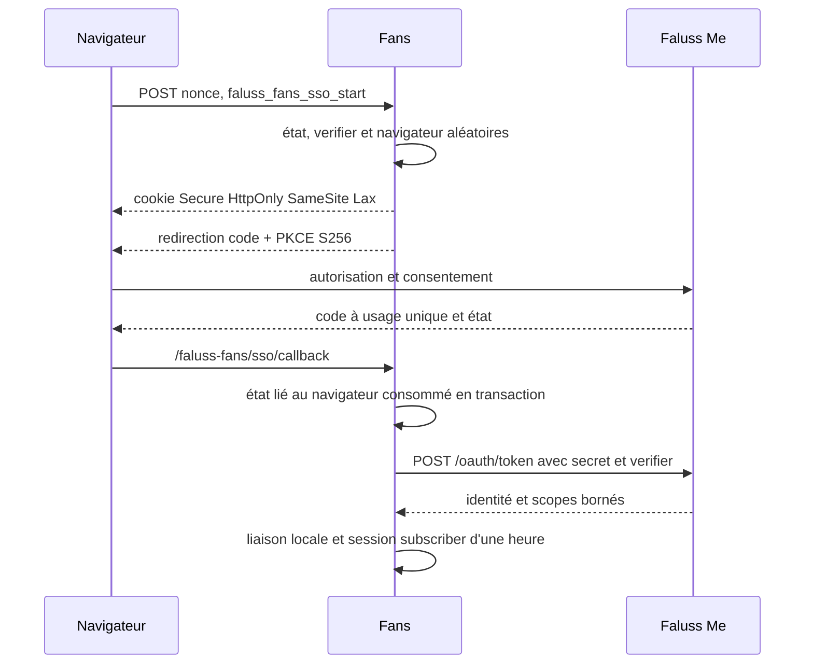

# Client SSO Faluss Fans

## Portée implémentée

`fans-sso` est un client local de l'autorité Identity sur `faluss.me`. Il ne partage ni les classes du client Hub, ni son adaptateur Apps Registry, ses widgets Elementor, ses tables, ses options, ses hooks ou ses routes. Me reste propriétaire du `faluss_id`, du code à usage unique de 60 secondes et de la session centrale. Fans garde son propre `wp_user_id` et sa session WordPress. Aucun profil créateur, publication, message ou droit commercial n'est créé par ce module.



## Configuration et activation

Le site Fans doit servir une URL HTTPS distincte de Me. Un administrateur de Me doit préenregistrer **l'URI exacte** `https://<hôte-fans>/faluss-fans/sso/callback` pour un client confidentiel autorisé aux scopes `identity.basic` et `identity.email`. Le secret aléatoire de 43 caractères base64url est fourni par la configuration serveur non versionnée ; il ne passe ni dans une URL, ni dans les logs, ni dans une option WordPress. Exemple sans valeur de secret :

```php
define('FALUSS_PLATFORM_ROLE', 'fans');
define('FALUSS_PLATFORM_FANS_SSO', true);
define('FALUSS_FANS_SSO_CLIENT_ID', '<identifiant-préenregistré>');
define('FALUSS_FANS_SSO_CLIENT_SECRET', '<secret-hors-git>');
```

Le flag est inactif par défaut. L'activation du plugin, après configuration, installe ou vérifie les deux tables et les règles de réécriture. Si le plugin est déjà actif, une réactivation contrôlée est nécessaire ; un simple changement de flag n'installe jamais silencieusement le schéma pendant une requête. L'amorçage n'enregistre `fans-sso` que si le rôle, le flag, le secret et le schéma exact sont présents. Le shortcode `[faluss_fans_sso_button]` est alors disponible. La désactivation du flag coupe les routes et la création de nouvelles sessions SSO ; les liaisons existantes et les sessions WordPress déjà émises ne sont pas révoquées automatiquement. La désactivation du plugin conserve les tables et l'option et vide les règles de réécriture.

## Stockage et contrat public

| Surface | Propriétaire Fans | Règle |
| --- | --- | --- |
| `${prefix}faluss_fans_identity_links` | Client SSO Fans | Une liaison unique par `wp_user_id` local et par `faluss_id` opaque. |
| `${prefix}faluss_fans_sso_states` | Client SSO Fans | Empreintes d'état et de navigateur, mode, membre optionnel, expiration et consommation unique. |
| `faluss_fans_sso_schema_version` | Client SSO Fans | Version `1`, écrite uniquement après vérification des tables InnoDB. |
| `faluss_fans_sso_start` | Client SSO Fans | POST avec nonce ; connexion anonyme ou liaison explicite d'un `subscriber` connecté. |
| `/faluss-fans/sso/callback` | Client SSO Fans | URI fixe HTTPS ; aucun retour libre fourni par le navigateur. |
| `FansSsoService::currentLinkedSubject()` | Futurs modules Fans | Retourne seulement `faluss_id`, création et dernière preuve du membre local lié. Ce n'est pas une autorisation métier. |

Le démarrage crée 32 octets aléatoires indépendants pour l'état, le verifier et la liaison navigateur. Le cookie est limité à l'hôte Fans, `Secure`, `HttpOnly`, `SameSite=Lax`. Le callback vérifie le cookie, l'état, l'expiration et la consommation sous verrou InnoDB avant l'échange réseau ; les erreurs redirigent vers une notice locale sans renvoyer le code ni le secret. Le token doit contenir un UUID v4 et exactement les scopes demandés. Les autres claims, dont `apps`, sont ignorés.

Le flux anonyme peut créer uniquement un compte `subscriber` local après une preuve `identity.email`, et refuse une collision avec un e-mail déjà présent. La liaison d'un compte existant exige un `subscriber` connecté, le nonce et le même compte au retour. Un rôle privilégié ne reçoit pas de session SSO. Une session locale liée expire après une heure. Ni l'e-mail ni le `wp_user_id` d'un autre site ne servent de clé de droit.

## Tests, limites et ouverture

Les tests automatisés couvrent les noms et rôles isolés, le schéma partiel fermé, HTTPS, l'URI fixe, PKCE S256, le secret dans le POST serveur, les claims bornés, l'état lié au navigateur, le rejeu, l'expiration, la collision d'e-mail, le refus des rôles privilégiés et la session courte. Les tests d'isolation préexistants vérifient que les hooks Link ne chargent pas son schéma sur Fans avec un flag erroné.

Avant une activation réelle, vérifier sur un site WordPress/MariaDB de test : les deux tables InnoDB exactes, le client confidentiel Me et son URI enregistrée, une autorisation et un échange réussis, un code expiré ou rejoué, la création et la liaison de comptes, la collision d'e-mail, les cookies dans le navigateur et la durée de session. Faire un essai de rollback par retrait du flag et des règles de réécriture, sans supprimer les liaisons. Aucun de ces essais réels ni déploiement de production n'est réalisé par cette PR.
