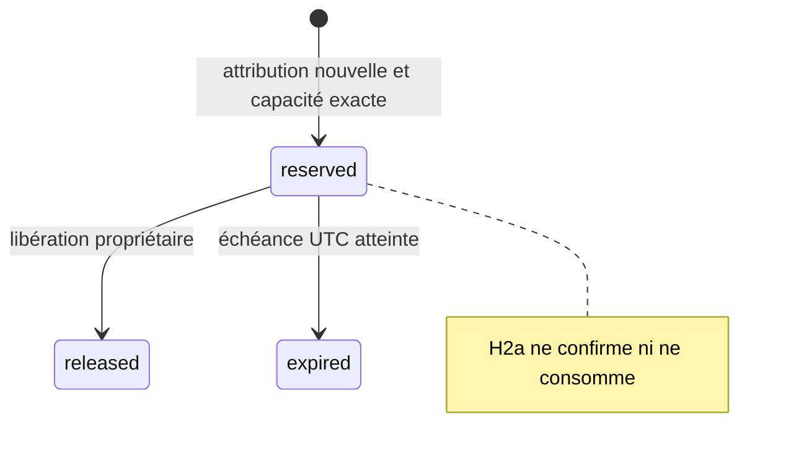

# Hub PF — H2 fermé

## Accord et découpage

Le 5 octobre 2026, **ALB-Origine** autorise H2 fermé et les garanties D6 nécessaires :
réservations et consommation atomiques avec le ledger officiel, journal dans la
même transaction, lookup primaire après résultat incertain, même intention/clé
après timeout. [Accord humain rapporté dans #147](https://github.com/Alternative-LAB/faluss-platform/issues/147#issuecomment-5991250215).

Ce document décrit **H2a : réservations**. H2b apportera séparément la consommation
et son journal atomique. H2 ne ratifie pas D3, D5 ni le reste de D6 ;
[réduction après remboursement #149](https://github.com/Alternative-LAB/faluss-platform/issues/149)
et [conservation #150](https://github.com/Alternative-LAB/faluss-platform/issues/150)
restent ouverts. Aucun reçu signé, remboursement partiel, purge, réseau ou score.

## Fermeture et propriété

Code propriétaire Hub dans `TokenEngine/PurchasedPf`, sans hook, route, façade
publique, commande opérateur, producteur commercial ou migration automatique.
Le garde exige celui de [H1](HUB-PF-H1-MODEL.md), **plus** le marqueur de recette
`FALUSS_HUB_PF_H2_RECIPE_ONLY=true` et une connexion primaire non `read_only`.
Les marqueurs appartiennent au wp-config **jetable**, jamais à un site réel.
L'installation reste explicite. Aucun flag de production n'est changé.

`ClosedLedgerWriter` est un port composant interne au propriétaire Token Engine.
Il ajoute des crédits **fictifs** `funded/pf_pack_purchase` dans le **ledger PF
officiel existant**, au sein de la transaction H2. Le writer historique ouvre sa
propre transaction : il n'est ni invoqué par réflexion, ni détourné, ni ouvert à
de nouvelles catégories. Ses six classes et ses claims restent identiques.
Aucun montant/balance mutable ou ledger PF Fans n'est créé. Le bonus reste hors
des crédits admissibles de cette recette ; aucun adaptateur d'achat n'est enregistré.

## Schéma H2a v1

Cinq tables InnoDB `token_engine_pf_h2_{schema,credits,reservations,allocations,keys}`,
distinctes du modèle H1 v1 et du schéma historique v5. `credits` contient uniquement
la filiation du lot H1 synthétique vers son crédit officiel, pas un solde.
Réservation globale immuable : client, membre, créateur, quantité, politique et
empreinte, clé de réserve, UUID propriétaire, création/expiration. Les allocations
conservent lot/preuve/révision/quantité. Les clés sont hachées et liées au contenu.

Installation : tables temporaires, contrôle strict colonnes/index/collations et
InnoDB, publication atomique du groupe par RENAME. Groupe partiel/divergent refusé,
aucune adoption/réparation. Aucun DDL ou option historique changé.

## Réservations et reprise

- Première admission de crédit H2 : horloge UTC MariaDB, FIFO croissant puis UUID
  de lot ASCII binaire. La date d'achat, de compte et le plan non consommant H1
  ne déterminent pas une disponibilité. Seul un lot synthétique actuellement
  `confirmed`, lié au crédit officiel intègre et sans compensation, est admis.
- Quantité entière ou refus, jusqu'à 32 lots ; PF achetés uniquement, jamais
  bonus, `earned`, `promotional` ou solde `funded` historique sans filiation.
- TTL **120 secondes réelles**, fixé à la création, sans renouvellement. Échéance
  vérifiée par la base, expiration terminale ; libération ne débite rien. Rejeu
  retrouve la réserve même expirée/libérée. Nouvelle intention après clôture
  certaine ; **changer la clé de la même attribution est refusé**, sans nouveau crédit/réserve.
- Trois réserves actives et dix créations/minute/membre ; les rejeux ne créent
  aucune réserve et n'épuisent pas ces quotas. Limites de lectures/pairs et
  transport restent H3, absent de la recette CLI fermée.
- Ordre de verrou : mutex historique sujet/classe `funded` (10 s), mutex du modèle
  H1, transaction, lignes officielles puis provenance/réserve/allocations/clés.
  Aucun appel réseau ni transaction imbriquée. Le mutex H1 sérialise aussi les
  révisions source ; une mutation future opérationnelle demandera son verrou
  propriétaire dédié et un test de charge, sans ouvrir ce garde de recette.
- Crédit et filiation/clé sont atomiques. Réserve/allocations/clé sont atomiques.
  Après COMMIT incertain : `h2_commit_unknown`, jamais faux rollback. La lecture
  sérialisée sur la connexion primaire et le rejeu **identique** retrouvent le
  résultat. Un primaire indisponible ne prouve pas l'absence. Aucun retry
  automatique n'invente une nouvelle clé ou nouvelle attribution.

## Scénarios et preuves

Avant code : admission synthétique/clé identique ; quantité/FIFO exacts ; négatifs
source absente, pending/disputed, mauvais titulaire/client, auto-attribution,
conflit, dépassement, nouvelle clé, expiration, schéma divergent.
Recette réelle multi-processus : huit admissions/réserves identiques et distinctes,
arrêt avant/après COMMIT, acquittement perdu injecté, rollback final INSERT,
quotas, schémas et garde de production. Aucun contenu privé dans le rapport.

Voir [README](../../tests/TokenEngine/recipe/README.md), `--h2-reservations`.
H0/H1 sont également exécutés. Tous les octets des anciennes lignes PF et du
ledger ALB sont comparés ; les nouvelles lignes sont seulement celles de la
fixture. Un kill après COMMIT perd réellement la réponse du processus ; le faux
retour `false` de wpdb est une injection, pas une panne réseau MariaDB.

## Limites et retour arrière

H2a ne consomme aucun PF et ne journalise aucun événement. H2b reste à livrer.
Les compensations historiques ne servent pas de protocole H4 : une compensation
hors H2 d'un crédit synthétique ferme la filiation, sans recréer des PF disponibles.
Avant toute ouverture future, l'exclusivité des corrections nouvelles, les reçus,
l'autorité d'achat, les politiques et l'environnement Hub devront être approuvés.
La recette ne prouve ni Hub cible, ni replica/restore, HTTP, identité/délégation
économique, achat réel ou HoF. Aucune attribution utilisable sur les sites.

Retour arrière par revert de la PR ; aucune donnée réelle à migrer. Ne pas
installer les marqueurs, ni supprimer/corriger de table sur un site. La recette
détruit uniquement sa racine/socket/processus privés.
