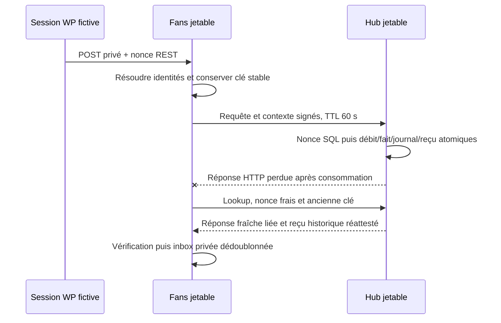

# Hub ↔ Fans — H3 fermé

## Accord et limites

Le 5 octobre 2026, **ALB-Origine** valide D3 de R1 pour H3 fermé uniquement :
reçus privés signés/versionnés, permissions PF dédiées et délégation explicite
Fan/Créateur. [Accord humain rapporté dans #147](https://github.com/Alternative-LAB/faluss-platform/issues/147#issuecomment-5992165128).
Identités, achats, pairs et clés sont fictifs sur deux WordPress/MariaDB jetables.
H4, F1, réduction après remboursement #149 et conservation #150 restent ouverts.
Aucune autorité d'achat réelle, paire de production, migration automatique,
activation, score, paiement, déploiement ou flag de production.

H3a livre les DTO/codecs publics de `TokenEngine/PurchasedPf/Protocol`, sans hook,
route ou persistance. H3b raccorde le ledger H2, les reçus et la persistance
anti-rejeu. H3c raccorde la recette HTTP Hub/Fans impossible à charger en
configuration ordinaire ; aucun bootstrap ni dispatcher n'est ajouté par H3b.
Ces DTO sont le contrat étroit de lecture côté Fans : aucun accès aux tables Hub.

## Formats H3a

- Contrat `fans.hub-purchased-pf/0.2.0` ; types/domaines séparés receipt, context,
  request et response sous `faluss.hub-purchased-pf.* /1` (sans espace).
- JSON canonique [JCS RFC 8785](https://www.rfc-editor.org/rfc/rfc8785) **restreint**
  aux clés ASCII et valeurs textuelles ASCII, booléens, null, objets/listes.
  Quantités/révisions en chaînes décimales exactes ; nombres JSON et Unicode
  refusés. Aucune donnée éditoriale n'entre dans ces preuves. Tri ASCII récursif,
  sans espaces/échappements alternatifs ; octets non canoniques et doublons refusés.
  Ce n'est pas un sérialiseur JCS général. Federation garde ses octets bruts.
- Signature [Ed25519 RFC 8032](https://www.rfc-editor.org/rfc/rfc8032) par les
  méthodes publiques existantes `Faluss_Federation_Crypto::sign/verify`, via
  `FederationBridge`. Sodium natif requis ; aucune dépendance nouvelle. Le
  dispatcher, les cinq opérations, limites et contrats historiques ne changent pas.
- Enveloppe exacte : `payload_base64url`, `key_id`, `payload_sha256`,
  `signature_base64url`. Pas de clé publique venant du payload. Le domaine,
  `kid:<key_id>` et `sha256:<digest minuscule>` sont signés, séparés par LF,
  sans LF final. Key ID 1–64 caractères ASCII ; clé locale de pair explicite,
  active et dans sa période au moment de vérification. Inconnue/révoquée : refus.
- Reçu canonique ≤32 KiB ; payload de transport ≤48 KiB, enveloppe HTTP ≤64 KiB.
  L'enveloppe transporte le digest des octets canoniques, jamais une URL.

## Délégation et permissions

Permissions distinctes `pf.reserve`, `pf.confirm`, `pf.release`, `pf.lookup` et
`pf.context.delegate`, jamais déduites de `wallet.read`, `reward.claim`,
`read_model.read` ou `event.publish`. Pairs `fixture.*` uniquement en H3 fermé.

Le contexte contient contrat/type, émetteur/audience exacts, opération, nonce,
clé d'idempotence hachée, opération recherchée, intention immuable et dates UTC.
TTL ≤60 s ; expiration exclue, tolérance d'horloge future ≤5 s. Le contexte est
signé dans un domaine distinct et lié à la requête. Client de l'intention =
délégataire admis ; auto-attribution et UUID invalides refusés.
Le serveur Fans doit résoudre le membre depuis une session/lien vérifiés et le
créateur depuis son propriétaire actif ; une signature n'atteste pas, seule,
le véritable SSO Me. Cette résolution est exercée avec des liaisons fictives
dans la recette H3c, sans réutiliser de code SSO ni fournir un UUID arbitraire.

## Reçu privé historique

Version/révision, émetteur/audience, consommation/réserve/attribution, identités,
quantité, politique, référence de débit et date de confirmation. Allocations
triées par `allocation_id`, chacune liée à lot/preuve/révision et référence
d'achat propriétaire. L'identifiant stable de l'allocation est le SHA-256 ASCII
de `attribution_id|lot_id` ; pas un nouvel identifiant d'achat ni une seconde
allocation économique. Lot unique, 1–32 allocations, somme exacte et bornée.

Le reçu prouve un fait passé ; il ne prouve **pas** l'état courant après litige,
remboursement ou correction H4. Aucune projection HoF/PC, inbox de score ou
réconciliation économique n'est créée par H3a.

## Scénarios écrits avant code

Positifs : vecteurs ASCII canoniques, signature native et domaine distinct,
reçu exact, contexte de 60 s et permissions explicites. Négatifs : clés et
champs inconnus, encodage/duplicate/float/Unicode, signature/digest/payload
altérés, audience/émetteur/opération/nonce/clé différents, contexte expiré ou
futur, auto-attribution, identité invalide, allocations incohérentes et
permissions historiques seules. H3b teste concurrence/anti-rejeu SQL, crash et
lookup sans second débit ; H3c ajoute les réponses HTTP perdues et la délégation.

## Persistance fermée H3b

- Schéma propriétaire Hub `closed_h3_hub/1` explicitement installé après H2 :
  marqueur, nonces et reçus. Installation partielle/divergente refusée ; aucun
  upgrade normal, hook ou cron. Le schéma ledger historique reste en version 5.
- Le callback facultatif de H2 écrit le reçu signé **dans la même transaction**
  que débit officiel, consommation, journal et clé. En H2 sans callback, le
  comportement historique de H2 reste inchangé. Échec de signature/INSERT :
  rollback complet ; résultat COMMIT incertain : lookup primaire, même clé.
- Le lookup vérifie les liens du fait immuable, du débit officiel et des lots,
  puis réatteste les mêmes octets avec la clé courante. Pas de nouveau reçu
  économique, débit, crédit Créateur, PF parallèle, projection ou PC.
- Nonce SHA-256 et digest de requête persistés avant l'opération, verrou du pair
  et transaction propres ; rejeu refusé. Limites **de recette fermée** : 60
  requêtes/minute/membre et 600/minute/pair. Elles ne constituent aucune politique
  publique de production. Après résultat incertain : nouveau nonce/contexte,
  ancienne clé métier obligatoire, jamais une clé de remplacement.
- Le garde exige environnement local, root `/var/tmp/hub-pf-wp-*` mode 0700,
  WordPress exact, socket MariaDB privé, primaire et base dédiée ; H3 ajoute un
  bail privé 0600 dont le digest est dans la configuration non exportable.
  HTTP exige en plus **SAPI PHP cli-server**, écoute/Host/origine loopback exacts.
  FPM et un site normal échouent avant leur première requête SQL, même si les
  constantes de recette ont été copiées. Une constante ou un flag seul ne suffit
  pas à ouvrir le protocole. Aucun fichier de test n'est chargé normalement.

Recette : `python3 tests/TokenEngine/recipe/run.py --h3-proofs --source … --core …
--cli … --output …`. Elle exécute d'abord les **161 contrôles H0/H1/H2** puis les
preuves H3 SQL/signatures, supprime root, socket, base et processus appartenant
à sa fixture, et n'exporte que libellés/résultats/versions. Ce lot ne démontre
encore ni transport HTTP entre instances, ni SSO Me réel.

## Scénarios HTTP H3c, avant implémentation de la recette

Deux WordPress distincts, deux bases dans le même MariaDB privé, deux seeds et
deux politiques explicites : demandes POST signées/déléguées, réserve/confirmation/
libération/lookup, inbox privée dédoublonnée. Fans vérifie session WP absolue,
lien local et propriétaire actif via leurs contrats privés ; ces liaisons sont
**fictives**, sans échange réel avec Me. Un paramètre d'identité ne peut pas
remplacer ces résolutions. Aucun nouveau droit d'achat ou UI d'attribution.

Négatifs réseau : signatures de requête/contexte/réponse/reçu altérées, mauvaises
audiences, clés inconnues/révoquées, expiration et mauvais nonce/digest/opération,
identité navigateur falsifiée, invité/non lié/admin, auto-attribution, profil
inactif, permissions wallet seules, GET, mauvais Host/bail de fixture. Rejeux
réseau refusés, reprise métier avec nouveau nonce et ancienne clé ; confirmation
concurrente unique. Une réponse HTTP est perdue **après consommation**, puis
lookup restitue le reçu sans second débit. Rotation : réattestation du même fait
immuable avec clé courante, ancienne clé révoquée refusée. Aucun log privé.

## Transport et réception fermés H3c

Le plugin ne charge **aucune route H3**. Seul `h3-http-adapter.php`, copié comme
MU-loader dans les deux fixtures, enregistre un namespace de recette après le
garde cumulatif H3. Il ne fait partie ni du bootstrap ni du ZIP installable.
Les constantes copiées, un bail incorrect, un autre Host, FPM, une base distante
ou un chemin de site ordinaire ne peuvent pas l'ouvrir. Aucun pair, permission
ou opération n'est ajouté au dispatcher Federation historique.

- Hub : requête et contexte signés indépendamment, droits `pf.*` et délégation,
  fraîcheur de 60 s, audience/opération/nonce/clé immuables. Anti-rejeu SQL avant
  dispatch. Réponse signée avec nonce **et digest des octets complets** de la requête.
- La délégation et la requête expirent au plus tôt entre échéance de session
  locale et plafond de 60 s ; une session expirée pendant la préparation ne peut
  pas émettre un contexte neuf. Aucun renouvellement de la session locale.
- Fans : session WP authentifiée et nonce REST réel dans la fixture ; résolution
  par `currentLinkedSubject`, `activeOwner`, `linkedIdentity` et échéance absolue
  de cookie/token. Invité, non lié, compte privilégié, profil suspendu,
  auto-attribution et UUID de membre fourni par le navigateur sont refusés.
  Ces liens sont semés fictivement ; aucune preuve Me n'est produite par ce test.
- Le client conserve intention et clés d'opération **avant** tout envoi. Toute
  modification du contenu est un conflit. Lookup lit la clé originale sans
  en créer ; timeout, body altéré ou réponse perdue restent inconnus.
  Nouveau nonce/contexte pour la reprise, jamais nouvelle clé métier.
- Endpoint loopback fixe, POST JSON, zéro redirection/cookie central, délai borné,
  limite 64 KiB et aucune URL/identité/clé dans les paramètres GET. Cache privé
  `no-store` ; pas de logs des payloads, cookies, identités ou clés.
- Inbox **privée Fans**, pas de ledger : intentions, clés et reçus canoniques.
  Le client vérifie réponse fraîche et signature/audience/contenu du reçu avant
  INSERT. Même reçu/digest : inertie ; contenu divergent : refus sans remplacement.
  H3 reste à la révision 1, aucune correction H4 ou projection F1.
- Le journal H2 reste `pending` : aucun event/score n'est annoncé comme remis
  à une projection HoF. La réception privée ne prouve pas de net économique courant.

`run.py --h3-http` exécute les contrôles antérieurs et la recette Hub/Fans HTTP.
Deux WordPress/bases distincts, MariaDB sans écoute réseau, PHP cli-server local
multiworkers ; root privé et tous ses processus supprimés à la fin.
L'échec de retour HTTP est réel entre les deux instances ; le COMMIT SQL négatif
injecté des lots H2/H3b reste une preuve distincte. Pas de SSO/passwordless Me,
TLS de production, producteur d'achat, remboursement, réplica/restore ou score.

Rollback : revert du lot ; aucun chargement normal ou changement de données
réelles. Aucun secret, reçu privé, identifiant de personne ou payload dans les
logs/rapports. La recette isolée ne vaut ni admission réseau de production,
ni validation TLS/SSO réel, ni autorisation d'achat ou de score.
