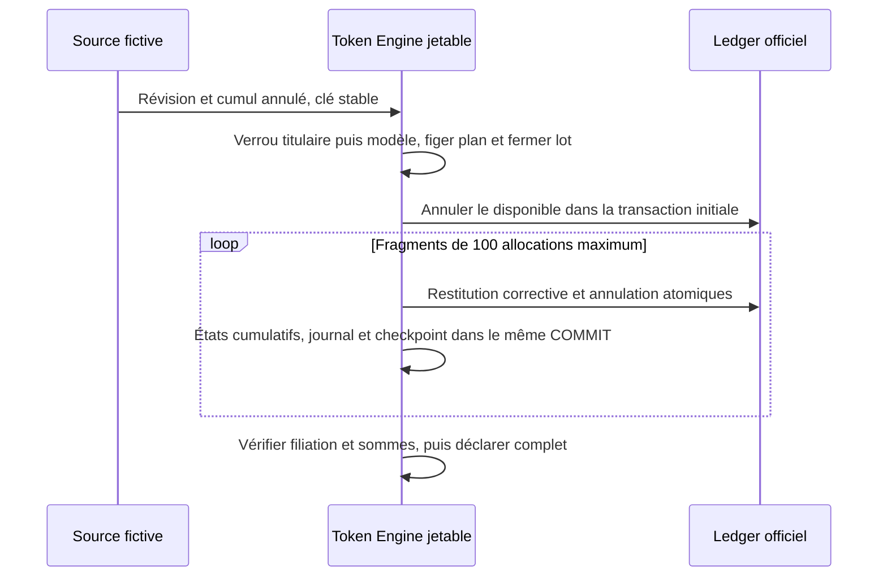
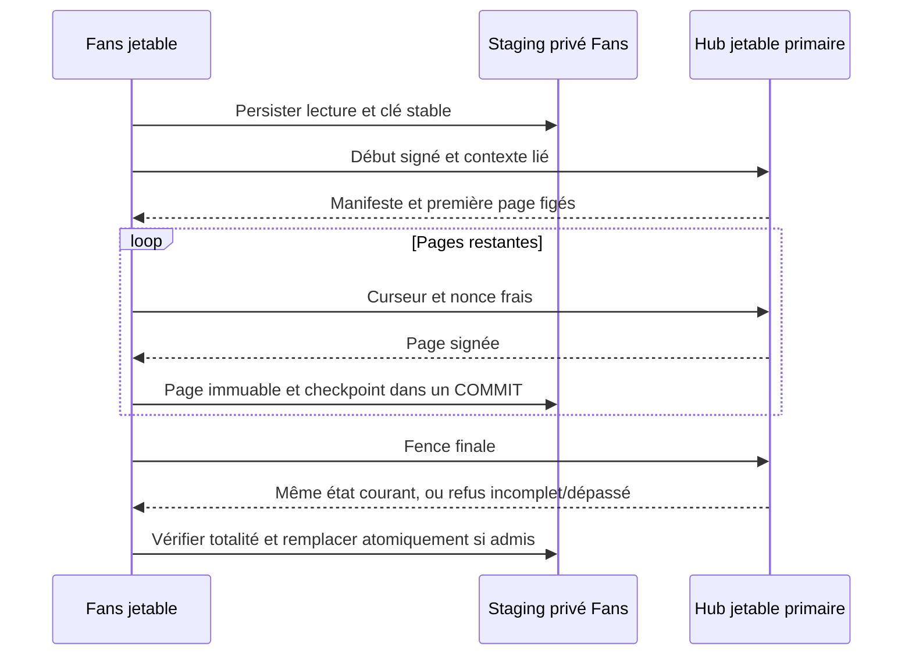

# H4 — corrections et rapprochement fermés

## Autorisation et frontières

ALB-Origine a validé #149 : PF disponibles d'abord, puis allocations du lot
de la plus récente à la plus ancienne. H4 ne reçoit que des preuves fictives,
sur des instances WordPress/MariaDB jetables. Aucun producteur d'achat réel,
remboursement monétaire, admission de pair, score public ou installation
automatique n'est ajouté. F1 et la politique de conservation #150 restent ouverts.
**Aucune durée de conservation, valeur de 24 mois ou purge réelle n'est définie.**

## Lots et scénarios écrits avant implémentation

- H4a : primitive propriétaire distincte, annulation cumulative, gel des réserves,
  litige/résolution, fragments de 100 allocations au plus et journal durable.
- H4b : snapshots propriétaires matérialisés complets et fence primaire.
- H4c : transfert privé et reprise entre instances jetables ; aucun ledger ni
  calcul de classement dans Fans.

Positifs : lot 100, allocations 25 puis 15, annulations cumulatives 30/80/90 ;
annulation partielle d'une allocation ; plusieurs lots dans une attribution ;
litige puis résolution ne restaurant que le net non annulé ; reprise sur le
primaire avec la même clé après COMMIT incertain ; plus de 100 allocations.

Négatifs : source/titulaire modifiés, révision ancienne, même révision avec
contenu différent, réduction du cumul annulé, réouverture d'une annulation
terminale, filiation absente ou compensée, solde incohérent, fragment absent,
snapshot tronqué, doublon, mauvais destinataire et signature altérée. Tester
les décisions concurrentes et tuer réellement un worker avant/après COMMIT.

## Règle économique fermée

La preuve source fournit des **unités PF annulées cumulatives**, jamais des euros.
Le disponible du lot est réduit avant ses consommations, ordonnées par
`confirmed_at DESC, attribution_id DESC, lot_id DESC` (ordre binaire). H2 possède
une seule allocation par attribution/lot : ce couple est son identifiant stable.
Les écritures H2 et les claims historiques restent immuables. Une restitution
corrective de PF consommés et leur annulation sont inscrites ensemble dans le
ledger officiel, par une primitive H4 distincte de la compensation intégrale.
Ni `earned`, ni `promotional`, ni les lots étrangers ne sont utilisés.

La recette installe explicitement un garde `BEFORE INSERT` qui refuse l'ancienne
compensation intégrale des seules écritures `fixture.h2.*`/`fixture.h4.*` du
propriétaire Hub. Il ne modifie aucune colonne, aucun index ou ancien enregistrement
du ledger v5, ni les fichiers historiques. Son absence ou une définition divergente
ferme H4. Ce garde ne s'installe jamais sur un site normal ; son éventuelle admission
hors recette ferait l'objet d'une migration et autorisation distinctes.

Une révision fige son plan et libère entièrement les réserves non consommées
touchant ce lot. Jusqu'au dernier fragment vérifié, le lot reste `reconciling`.
Chaque fragment possède une clé déterministe, des états cumulatifs et un journal
dans la même transaction. Une panne ne produit ni nouvelle clé ni double effet.
Un litige suspend les contributions sans les annuler ; une résolution plus
récente restaure seulement leur net. Toute filiation incomplète conduit à
`review_required`, sans delta inventé ni annonce d'un score exact.

## Exploitation et preuve

Tout DDL est explicitement demandé par la recette isolée. Aucun hook, cron,
flag, route ordinaire ou bootstrap ne l'installe. Le marqueur seul ne suffit pas :
les barrières physiques H1/H2/H3 restent requises. Le nettoyage détruit la fixture
entière, ce qui n'est pas une politique de purge applicable aux données réelles.
Les preuves d'isolation ne valident ni le vrai SSO, ni les achats, ni une
restauration incohérente de sauvegardes, ni l'exploitation d'un Hub réel.

## Recette H4a

`tests/TokenEngine/recipe/run.py --h4` garde les 242 contrôles H0-H3 et ajoute
34 contrôles H4a. La recette locale a obtenu **276/276**, sur WordPress 7.1.2,
PHP 8.5.4 et MariaDB 11.8.6 ; la CI vérifie séparément son environnement PHP 8.3.
Le code historique des claims reste à son empreinte LF
`17bcf34819cd7de662ec61fb706fd3691ca9d2f608093d4961259a0f175d5281`.
Les anciennes lignes PF/ALB sont comparées octet par octet ; les fixtures et leurs
processus sont supprimés. Un plan H4a complet n'est pas encore un accusé de
rapprochement Fans.

## Snapshots H4b

Le contrat privé `hub.purchased-pf.snapshot/1.0.0` photographie tous les lots
admis du titulaire et toutes leurs allocations confirmées, y compris celles
annulées ou suspendues. Il transmet des faits cumulatifs, pas des deltas à
additionner. Les reçus H3 initiaux restent immuables. Un consommateur doit
remplacer son état privé complet seulement après vérification de toutes les
pages ; aucune projection partielle ne peut être déclarée exacte.

L'installation explicite crée une époque UUID et un compteur de documents
monotone. Chaque clé de lecture stable matérialise, dans une seule transaction,
le manifeste et toutes les pages de 100 lignes au plus. Les curseurs opaques
sont liés au snapshot, au titulaire et au client. Les lots sont ordonnés par
UUID binaire, puis les allocations par attribution/lot ; cet ordre technique
de pagination n'est pas la règle de réduction économique de #149.

Le manifeste porte le hash canonique complet, les nombres de lignes/pages et
les sommes des allocations originales, annulées, suspendues et nettes. Le
disponible des lots est séparé et rapproché du ledger officiel. Chaque allocation
conserve la filiation au débit et la quantité originale de son attribution ;
une attribution multi-lots tronquée ou dont l'identité diverge est refusée.

Les pages restent identiques pendant une correction ultérieure. La clôture
relit les faits sur le primaire sous les verrous propriétaires : filiation,
chaîne des curseurs, empreinte complète et sommes doivent correspondre. Une
correction incomplète ou `review_required` refuse la clôture ; un document
dépassé renvoie `pf_snapshot_superseded`. La reprise d'une réponse perdue
utilise la même clé et ne crée ni nouveau document ni écriture économique.

`run.py --h4-snapshots` conserve H0-H4a et ajoute la recette des pages, de
leur intégrité et des pannes avant/après COMMIT. Le transfert signé vers Fans
est H4c : H4b seul ne prétend pas livrer une projection ou un classement.
L'époque doit être admise explicitement par le consommateur de recette ;
une restauration incohérente de sauvegardes demeure hors des preuves obtenues.

## Transfert privé H4c

Le droit `pf.snapshot` et la délégation explicite `pf.context.delegate` sont
obligatoires. Aucun droit wallet, Events ou ancien `pf.lookup` ne les confère.
Les nouveaux domaines Ed25519 des contextes, requêtes et réponses snapshots
sont distincts des domaines H3 ; les anciennes bornes de taille restent
inchangées. Les réponses sont liées à une requête fraîche de 60 secondes,
son nonce, son empreinte, sa lecture, son audience et son titulaire.

Fans déduit le titulaire de la session locale liée et de son échéance absolue,
jamais d'un UUID fourni par le navigateur. Une clé de lecture durable est
commise **avant** HTTP. Chaque avance explicite fait une seule lecture bornée :
début, page suivante ou fence finale. Un timeout, une réponse perdue ou un
COMMIT local incertain conserve cette clé et son checkpoint. Les nonces réseau
sont frais à chaque reprise ; un paquet exact rejoué est refusé côté Hub.

Les pages restent dans le staging privé jusqu'à validation de leur nombre,
chaîne de curseurs, filiation, identité, sommes et hash complet. La fence
primaire doit confirmer les mêmes faits. Leur remplacement complet dans Fans
est atomique et monotone ; un document ancien reçu après un nouveau ne peut
restaurer une allocation annulée. Une lecture en cours ou refusée n'est pas
présentée comme un état exact. L'époque de Hub doit être explicitement admise
dans le fichier privé de la fixture ; aucune rotation automatique de confiance.

Cette inbox ne constitue **ni un ledger PF, ni une projection HoF/classement**.
Elle conserve un état privé attesté à l'instant de la fence, pas une promesse
d'actualisation continue. Les sommes par Fan/Créateur vérifiées dans la recette
sont des contrôles des faits fictifs, pas F1. Le journal des fragments demeure
`pending` : aucun dispatch Events, accusé de remise économique de production,
cron automatique ou service de classement n'est annoncé.

L'adaptateur HTTP existe exclusivement dans `tests/TokenEngine/recipe/` et est
copié en MU-plugin par la recette. Le plugin livré ne l'enregistre pas. Même
copié avec les marqueurs, il exige loopback, serveur CLI, environnement local,
racine physique privée, lease privée de recette, socket et base primaire attendus.
Il refuse FPM, une origine/Host externe ou une lease trop permissive avant
d'ouvrir une route. Les réponses portent `private, no-store` ; les paquets,
identités, cookies et clés ne figurent pas dans les journaux/rapports.

`run.py --h4-http` conserve toutes les recettes antérieures et vérifie le
transfert privé entre deux WordPress/MariaDB réels mais jetables : données et
liaisons d'identité fictives, signatures/contextes altérés, droits manquants,
clé révoquée, pagination multi-page, perte de réponse après COMMIT, checkpoint
local incertain, SIGKILL, correction pendant lecture et réception désordonnée.
La recette locale complète a obtenu **349/349** : 298 contrôles antérieurs
et 51 contrôles de transfert H4. WordPress 7.1.2, PHP 8.5.4 et MariaDB 11.8.6 ;
la CI vérifie séparément sa plateforme PHP 8.3. Le staging incomplet/corrompu,
les litiges et leurs résolutions sont inclus ; toutes les fixtures sont supprimées.
**Le véritable SSO, les achats, les scores publics et la recette cible ne sont
pas prouvés.** Aucun site, flag, déploiement ou durée réelle #150 n'est modifié.

Retour arrière : revert du lot de code ; aucune donnée réelle à migrer/restaurer.
Une fixture divergente est refusée, pas réparée automatiquement. Les schémas,
garde de recette et données fictives sont détruits avec la racine de recette.
