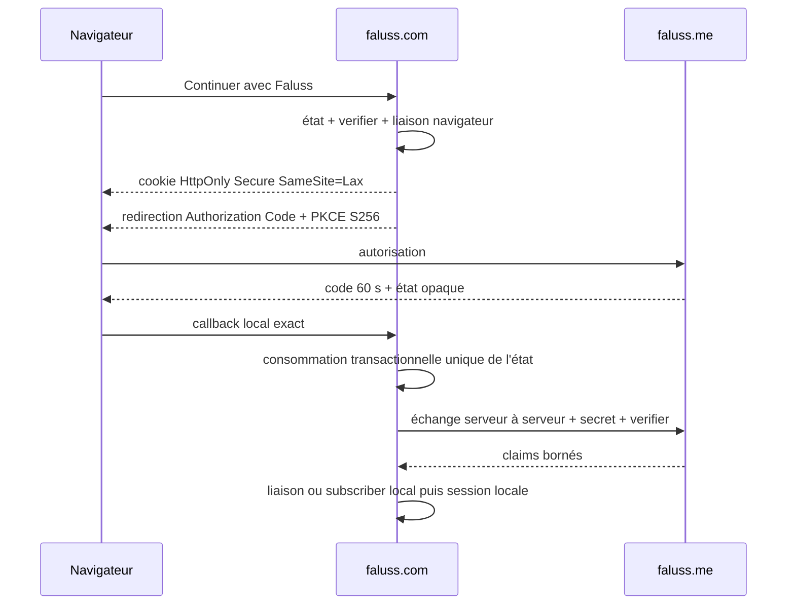

# Migration de Faluss Identity Client

Faluss Identity Client appartient au rôle `hub` de `faluss.com`. Il établit une session WordPress locale à partir d'une preuve délivrée par Faluss Identity sur `faluss.me`, sans déplacer les rôles, les droits ni les données métier du Hub. L'autorité reste seule responsable du `faluss_id` et du code d'autorisation ; le Hub conserve son propre `wp_user_id`.



## Inventaire de compatibilité

| Surface | Contrat conservé | Propriétaire ou consommateur |
|---|---|---|
| Réglages | `faluss_identity_client_settings` | Hub local |
| Schéma | `faluss_identity_client_schema_version=1` | Hub local |
| Liaisons | `${prefix}faluss_identity_links`, unicité de `wp_user_id` et `faluss_id` | Identity Client |
| États | `${prefix}faluss_identity_client_state`, état unique, navigateur, mode, expiration et consommation | Identity Client |
| Callback | `/faluss-identity/callback` | WordPress Hub |
| Shortcode | `[faluss_identity_client_button]` | Contenus Hub |
| Actions POST | `faluss_identity_client_start` et `faluss_identity_client_continue` | Formulaires locaux |
| Façades PHP | `Faluss_Identity_Client`, `Faluss_Identity_Client_Schema`, administration, plugin et adaptateur Apps Registry | Portail et appelants historiques |
| Projection Faluss Me | méta `_faluss_identity_client_member_apps_v1` | Apps Registry et Portail |
| Widget Elementor | `faluss_identity_client_button`, identifiants de contrôles et sélecteurs `{{WRAPPER}}` historiques | Pages Elementor |

Les noms des tables, options, constantes, méthodes publiques, hooks, shortcode et réglages restent compatibles. L'administration est déplacée sous le menu Faluss commun, mais garde le groupe de réglages et l'option historiques.

## Propriétés de sécurité

Le client génère 32 octets aléatoires séparés pour l'état, le verifier PKCE et la liaison navigateur. Le navigateur reçoit seulement leur enveloppe dans un cookie `Secure`, `HttpOnly`, `SameSite=Lax`; la base ne conserve que les empreintes nécessaires. L'état est sélectionné `FOR UPDATE`, vérifié avec sa liaison navigateur, marqué consommé dans la même transaction InnoDB puis refusé à toute nouvelle tentative.

L'autorité est fixée à `https://faluss.me`. Le callback et les retours sont des URL locales exactes préenregistrées, sans utilisateur, mot de passe ni fragment. L'échange est serveur à serveur, n'accepte aucune redirection HTTP et ajoute `FALUSS_IDENTITY_CLIENT_SECRET` uniquement depuis la configuration serveur. Le secret, le code et les claims ne sont jamais placés dans une URL ni journalisés.

Le flux de liaison demande seulement `identity.basic`. Le flux de première connexion peut aussi demander `identity.email`, utilisé une seule fois pour créer un compte local `subscriber`. Une adresse déjà connue localement n'est jamais rapprochée automatiquement. Un utilisateur lié existant est retrouvé par le `faluss_id`; seul un compte dont l'unique rôle est `subscriber` reçoit la session courte d'une heure. Aucun rôle privilégié n'est créé ou modifié.

La projection Faluss Me reste bornée au contrat `1`, au statut `published` et à l'URL canonique de l'autorité. Aucun Bearer, secret, préférence ou donnée métier Faluss Me n'est persistant sur le Hub.

## Activation contrôlée et coexistence

Le module s'enregistre uniquement sur le rôle `hub`, avec une constante booléenne explicite et si le plugin historique n'a pas déjà déclaré sa classe principale :

```php
define('FALUSS_PLATFORM_ROLE', 'hub');
define('FALUSS_PLATFORM_IDENTITY_CLIENT', true);
define('FALUSS_IDENTITY_CLIENT_SECRET', 'secret-fourni-hors-git');
```

Ces constantes appartiennent à une configuration non versionnée. Tant que `faluss-identity-client` est chargé, le nouveau module ne se superpose pas. Lors du premier chargement administratif après opt-in, le module actualise une seule fois les règles de réécriture ; il ne modifie pas les parcours de connexion existants si son réglage `enabled` reste faux.

Pour revenir en arrière, **désactiver d'abord `FALUSS_PLATFORM_IDENTITY_CLIENT`, charger une nouvelle requête, puis réactiver l'ancien plugin**. Les deux tables, l'option, les liaisons et les projections sont conservées. Réactiver l'ancien plugin dans une requête où les façades du module sont déjà chargées provoquerait une collision de classe PHP.

## Preuves automatisées et porte de bascule

Les tests du nouveau module couvrent les deux schémas et leurs index uniques, la garde de coexistence, les hooks historiques, les URL de retour exactes, PKCE S256, la liaison et la consommation transactionnelle de l'état, le rejet des claims hors contrat, l'absence de rapprochement implicite par e-mail et la session courte du seul membre normal lié. Les contrats historiques FI-05, FI-06, AP-02A, AP-02A1 et Portal restent des caractérisations séparées de l'ancien plugin et de ses consommateurs.

La porte de bascule reste fermée tant qu'une copie représentative de `faluss.com` et une autorité de préproduction n'ont pas validé : les deux tables InnoDB existantes, le callback HTTPS exact, le secret serveur réel, un code à usage unique expirant en 60 secondes, les erreurs et rejeux, la liaison d'un compte existant, la création d'un nouveau `subscriber`, la session d'une heure, le widget Elementor, puis les projections consommées par Apps Registry et Portal. Les tests statiques et le harnais PHP ne constituent pas une recette WordPress, MariaDB, Elementor ou réseau réelle.

## Bascule de production du 22 septembre 2026

Avant la bascule, les implémentations historique et Platform ont retourné la
même configuration, le même callback et le même HTML de bouton. Les tables
`wp_faluss_identity_links` et `wp_faluss_identity_client_state` sont InnoDB ;
les quatre liaisons existantes sont restées intactes. Le client configuré est
un client PKCE sans constante serveur `FALUSS_IDENTITY_CLIENT_SECRET`, que le
protocole historique traite comme optionnelle.

Un démarrage synthétique non authentifié a produit une redirection vers
`https://faluss.me/oauth/authorize` avec les paramètres attendus, un challenge
PKCE S256, les scopes `identity.basic identity.email` et un cookie Secure,
HttpOnly et SameSite=Lax. Le callback a consommé l'état à usage unique puis
refusé un faux code opaque avec une redirection d'erreur locale.

`FALUSS_PLATFORM_IDENTITY_CLIENT` a ensuite été activé et
`faluss-identity-client` désactivé. Les mêmes contrôles synthétiques ont réussi
avec la façade Platform. L'accueil, le portail et le callback répondent, les
conteneurs restent sains et les fichiers historiques sont conservés.

Un parcours réussi avec un membre existant et la création d'un nouveau
`subscriber` exigera une recette contrôlée avec des identités de test ; aucun
compte de production n'a été usurpé pour simuler cette preuve. Les cas de
rejeu, expiration, liaison et durée de session restent couverts par les tests
automatisés. Avant suppression des fichiers historiques, vérifier aussi le
widget Elementor dans un navigateur. Pour revenir en arrière, remettre le
drapeau à `false`, charger une requête, puis réactiver l'ancien client.
