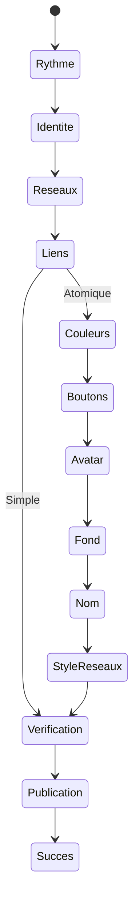

# Onboarding Faluss.me V3 natif

V3 est le parcours de création de carte du rôle `me`. Le flag `FALUSS_PLATFORM_ONBOARDING_V3` est absent ou `false` par défaut. Il exige les modules Identity, Catalog, Link, Apps Registry et la dépendance de Link `Token Engine Connector`, ainsi que le schéma Link V4 déjà migré. Le module Me Studio fournit l'interface ; Identity conserve l'identité, le slug, la publication et le curseur ; Link conserve les préférences, les réseaux, les blocs ordonnés et le rendu public. La carte affichée dans l'unique téléphone utilise `Faluss_Link::card_markup_from_presentation()`.

## Parcours et reprise

Simple : rythme → identité → réseaux → liens → dernier regard → publication. Atomique suit les mêmes quatre premières étapes puis ajoute couleurs, boutons, avatar, image de fond, nom et style des réseaux avant le dernier regard. Le panneau inférieur a une position compacte et une position déployée ; son contenu défile une fois déployé. La prévisualisation AJAX réutilise le renderer public. À l'étape Identité, une sauvegarde différée enregistre les champs dans une métadonnée privée du compte WordPress, liée au Faluss ID actif ; après un upload d'avatar réussi, cette sauvegarde est immédiate avant d'annoncer « Image prête ». Les autres aperçus ne sauvegardent pas l'étape courante.



L'étape Nom propose Outfit lorsqu'il est fourni par le site, ainsi que les piles natives sans et sérif avec poids 400 et 700. Aucun fichier de police ou service distant n'est ajouté ; la recette doit vérifier la disponibilité effective d'Outfit dans le thème actif.

Le curseur est enregistré dans `onboarding_next_step` d'Identity. Les anciens curseurs `choice`, `identifier`, `studio`, `wizard_*` et `wizard_atomic_*` sont projetés vers un écran V3 sans écriture à la lecture. Le mode choisi est encodé dans `v3_identity_simple` ou `v3_identity_atomic` avant l'enregistrement des préférences Link. À l'étape Identité, Retour enregistre le nom, le slug saisi et l'avatar dans la métadonnée privée **avant** de déplacer le curseur vers `v3_mode_*`. Un rechargement ou une reprise relit cette métadonnée pour les champs et l'aperçu ; elle est supprimée après l'enregistrement réussi de l'identité dans Link. Le slug n'est pas réservé par Retour ou par la sauvegarde différée : sa réservation permanente reste juste avant l'enregistrement de l'identité. Si ce dernier échoue, le slug reste réservé au même compte et peut être repris. Les autres passages suivants, retours ou étapes passées sauvegardent les données et le curseur dans la transaction Link/Identity existante.

Le serveur exige un nonce, une session membre, le curseur courant et la version agrégée du profil, des préférences et des blocs. Une version obsolète renvoie HTTP 409. Les champs non enregistrés restent dans le formulaire et un message invite à recharger. Les liens historiques omis par l'écran V3 ne sont pas supprimés. Une publication réussie marque le profil public et termine le curseur Identity dans une transaction. Un nouvel appel sur le profil déjà publié retourne son URL canonique.

## Activation et retour arrière

Sur un staging représentatif uniquement, migrer Link V4 par la procédure documentée dans [ME-STUDIO.md](ME-STUDIO.md), puis définir dans la configuration non versionnée :

```php
define('FALUSS_PLATFORM_ROLE', 'me');
define('FALUSS_PLATFORM_IDENTITY', true);
define('FALUSS_PLATFORM_CATALOG', true);
define('FALUSS_PLATFORM_TOKEN_ENGINE_CONNECTOR', true);
define('FALUSS_PLATFORM_LINK', true);
define('FALUSS_PLATFORM_APPS_REGISTRY', true);
define('FALUSS_PLATFORM_ONBOARDING_V3', true);
```

Le flag V3 seul charge le fournisseur Me Studio sans activer son Studio V2. Sur une installation où `FALUSS_PLATFORM_ME_STUDIO_V2` vaut déjà `true`, laisser ce flag en place pendant la recette : V3 prend la priorité pour l'onboarding et Studio V2 reste disponible pour l'édition. Si le fournisseur ou Link sont indisponibles pendant V3, une erreur récupérable remplace l'écran ; V1/V2 ne sont pas rendus sous le panneau V3. Pour revenir au parcours historique sur une nouvelle requête, mettre uniquement `FALUSS_PLATFORM_ONBOARDING_V3` à `false` : l'onboarding V2 reprend si son flag est actif, sinon Link reprend son parcours interne. Les données et médias déjà enregistrés restent dans leurs tables propriétaires.

## Vérification avant activation

Tester sur un WordPress/MariaDB isolé : nouveau profil sans slug, reprise de chaque ancien curseur, Simple et Atomique, retour, passer, rechargement après chaque étape, deux sessions concurrentes, liens historiques, upload JPEG/PNG/GIF/WebP, fichier rejeté et serveur sans dossier d'upload accessible. Vérifier le même rendu dans la preview, le profil public, le shortcode et le widget Elementor. Vérifier la carte et le panneau à 320, 390 et 768 px dans Chromium et WebKit, les deux positions du panneau, le clavier, un lecteur d'écran et une préférence de mouvement réduit. Les logos de réseaux proviennent du catalogue Link ; un média absent est signalé dans son administration et aucune icône distante n'est téléchargée. Une recette fonctionnelle locale sur WordPress/MariaDB et Elementor est documentée dans [les preuves V3](../evidence/onboarding-v3/WORDPRESS-RECIPE.md) ; elle ne couvre pas le staging ni la production.

Les échecs de téléversement renvoient désormais un code structuré distinguant notamment taille, format, refus WordPress et création de pièce jointe. Le flux de publication renvoie un code d'échec et laisse le brouillon intact. Aucun code ou trace HTTP des incidents de production n'a été fourni : leur cause précise reste à établir à partir de la réponse brute et des logs serveur horodatés.
