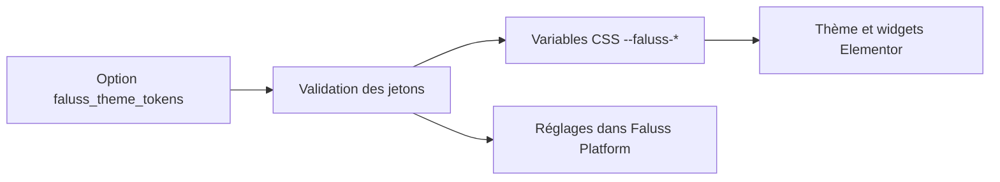

# Module des jetons visuels

Ce module reprend la responsabilité du plugin historique `Faluss Theme` sur `faluss.me` : réglages de couleurs, rayons, ombre et variables CSS destinées au thème et aux widgets Elementor. Il ne concerne pas `faluss.com`, ne transmet aucune donnée entre les sites et n’ajoute aucune table, route REST ou tâche cron.



## Contrat et dépendances

- Rôle autorisé : `me` uniquement.
- Dépendance interne : `admin-dashboard` pour le sous-menu d’administration.
- Stockage : option WordPress existante `faluss_theme_tokens` ; aucune migration SQL ni conversion obligatoire.
- Sortie publique : handle CSS existant `faluss-theme-tokens` et variables `--faluss-*` conservées.
- Droits : `manage_options` ; le formulaire utilise l’API Settings de WordPress et son nonce.
- Dépendances externes : WordPress et, pour l’interface, le sélecteur de couleurs standard WordPress.

## Activation progressive

Le module est désactivé par défaut. Il ne s’enregistre que si `FALUSS_PLATFORM_ROLE` vaut `me`, si `FALUSS_PLATFORM_THEME_TOKENS` vaut le booléen `true` et si la classe du plugin historique `Faluss_Theme` n’est pas chargée. Tant que l’ancien plugin reste actif, il demeure seul responsable des jetons et de son écran de réglages.

Après validation en préproduction et approbation explicite de la bascule : sauvegarder la valeur de l’option, désactiver `Faluss Theme`, puis définir dans la configuration non versionnée de `faluss.me` :

```php
define('FALUSS_PLATFORM_ROLE', 'me');
define('FALUSS_PLATFORM_THEME_TOKENS', true);
```

Contrôler ensuite le rendu front-end, les valeurs des variables CSS, les widgets Elementor et l’enregistrement des réglages. La page se trouve sous « Faluss → Identité visuelle ». Le module relit et réécrit la même option ; il ne supprime pas les anciennes valeurs lors de l’activation.

## Retour arrière

Retirer ou mettre à `false` `FALUSS_PLATFORM_THEME_TOKENS`, puis réactiver `Faluss Theme`. L’option et ses valeurs restent disponibles pour l’ancien plugin. Si l’ancien plugin est réactivé avant la désactivation du module, la garde `class_exists` empêche le module de charger ses hooks au prochain cycle WordPress. Vérifier malgré tout le résultat en préproduction avant toute bascule de production.

## Limites de la parité

Le nouvel écran conserve les réglages, la remise aux valeurs par défaut et l’aperçu visuel de l’ancien écran. La validation de parité fonctionnelle et visuelle en préproduction reste obligatoire avant retrait définitif de l’ancien plugin.
