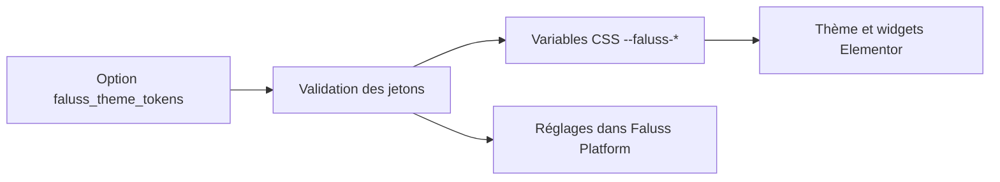
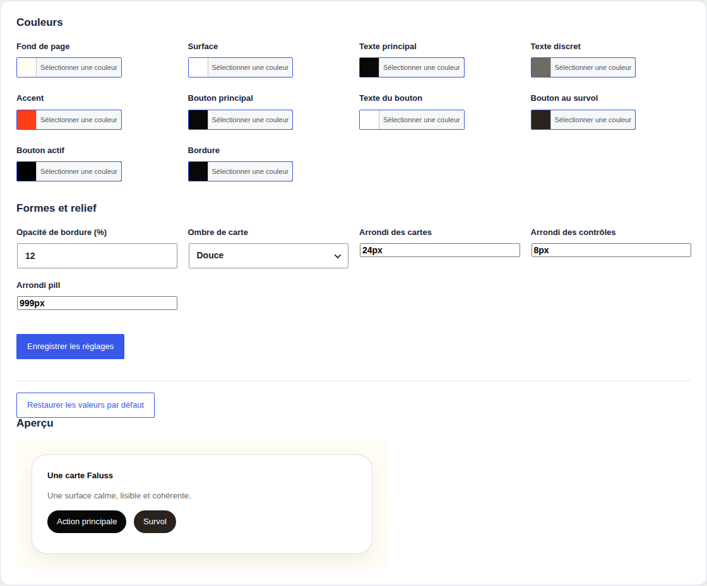

# Module des jetons visuels

Ce module reprend la responsabilité du plugin historique `Faluss Theme` sur `faluss.me` : réglages de couleurs, rayons, ombre et variables CSS destinées au thème et aux widgets Elementor. Il ne concerne pas `faluss.com`, ne transmet aucune donnée entre les sites et n’ajoute aucune table, route REST ou tâche cron.



## Contrat et dépendances

- Rôle autorisé : `me` uniquement.
- Dépendance interne : `admin-dashboard` pour le sous-menu d’administration.
- Stockage : option WordPress existante `faluss_theme_tokens` ; aucune migration SQL ni conversion obligatoire.
- Sortie publique : handle CSS existant `faluss-theme-tokens` et variables `--faluss-*` conservées.
- Droits : `manage_options` ; le formulaire utilise l’API Settings de WordPress et son nonce.
- Dépendances externes : WordPress et, pour l’interface, le sélecteur de couleurs standard WordPress.

## Inventaire du plugin historique

Le code du plugin `faluss-theme` 0.1.0 installé sur `faluss.me` correspond octet
pour octet à la copie auditée le 20 septembre 2026. La vérification du 21
septembre 2026 confirme qu’il est actif sur `.me`, absent de `.com`, et que
`faluss_theme_tokens` n’existe pas encore en base : le site utilise les 15
valeurs par défaut. Hello Elementor 3.5.1 et Elementor 4.2.4 sont actifs.

| Surface | Contrat historique | Consommateur ou effet |
|---|---|---|
| Données | Option `faluss_theme_tokens`, 15 valeurs ; aucune table | WordPress local `.me` |
| PHP | Classe globale `Faluss_Theme`, méthodes `defaults`, `get`, `sanitize`, `tokens` et rendu admin | Aucun appel direct trouvé dans les autres plugins Faluss copiés ; la classe sert de garde de coexistence |
| Hooks | `wp_enqueue_scripts`, puis `admin_menu`, `admin_init`, `admin_enqueue_scripts` dans l’administration ; hook d’activation | WordPress |
| Administration | `Réglages → Faluss Theme`, capacité `manage_options`, Settings API et nonce | Administrateurs `.me` |
| CSS | Handle `faluss-theme-tokens`, variables `--faluss-*` avec variantes `_` et `-` pour rayons et actions | Faluss Link et les widgets Elementor du site |
| Routes, shortcodes, widgets, cron | Aucun déclaré | Sans objet |

Le nouveau module garde l’option et le handle. Il émet exactement la même
chaîne CSS avec les valeurs par défaut du site. Les deux formes des variables
de rayon et d’action restent disponibles pour les feuilles Faluss Link.
Les libellés des ombres restent ceux de l’ancien écran. L’écran de préproduction
a un nonce distinct pour chacun des deux formulaires ; ses dix sélecteurs de
couleur ont chacun un nom accessible spécifique et l’aperçu utilise des
éléments non interactifs afin de ne pas créer de faux boutons au clavier.

## Activation progressive

Le module est désactivé par défaut. Il ne s’enregistre que si `FALUSS_PLATFORM_ROLE` vaut `me`, si `FALUSS_PLATFORM_THEME_TOKENS` vaut le booléen `true` et si la classe du plugin historique `Faluss_Theme` n’est pas chargée. Tant que l’ancien plugin reste actif, il demeure seul responsable des jetons et de son écran de réglages.

Après validation en préproduction et approbation explicite de la bascule : sauvegarder la valeur de l’option, désactiver `Faluss Theme`, puis définir dans la configuration non versionnée de `faluss.me` :

```php
define('FALUSS_PLATFORM_ROLE', 'me');
define('FALUSS_PLATFORM_THEME_TOKENS', true);
```

Contrôler ensuite le rendu front-end, les valeurs des variables CSS, les widgets Elementor et l’enregistrement des réglages. La page se trouve sous « Faluss → Identité visuelle ». Le module relit et réécrit la même option ; il ne supprime pas les anciennes valeurs lors de l’activation.

## Retour arrière

Retirer ou mettre à `false` `FALUSS_PLATFORM_THEME_TOKENS`, puis réactiver `Faluss Theme`. L’option et ses valeurs restent disponibles pour l’ancien plugin. Si l’ancien plugin est réactivé avant la désactivation du module, la garde `class_exists` empêche le module de charger ses hooks au prochain cycle WordPress. Vérifier malgré tout le résultat en préproduction avant toute bascule de production.

## Limites de la parité

Le nouvel écran conserve les réglages, la remise aux valeurs par défaut et l’aperçu visuel de l’ancien écran. Le 21 septembre 2026, une copie isolée de
`faluss.me` a été restaurée à partir d’un export SQL cohérent et d’une copie de
`wp-content`, sur une base et un réseau Docker distincts, sans accès réseau
externe. Les fichiers de cette copie sont protégés sur l’hôte de préproduction ;
les comptes WordPress y portent des identités de test. La restauration a chargé
le thème, Elementor et l’ancien plugin, puis le nouveau code a été activé
uniquement sur cette copie.

La page publique y a répondu HTTP 200 avant et après la bascule. Avec les deux
plugins actifs, une seule feuille `faluss-theme-tokens` a été rendue. Après
désactivation de l’ancien plugin, le hash SHA-256 de la règle CSS frontale est
resté identique (`c3ce0d2c271fea6b28d0a448791d107d2cda0663cebff9c08e11242681e22d84`, saut de ligne inclus). L’écran
« Faluss → Identité visuelle » s’est chargé avec ses libellés, champs associés,
nonces et aperçu ; l’enregistrement d’une couleur personnalisée et la remise
aux valeurs par défaut ont abouti par `options.php`. Le retour arrière a été
testé en désactivant le module puis en réactivant l’ancien plugin : HTTP 200,
une seule feuille, même hash CSS. La page d’accueil rend des widgets Elementor.



Une revue visuelle dans un navigateur et les parcours Elementor de pages
spécifiques restent à faire avant la bascule de production. La copie de
préproduction ne constitue pas une activation de `faluss-platform` sur `.me`.

Les tests automatisés vérifient les hooks WordPress, la clé d’option, le handle
et la chaîne CSS historique. Les écarts de validation sur des entrées malformées
restent volontaires : la nouvelle validation refuse les suffixes et sauts de
ligne qui n’ont jamais été enregistrés dans l’option actuelle.
