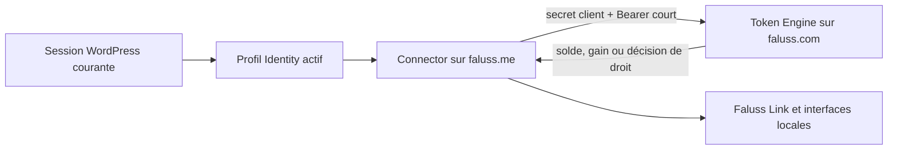

# Migration du Token Engine Connector

Le Token Engine Connector de `faluss.me` est uniquement un client serveur du Token Engine qui reste autoritaire sur `faluss.com`. Le module ne possède aucun ledger, solde, gain, attribution ou définition de droit. Il ne persiste jamais un `faluss_id` et n’accepte pas d’identifiant de sujet arbitraire envoyé par le navigateur.



## Inventaire de compatibilité

| Surface | Contrat conservé | Propriétaire ou consommateur |
|---|---|---|
| Réglages | `token_engine_connector_settings` et version `token_engine_connector_settings_version=2` | Connector local |
| Secret | Chiffrement authentifié local, formats historiques lisibles, valeur jamais réaffichée | Connector local |
| Classe publique | `Token_Engine_Connector_Service`, constantes et méthodes historiques | Faluss Link et autres appelants PHP |
| Permissions | `wallet.read`, `reward.claim`, `entitlements.read` seulement | Token Engine Core |
| Actions privées | `token_engine_connector_save`, `test`, `test_core`, `test_subject`, `test_daily_reward`, `test_entitlements` | Administration WordPress |
| Sujet | Profil Faluss Identity actif de l’utilisateur WordPress courant, résolu côté serveur après `plugins_loaded` | Faluss Identity |
| Routes Core | Token, diagnostic, balance, reward offer/diagnostic/status/claim et entitlements | Token Engine sur `faluss.com` |
| Tables locales | Aucune | Sans objet |
| Routes publiques, shortcode ou JavaScript métier | Aucun | Sans objet |

La façade conserve notamment `configuration`, `save_configuration`, `core_connection_test`, `balance_for_current_subject`, les trois opérations de gain quotidien et les opérations de droits utilisées par Faluss Link. Le filtre historique `token_engine_connector_subject_id` reste disponible, mais reçoit d’abord le sujet de la session locale ; aucune donnée de requête n’est utilisée pour choisir un membre.

## Authentification et réponses distantes

Le secret client reste dans l’option protégée. Le Core délivre un Bearer d’au plus 300 secondes. Le module vérifie strictement son alphabet, `token_type=Bearer`, sa durée, la version de protocole et la liste fermée des permissions. Il met ce jeton en cache objet pendant au plus 240 secondes et jamais au-delà de sa marge d’expiration. Le cache est invalidé après chaque changement de configuration.

Une route protégée qui refuse un jeton provenant du cache provoque une seule purge, une seule nouvelle authentification et une seule nouvelle tentative. Un second refus, une erreur réseau, une redirection, un corps JSON invalide, un projet différent, une permission absente ou une valeur hors schéma échoue fermé. Les réponses brutes, secrets, Bearers et Faluss IDs ne sont ni enregistrés ni rendus dans l’administration ; seuls des codes fermés et des identifiants de diagnostic non sensibles sont conservés brièvement.

Les lectures économiques restent distantes : `balance` exige un entier positif ou nul ; les états de gain appartiennent à une liste fermée ; les décisions de droit exigent un booléen et le code demandé exact. Le Connector ne reconstitue jamais une décision locale depuis une réponse partielle.

## Activation contrôlée et coexistence

Le module s’enregistre uniquement sur le rôle `me`, avec une constante booléenne explicite et si la classe historique n’est pas déjà chargée :

```php
define('FALUSS_PLATFORM_ROLE', 'me');
define('FALUSS_PLATFORM_TOKEN_ENGINE_CONNECTOR', true);
```

Ces constantes appartiennent à la configuration non versionnée de WordPress. Tant que `token-engine-connector` est actif, le nouveau module ne se charge pas et aucun hook administratif ni aucune façade ne se superpose. L’administration apparaît comme sous-menu de « Faluss » et exige `manage_options` ainsi qu’un nonce distinct pour chaque action.

Pour revenir en arrière, **désactiver d’abord `FALUSS_PLATFORM_TOKEN_ENGINE_CONNECTOR`, charger une nouvelle requête, puis réactiver l’ancien plugin**. L’option et le secret protégé sont conservés. Réactiver l’ancien plugin dans une requête où la façade du nouveau module est déjà chargée créerait une collision de classe PHP.

## Preuves automatisées et porte de bascule

Les tests du nouveau module couvrent les URL canoniques et refusées, la protection et la conservation du secret, la réutilisation et l’expiration du cache Bearer, le renouvellement unique après rejet, les jetons mal formés, la résolution du sujet de session, les hooks privés, le refus d’un nonce invalide, la façade publique et la collision avec le plugin historique. Les contrats historiques ciblés du Connector et de Faluss Link restent exécutés comme caractérisation de leurs consommateurs.

La porte de bascule de production reste fermée tant qu’une copie représentative de `faluss.me` n’a pas confirmé : la relecture du secret existant, une authentification réelle vers le Core, les trois permissions, l’expiration et le renouvellement du Bearer, les erreurs réseau, une session Faluss Identity réelle, le portefeuille, le gain quotidien, les droits de thème et les parcours Faluss Link. Cette limite n’empêche pas les migrations de code indépendantes suivantes, mais interdit de désactiver l’ancien Connector ou de déclarer la parité de production.
